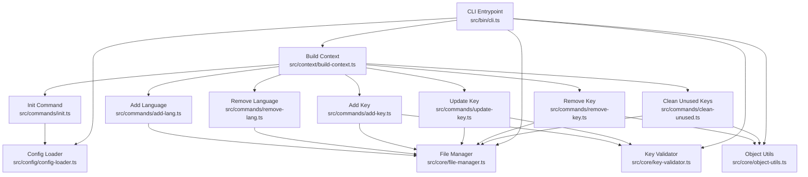
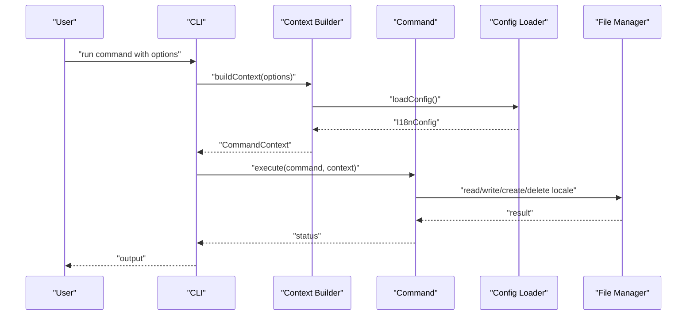
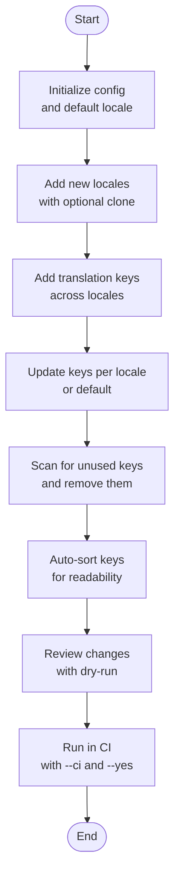

# Features & Benefits

<cite>
**Referenced Files in This Document**
- [README.md](file://README.md)
- [package.json](file://package.json)
- [src/bin/cli.ts](file://src/bin/cli.ts)
- [src/config/config-loader.ts](file://src/config/config-loader.ts)
- [src/config/types.ts](file://src/config/types.ts)
- [src/context/types.ts](file://src/context/types.ts)
- [src/context/build-context.ts](file://src/context/build-context.ts)
- [src/core/file-manager.ts](file://src/core/file-manager.ts)
- [src/core/key-validator.ts](file://src/core/key-validator.ts)
- [src/core/object-utils.ts](file://src/core/object-utils.ts)
- [src/core/confirmation.ts](file://src/core/confirmation.ts)
- [src/commands/init.ts](file://src/commands/init.ts)
- [src/commands/add-lang.ts](file://src/commands/add-lang.ts)
- [src/commands/remove-lang.ts](file://src/commands/remove-lang.ts)
- [src/commands/add-key.ts](file://src/commands/add-key.ts)
- [src/commands/update-key.ts](file://src/commands/update-key.ts)
- [src/commands/remove-key.ts](file://src/commands/remove-key.ts)
- [src/commands/clean-unused.ts](file://src/commands/clean-unused.ts)
</cite>

## Table of Contents
1. [Introduction](#introduction)
2. [Project Structure](#project-structure)
3. [Core Components](#core-components)
4. [Architecture Overview](#architecture-overview)
5. [Detailed Feature Analysis](#detailed-feature-analysis)
6. [Feature Matrix](#feature-matrix)
7. [Workflow Integration](#workflow-integration)
8. [Practical Use Cases and Advanced Patterns](#practical-use-cases-and-advanced-patterns)
9. [Performance and Developer Experience](#performance-and-developer-experience)
10. [Troubleshooting Guide](#troubleshooting-guide)
11. [Conclusion](#conclusion)

## Introduction
This document presents the complete feature set and value proposition of i18n-pro, a professional CLI tool for managing translation files in internationalized applications. It focuses on how features work together to streamline i18n workflows, reduce manual effort, and improve reliability. The content is grounded in the repository’s implementation and documentation, and includes practical use cases, comparisons with manual management and alternative tools, and guidance on combining features for advanced scenarios.

## Project Structure
At a high level, i18n-pro is organized around:
- CLI entrypoint and command wiring
- Configuration loading and validation
- Command modules implementing language and key operations
- Core utilities for file operations, key flattening/unflattening, structural validation, and confirmation prompts
- Context building to share configuration and utilities across commands

**Diagram sources**
- [src/bin/cli.ts:1-122](file://src/bin/cli.ts#L1-L122)
- [src/context/build-context.ts](file://src/context/build-context.ts)
- [src/config/config-loader.ts:1-176](file://src/config/config-loader.ts#L1-L176)
- [src/core/file-manager.ts:1-118](file://src/core/file-manager.ts#L1-L118)
- [src/core/key-validator.ts:1-33](file://src/core/key-validator.ts#L1-L33)
- [src/core/object-utils.ts:1-95](file://src/core/object-utils.ts#L1-L95)
- [src/commands/init.ts:1-236](file://src/commands/init.ts#L1-L236)
- [src/commands/add-lang.ts:1-98](file://src/commands/add-lang.ts#L1-L98)
- [src/commands/remove-lang.ts:1-74](file://src/commands/remove-lang.ts#L1-L74)
- [src/commands/add-key.ts:1-93](file://src/commands/add-key.ts#L1-L93)
- [src/commands/update-key.ts:1-103](file://src/commands/update-key.ts#L1-L103)
- [src/commands/remove-key.ts:1-96](file://src/commands/remove-key.ts#L1-L96)
- [src/commands/clean-unused.ts:1-138](file://src/commands/clean-unused.ts#L1-L138)

**Section sources**
- [README.md:1-346](file://README.md#L1-L346)
- [src/bin/cli.ts:1-122](file://src/bin/cli.ts#L1-L122)

## Core Components
- CLI and Commands: The CLI wires global options and routes commands to dedicated modules. Commands receive a shared context containing configuration and a file manager.
- Configuration: Strongly typed configuration with Zod validation, including locales path, default locale, supported locales, key style, usage patterns, and auto-sort behavior.
- File Manager: Reads, writes, creates, and deletes locale files; applies recursive key sorting when enabled.
- Utilities:
  - Object utils: Flatten/unflatten nested/flat key structures and remove empty objects after deletions.
  - Key validator: Prevents structural conflicts between nested and flat key styles.
  - Confirmation: Handles interactive prompts, dry runs, CI mode, and non-interactive environments.
- Context: Provides typed access to configuration, file manager, and global options across commands.

**Section sources**
- [src/config/types.ts:1-12](file://src/config/types.ts#L1-L12)
- [src/config/config-loader.ts:1-176](file://src/config/config-loader.ts#L1-L176)
- [src/context/types.ts:1-15](file://src/context/types.ts#L1-L15)
- [src/core/file-manager.ts:1-118](file://src/core/file-manager.ts#L1-L118)
- [src/core/object-utils.ts:1-95](file://src/core/object-utils.ts#L1-L95)
- [src/core/key-validator.ts:1-33](file://src/core/key-validator.ts#L1-L33)
- [src/core/confirmation.ts:1-43](file://src/core/confirmation.ts#L1-L43)

## Architecture Overview
The CLI orchestrates commands that operate on translation files through a shared context. Commands validate inputs, consult configuration, and delegate persistence to the file manager. Structural integrity is enforced by validators and utilities, while configuration ensures consistent behavior across operations.

**Diagram sources**
- [src/bin/cli.ts:1-122](file://src/bin/cli.ts#L1-L122)
- [src/context/build-context.ts](file://src/context/build-context.ts)
- [src/config/config-loader.ts:1-176](file://src/config/config-loader.ts#L1-L176)
- [src/core/file-manager.ts:1-118](file://src/core/file-manager.ts#L1-L118)

## Detailed Feature Analysis

### Language Management Capabilities
- Add a new language with optional cloning from an existing locale, including ISO 639-1 validation for language codes.
- Remove a language with safeguards against removing the default locale and ensuring the file exists.
- Benefits:
  - Reduces boilerplate and human error when adding/removing locales.
  - Prevents invalid locales from entering the system.
  - Streamlines onboarding of new markets with minimal friction.

Practical scenarios:
- Onboarding a new region: add a language and clone content from a reference locale.
- Sunset a market: remove the locale file after confirming it is safe to do so.

**Section sources**
- [src/commands/add-lang.ts:1-98](file://src/commands/add-lang.ts#L1-L98)
- [src/commands/remove-lang.ts:1-74](file://src/commands/remove-lang.ts#L1-L74)
- [README.md:139-158](file://README.md#L139-L158)

### Key Management Operations
- Add a translation key across all locales, respecting key style and preventing structural conflicts.
- Update a key in a specific locale (or default locale), with strict structural checks.
- Remove a key from all locales, rebuilding nested structures and pruning empty objects.
- Benefits:
  - Consistent key creation/update/removal across locales.
  - Prevents accidental structural mismatches.
  - Keeps translation files tidy and maintainable.

Practical scenarios:
- Adding a new feature label across languages.
- Updating marketing copy in the default locale only.
- Removing deprecated keys after refactoring.

**Section sources**
- [src/commands/add-key.ts:1-93](file://src/commands/add-key.ts#L1-L93)
- [src/commands/update-key.ts:1-103](file://src/commands/update-key.ts#L1-L103)
- [src/commands/remove-key.ts:1-96](file://src/commands/remove-key.ts#L1-L96)
- [src/core/key-validator.ts:1-33](file://src/core/key-validator.ts#L1-L33)
- [src/core/object-utils.ts:1-95](file://src/core/object-utils.ts#L1-L95)

### Cleanup Functionality
- Detects unused keys by scanning source files using configurable regex patterns and removes them from all locales.
- Benefits:
  - Keeps translation files lean and free of cruft.
  - Integrates with CI to prevent accumulation of dead keys.

Practical scenarios:
- Post-refactor cleanup to remove obsolete keys.
- CI gate to block PRs with unused keys.

**Section sources**
- [src/commands/clean-unused.ts:1-138](file://src/commands/clean-unused.ts#L1-L138)
- [README.md:185-201](file://README.md#L185-L201)

### Structural Validation
- Prevents conflicts when mixing nested and flat key styles, ensuring that adding a key does not overwrite or conflict with existing structures.
- Benefits:
  - Guarantees consistent translation file structure.
  - Avoids subtle bugs caused by structural mismatches.

**Section sources**
- [src/core/key-validator.ts:1-33](file://src/core/key-validator.ts#L1-L33)
- [src/commands/add-key.ts:1-93](file://src/commands/add-key.ts#L1-L93)
- [src/commands/update-key.ts:1-103](file://src/commands/update-key.ts#L1-L103)

### Dry Run Mode
- Preview changes without writing files, enabling safe experimentation and review.
- Benefits:
  - Reduces risk of accidental modifications.
  - Supports pre-flight checks in development and CI.

**Section sources**
- [src/bin/cli.ts:21-28](file://src/bin/cli.ts#L21-L28)
- [src/commands/init.ts:170-174](file://src/commands/init.ts#L170-L174)
- [src/commands/add-lang.ts:83-87](file://src/commands/add-lang.ts#L83-L87)
- [src/commands/remove-key.ts:82-86](file://src/commands/remove-key.ts#L82-L86)
- [src/commands/clean-unused.ts:126-130](file://src/commands/clean-unused.ts#L126-L130)

### CI/CD Support
- Non-interactive mode with deterministic exit codes and fail-on-change semantics.
- Benefits:
  - Enables automated quality gates.
  - Prevents unintended changes in pipelines.

**Section sources**
- [src/bin/cli.ts:21-28](file://src/bin/cli.ts#L21-L28)
- [src/core/confirmation.ts:20-25](file://src/core/confirmation.ts#L20-L25)
- [src/commands/init.ts:151-156](file://src/commands/init.ts#L151-L156)
- [README.md:222-231](file://README.md#L222-L231)

### Auto Sorting
- Automatically sorts keys recursively in translation files when enabled.
- Benefits:
  - Improves readability and diff stability.
  - Reduces merge conflicts in collaborative environments.

**Section sources**
- [src/core/file-manager.ts:100-115](file://src/core/file-manager.ts#L100-L115)
- [src/config/types.ts:10](file://src/config/types.ts#L10)
- [README.md:76](file://README.md#L76)

### Flexible Key Styles
- Support for both flat and nested key styles, with automatic conversion during reads/writes.
- Benefits:
  - Adapts to team preferences and framework conventions.
  - Maintains compatibility with various i18n libraries.

**Section sources**
- [src/config/types.ts:1-12](file://src/config/types.ts#L1-L12)
- [src/core/object-utils.ts:17-64](file://src/core/object-utils.ts#L17-L64)
- [src/commands/add-key.ts:71-77](file://src/commands/add-key.ts#L71-L77)
- [src/commands/update-key.ts:82-86](file://src/commands/update-key.ts#L82-L86)
- [src/commands/remove-key.ts:74-78](file://src/commands/remove-key.ts#L74-L78)
- [README.md:91-109](file://README.md#L91-L109)

### Init Wizard
- Interactive configuration generator with sensible defaults and optional custom usage patterns.
- Benefits:
  - Accelerates setup with guided configuration.
  - Ensures consistent project-wide settings.

**Section sources**
- [src/commands/init.ts:1-236](file://src/commands/init.ts#L1-L236)
- [README.md:131-138](file://README.md#L131-L138)

### ISO 639-1 Validation
- Validates language codes against ISO 639-1 standard, accepting both simple and extended codes.
- Benefits:
  - Enforces standardized locale identifiers.
  - Prevents typos and inconsistencies.

**Section sources**
- [src/commands/add-lang.ts:11-24](file://src/commands/add-lang.ts#L11-L24)
- [README.md:151](file://README.md#L151)

### TypeScript Foundation
- Built with TypeScript for full type safety and developer ergonomics.
- Benefits:
  - Reduces runtime errors.
  - Improves IDE support and refactoring confidence.

**Section sources**
- [package.json:26-43](file://package.json#L26-L43)
- [README.md:17](file://README.md#L17)

## Feature Matrix
The following matrix summarizes supported operations across command categories and highlights global options:

- Language Commands
  - add:lang: Add language with optional clone and ISO validation
  - remove:lang: Remove language with safeguards
- Key Commands
  - add:key: Add key across locales with structural validation
  - update:key: Update key in a specific locale with structural validation
  - remove:key: Remove key from all locales with nested rebuild
- Maintenance Commands
  - clean:unused: Detect and remove unused keys using usage patterns

Global Options
- -y, --yes: Skip confirmation prompts
- --dry-run: Preview changes without writing files
- --ci: Run in CI mode (non-interactive; exit on issues)
- -f, --force: Force operation (init overwrite)

**Section sources**
- [src/bin/cli.ts:30-111](file://src/bin/cli.ts#L30-L111)
- [README.md:202-240](file://README.md#L202-L240)

## Workflow Integration
i18n-pro is designed to integrate seamlessly into typical i18n workflows:
- Initialization: Use the init wizard to scaffold configuration and default locale.
- Expansion: Add new locales and clone content from existing ones.
- Evolution: Add or update keys consistently across locales.
- Maintenance: Periodically clean unused keys and keep files sorted.
- Quality Gates: Run in CI with dry-run and --yes to enforce standards.

[No sources needed since this diagram shows conceptual workflow, not actual code structure]

## Practical Use Cases and Advanced Patterns
- Onboarding a new region:
  - Add language with clone from an existing locale, then add keys and clean unused post-merge.
- CI-driven cleanup:
  - Run clean:unused with --ci --dry-run to surface unused keys; apply with --ci --yes in a follow-up job.
- Bulk key updates:
  - Add a key across locales, then update per-locale variations using update:key with targeted locales.
- Structured migration:
  - Switch key style by adding keys in the new style, validating structural conflicts, then cleaning old-style keys.

[No sources needed since this section provides general guidance]

## Performance and Developer Experience
- Performance benefits:
  - Recursive key sorting is applied only when enabled, minimizing overhead.
  - File I/O is batched per command to reduce repeated disk access.
- Developer experience improvements:
  - Strong typing reduces errors and improves autocompletion.
  - Clear error messages guide corrective actions.
  - Dry run and CI modes enable safe automation.
- Maintenance cost reductions:
  - Automated cleanup prevents accumulation of unused keys.
  - Centralized configuration and validation reduce divergence across teams.

[No sources needed since this section provides general guidance]

## Troubleshooting Guide
Common issues and resolutions:
- Configuration not found or invalid:
  - Ensure the configuration file exists and is valid JSON; re-run init if needed.
- Locale file missing or invalid:
  - Verify locale files exist and contain valid JSON; create default locale if absent.
- Structural conflicts:
  - Resolve conflicts reported by structural validation before proceeding.
- CI mode requires confirmation:
  - Use --yes to bypass confirmation in CI; otherwise, the command will fail.

**Section sources**
- [src/config/config-loader.ts:24-67](file://src/config/config-loader.ts#L24-L67)
- [src/core/file-manager.ts:31-43](file://src/core/file-manager.ts#L31-L43)
- [src/core/key-validator.ts:1-33](file://src/core/key-validator.ts#L1-L33)
- [src/core/confirmation.ts:20-25](file://src/core/confirmation.ts#L20-L25)

## Conclusion
i18n-pro delivers a cohesive, type-safe solution for managing translation files with powerful automation, robust validation, and seamless CI integration. Its feature set—language management, key operations, cleanup, structural validation, dry run, CI/CD support, auto sorting, flexible key styles, init wizard, ISO 639-1 validation, and TypeScript foundation—works together to reduce manual effort, prevent errors, and improve long-term maintainability. Compared to manual management and ad-hoc scripts, i18n-pro standardizes operations, enforces consistency, and accelerates developer productivity.