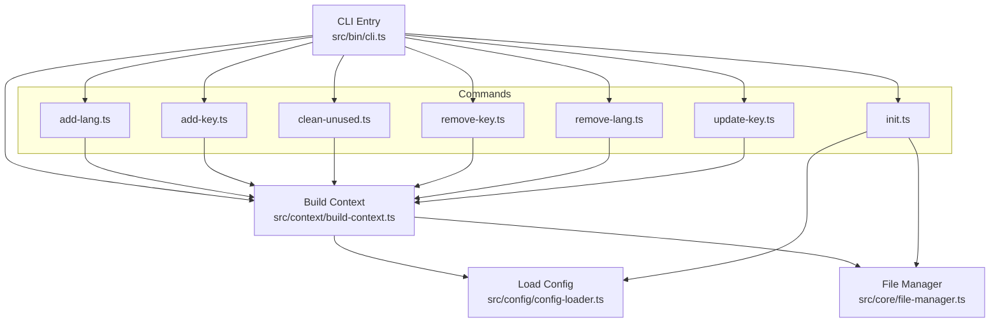

# Getting Started

<cite>
**Referenced Files in This Document**
- [package.json](file://package.json)
- [README.md](file://README.md)
- [src/bin/cli.ts](file://src/bin/cli.ts)
- [src/commands/init.ts](file://src/commands/init.ts)
- [src/commands/add-lang.ts](file://src/commands/add-lang.ts)
- [src/commands/add-key.ts](file://src/commands/add-key.ts)
- [src/commands/clean-unused.ts](file://src/commands/clean-unused.ts)
- [src/commands/remove-lang.ts](file://src/commands/remove-lang.ts)
- [src/commands/remove-key.ts](file://src/commands/remove-key.ts)
- [src/commands/update-key.ts](file://src/commands/update-key.ts)
- [src/context/build-context.ts](file://src/context/build-context.ts)
- [src/config/config-loader.ts](file://src/config/config-loader.ts)
- [src/core/file-manager.ts](file://src/core/file-manager.ts)
- [src/core/key-validator.ts](file://src/core/key-validator.ts)
- [src/core/object-utils.ts](file://src/core/object-utils.ts)
- [src/core/confirmation.ts](file://src/core/confirmation.ts)
</cite>

## Table of Contents
1. [Introduction](#introduction)
2. [Installation](#installation)
3. [Quick Start](#quick-start)
4. [Prerequisites](#prerequisites)
5. [Choosing Between Global and Local Installation](#choosing-between-global-and-local-installation)
6. [Step-by-Step Setup](#step-by-step-setup)
7. [Common First-Time Scenarios](#common-first-time-scenarios)
8. [Verification and Troubleshooting](#verification-and-troubleshooting)
9. [Architecture Overview](#architecture-overview)
10. [Conclusion](#conclusion)

## Introduction
i18n-pro is a professional CLI tool for managing translation files in internationalized applications. It helps you initialize configuration, manage locales, add and update translation keys, and clean unused keys. The tool supports both flat and nested key styles, structural validation to prevent conflicts, and CI-friendly modes for automation.

## Installation
You can install i18n-pro globally or locally in your project. Both approaches are supported.

- Global installation
  - Install globally using your package manager and run the command directly.
  - See [README.md:19-37](file://README.md#L19-L37) for the global installation command.

- Local installation
  - Install as a development dependency in your project and run via npx.
  - See [README.md:19-37](file://README.md#L19-L37) for the local installation command and npx usage.

- Package entry point
  - The CLI binary is exposed under the package name and maps to the built entry script.
  - See [package.json:23-25](file://package.json#L23-L25) for the binary mapping.

**Section sources**
- [README.md:19-37](file://README.md#L19-L37)
- [package.json:23-25](file://package.json#L23-L25)

## Quick Start
Get up and running quickly with a minimal workflow: initialize configuration, add a language, add a key, and clean unused keys.

- Minimal workflow
  - Initialize configuration, add a language, add a key, and clean unused keys.
  - See [README.md:39-53](file://README.md#L39-L53) for the quick start commands.

- Interactive initialization
  - Run the interactive wizard to generate a configuration file with sensible defaults.
  - See [README.md:131-134](file://README.md#L131-L134) for the init command.

- Dry run preview
  - Use the dry run option to preview changes before applying them.
  - See [README.md:215-220](file://README.md#L215-L220) for the dry run option.

**Section sources**
- [README.md:39-53](file://README.md#L39-L53)
- [README.md:131-134](file://README.md#L131-L134)
- [README.md:215-220](file://README.md#L215-L220)

## Prerequisites
Ensure your environment meets the minimum requirements before installing and using i18n-pro.

- Node.js version
  - Development requires Node.js 18+.
  - See [README.md:321-325](file://README.md#L321-L325) for the Node.js requirement.

- Package manager preference
  - The project is configured to use npm scripts for building and testing.
  - See [package.json:6-11](file://package.json#L6-L11) for the scripts section.

- OS compatibility
  - The CLI shebang indicates a Unix-like environment.
  - See [src/bin/cli.ts](file://src/bin/cli.ts#L1) for the interpreter directive.

**Section sources**
- [README.md:321-325](file://README.md#L321-L325)
- [package.json:6-11](file://package.json#L6-L11)
- [src/bin/cli.ts:1](file://src/bin/cli.ts#L1)

## Choosing Between Global and Local Installation
Select the installation method that best fits your workflow and project needs.

- Global installation
  - Pros: Available system-wide, convenient for ad-hoc tasks.
  - Cons: Can cause version conflicts across projects.
  - Use when you need quick access outside of a specific project.

- Local installation
  - Pros: Keeps tooling scoped to the project, ensures reproducibility across environments.
  - Cons: Requires npx to run.
  - Use when you want consistent versions per project or integrate with CI/CD.

- Binary mapping
  - The package exposes a binary mapped to the CLI entry script.
  - See [package.json:23-25](file://package.json#L23-L25) for the binary mapping.

**Section sources**
- [package.json:23-25](file://package.json#L23-L25)
- [README.md:19-37](file://README.md#L19-L37)

## Step-by-Step Setup
Follow this step-by-step guide to set up i18n-pro in a new project.

1. Initialize configuration
   - Run the interactive init wizard to create a configuration file and default locale.
   - See [README.md:131-134](file://README.md#L131-L134) for the init command.
   - Internally, the init command validates inputs, compiles usage patterns, and optionally creates the default locale file.
   - See [src/commands/init.ts:25-182](file://src/commands/init.ts#L25-L182) for the init command implementation.

2. Add a new language
   - Add a new locale and optionally clone content from an existing locale.
   - See [README.md:141-149](file://README.md#L141-L149) for the add:lang command.
   - The command validates the locale code and checks for duplicates and existing files.
   - See [src/commands/add-lang.ts:26-97](file://src/commands/add-lang.ts#L26-L97) for the add:lang command implementation.

3. Add a translation key
   - Add a new key across all supported locales with a default value.
   - See [README.md:161-167](file://README.md#L161-L167) for the add:key command.
   - The command validates structural conflicts and applies the key style (flat or nested).
   - See [src/commands/add-key.ts:7-92](file://src/commands/add-key.ts#L7-L92) for the add:key command implementation.

4. Clean unused keys
   - Scan source files using configured patterns and remove unused keys from all locales.
   - See [README.md:187-199](file://README.md#L187-L199) for the clean:unused command.
   - The command compiles usage patterns, scans files, and updates locales accordingly.
   - See [src/commands/clean-unused.ts:8-137](file://src/commands/clean-unused.ts#L8-L137) for the clean:unused command implementation.

5. Optional: Update or remove keys and languages
   - Update a key’s value in a specific locale.
     - See [README.md:169-175](file://README.md#L169-L175) and [src/commands/update-key.ts:15-102](file://src/commands/update-key.ts#L15-L102).
   - Remove a key from all locales.
     - See [README.md:177-183](file://README.md#L177-L183) and [src/commands/remove-key.ts:10-95](file://src/commands/remove-key.ts#L10-L95).
   - Remove a language.
     - See [README.md:153-157](file://README.md#L153-L157) and [src/commands/remove-lang.ts:5-73](file://src/commands/remove-lang.ts#L5-L73).

**Section sources**
- [README.md:131-199](file://README.md#L131-L199)
- [src/commands/init.ts:25-182](file://src/commands/init.ts#L25-L182)
- [src/commands/add-lang.ts:26-97](file://src/commands/add-lang.ts#L26-L97)
- [src/commands/add-key.ts:7-92](file://src/commands/add-key.ts#L7-L92)
- [src/commands/clean-unused.ts:8-137](file://src/commands/clean-unused.ts#L8-L137)
- [src/commands/update-key.ts:15-102](file://src/commands/update-key.ts#L15-L102)
- [src/commands/remove-key.ts:10-95](file://src/commands/remove-key.ts#L10-L95)
- [src/commands/remove-lang.ts:5-73](file://src/commands/remove-lang.ts#L5-L73)

## Common First-Time Scenarios
Demonstrate typical first-time user workflows with practical examples.

- Setting up a new project
  - Initialize configuration and create the default locale file.
  - See [src/commands/init.ts:210-235](file://src/commands/init.ts#L210-L235) for automatic default locale creation.

- Adding multiple languages
  - Add a new locale and optionally clone from an existing locale.
  - See [src/commands/add-lang.ts:49-60](file://src/commands/add-lang.ts#L49-L60) for cloning behavior.

- Managing translation keys
  - Add a key with a default value and update it later.
  - See [src/commands/add-key.ts:65-77](file://src/commands/add-key.ts#L65-L77) and [src/commands/update-key.ts:79-89](file://src/commands/update-key.ts#L79-L89).

- Cleaning up unused keys
  - Configure usage patterns and remove keys not found in source files.
  - See [src/config/config-loader.ts:84-109](file://src/config/config-loader.ts#L84-L109) and [src/commands/clean-unused.ts:25-46](file://src/commands/clean-unused.ts#L25-L46).

**Section sources**
- [src/commands/init.ts:210-235](file://src/commands/init.ts#L210-L235)
- [src/commands/add-lang.ts:49-60](file://src/commands/add-lang.ts#L49-L60)
- [src/commands/add-key.ts:65-77](file://src/commands/add-key.ts#L65-L77)
- [src/commands/update-key.ts:79-89](file://src/commands/update-key.ts#L79-L89)
- [src/config/config-loader.ts:84-109](file://src/config/config-loader.ts#L84-L109)
- [src/commands/clean-unused.ts:25-46](file://src/commands/clean-unused.ts#L25-L46)

## Verification and Troubleshooting
Confirm successful setup and resolve common issues.

- Verify installation
  - Check that the CLI is available and shows help.
  - See [README.md:19-37](file://README.md#L19-L37) for the npx usage example.

- Configuration file presence
  - Ensure the configuration file exists in the project root.
  - See [src/config/config-loader.ts:24-32](file://src/config/config-loader.ts#L24-L32) for the configuration loading behavior.

- Dry run and CI modes
  - Use dry run to preview changes and CI mode for non-interactive automation.
  - See [README.md:202-231](file://README.md#L202-L231) for global options.

- Common issues and resolutions
  - Invalid configuration file: Ensure the configuration file contains valid JSON and matches the schema.
    - See [src/config/config-loader.ts:34-54](file://src/config/config-loader.ts#L34-L54) for parsing and validation errors.
  - Locale validation failures: Locale codes must be valid and not duplicated.
    - See [src/commands/add-lang.ts:36-47](file://src/commands/add-lang.ts#L36-L47) and [src/config/config-loader.ts:69-82](file://src/config/config-loader.ts#L69-L82) for validation logic.
  - Structural conflicts when adding keys: Resolve conflicts between flat and nested key structures.
    - See [src/core/key-validator.ts:1-33](file://src/core/key-validator.ts#L1-L33) for conflict detection.
  - Usage patterns not defined: Configure usage patterns for the clean:unused command.
    - See [src/commands/clean-unused.ts:19-23](file://src/commands/clean-unused.ts#L19-L23) for the requirement.

**Section sources**
- [README.md:19-37](file://README.md#L19-L37)
- [src/config/config-loader.ts:24-54](file://src/config/config-loader.ts#L24-L54)
- [src/commands/add-lang.ts:36-47](file://src/commands/add-lang.ts#L36-L47)
- [src/config/config-loader.ts:69-82](file://src/config/config-loader.ts#L69-L82)
- [src/core/key-validator.ts:1-33](file://src/core/key-validator.ts#L1-L33)
- [src/commands/clean-unused.ts:19-23](file://src/commands/clean-unused.ts#L19-L23)

## Architecture Overview
Understand how i18n-pro is structured and how commands interact with configuration and file management.

**Diagram sources**
- [src/bin/cli.ts:1-122](file://src/bin/cli.ts#L1-L122)
- [src/context/build-context.ts:5-16](file://src/context/build-context.ts#L5-L16)
- [src/config/config-loader.ts:24-67](file://src/config/config-loader.ts#L24-L67)
- [src/core/file-manager.ts:5-118](file://src/core/file-manager.ts#L5-L118)
- [src/commands/init.ts:25-182](file://src/commands/init.ts#L25-L182)
- [src/commands/add-lang.ts:26-97](file://src/commands/add-lang.ts#L26-L97)
- [src/commands/add-key.ts:7-92](file://src/commands/add-key.ts#L7-L92)
- [src/commands/clean-unused.ts:8-137](file://src/commands/clean-unused.ts#L8-L137)
- [src/commands/remove-key.ts:10-95](file://src/commands/remove-key.ts#L10-L95)
- [src/commands/remove-lang.ts:5-73](file://src/commands/remove-lang.ts#L5-L73)
- [src/commands/update-key.ts:15-102](file://src/commands/update-key.ts#L15-L102)

## Conclusion
You now have the essentials to install i18n-pro, choose between global and local setups, and perform the most common first-time tasks. Use the interactive init wizard to bootstrap your configuration, add languages and keys, and keep your translation files tidy with the clean:unused command. For advanced automation, leverage dry run and CI modes to preview and enforce changes in non-interactive environments.