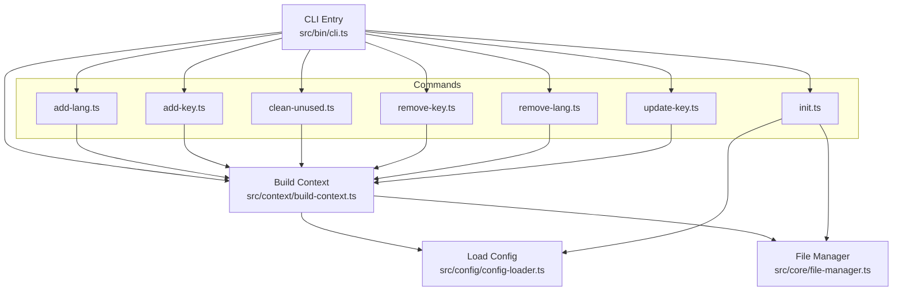

# Getting Started

<cite>
**Referenced Files in This Document**
- [README.md](file://README.md)
- [package.json](file://package.json)
- [src/bin/cli.ts](file://src/bin/cli.ts)
- [src/commands/init.ts](file://src/commands/init.ts)
- [src/commands/add-lang.ts](file://src/commands/add-lang.ts)
- [src/commands/add-key.ts](file://src/commands/add-key.ts)
- [src/commands/clean-unused.ts](file://src/commands/clean-unused.ts)
- [src/commands/remove-lang.ts](file://src/commands/remove-lang.ts)
- [src/commands/remove-key.ts](file://src/commands/remove-key.ts)
- [src/commands/update-key.ts](file://src/commands/update-key.ts)
- [src/context/build-context.ts](file://src/context/build-context.ts)
- [src/config/config-loader.ts](file://src/config/config-loader.ts)
- [src/core/file-manager.ts](file://src/core/file-manager.ts)
- [src/core/key-validator.ts](file://src/core/key-validator.ts)
- [src/core/object-utils.ts](file://src/core/object-utils.ts)
- [src/core/confirmation.ts](file://src/core/confirmation.ts)
</cite>

## Update Summary
**Changes Made**
- Updated installation examples to specify version 1.0.9 for clarity
- Enhanced installation section with explicit version pinning examples
- Maintained all other installation methods and explanations
- Updated version references to align with package.json version 1.0.9

## Table of Contents
1. [Introduction](#introduction)
2. [Installation](#installation)
3. [Quick Start](#quick-start)
4. [Prerequisites](#prerequisites)
5. [Choosing Between Global and Local Installation](#choosing-between-global-and-local-installation)
6. [Step-by-Step Setup](#step-by-step-setup)
7. [Common First-Time Scenarios](#common-first-time-scenarios)
8. [Verification and Troubleshooting](#verification-and-troubleshooting)
9. [Architecture Overview](#architecture-overview)
10. [Conclusion](#conclusion)

## Introduction
i18n-ai-cli is a powerful CLI tool for managing translation files in internationalized applications. It provides AI-powered translation capabilities, automated key management, unused key detection, and flexible configuration options. The tool supports both flat and nested key styles, structural validation to prevent conflicts, and CI-friendly modes for automation.

## Installation
The tool supports multiple installation methods to accommodate different workflow preferences and project requirements. Users can install the latest version 1.0.9 using either method below.

### Global Installation
Install the package globally for system-wide access:

```bash
npm install -g i18n-ai-cli@1.0.9
```

**Benefits:**
- Available from anywhere in your terminal
- No need for npx prefix
- Consistent across projects

**When to use:** Quick access outside of specific projects or when you frequently use the tool across multiple repositories.

### Local Installation
Install as a development dependency within your project:

```bash
npm install --save-dev i18n-ai-cli@1.0.9
```

**Benefits:**
- Keeps tooling scoped to the project
- Ensures reproducible versions across environments
- Ideal for CI/CD pipelines

**When to use:** Projects requiring consistent versions or integration with CI/CD workflows.

### Using Locally Installed Packages

When installed locally, the `i18n-ai-cli` command is not automatically available in your shell PATH. Use one of these methods:

**Option 1: Use npx (Recommended)**
```bash
npx i18n-ai-cli@1.0.9 --help
```

**Option 2: Add a script to your package.json**
```json
{
  "scripts": {
    "i18n": "i18n-ai-cli@1.0.9"
  }
}
```
Then run:
```bash
npm run i18n -- --help
```

**Option 3: Install globally**
```bash
npm install -g i18n-ai-cli@1.0.9
i18n-ai-cli@1.0.9 --help
```

**Section sources**
- [README.md:42-80](file://README.md#L42-L80)
- [package.json:42-47](file://package.json#L42-L47)

## Quick Start
Get up and running quickly with a minimal workflow: initialize configuration, add a language, add a key, and clean unused keys.

### Basic Workflow
```bash
# Initialize configuration
i18n-ai-cli@1.0.9 init

# Add a new language
i18n-ai-cli@1.0.9 add:lang es --from en

# Add a translation key
i18n-ai-cli@1.0.9 add:key welcome.message --value "Welcome to our app"

# Clean up unused keys
i18n-ai-cli@1.0.9 clean:unused
```

### Interactive Initialization
Run the interactive wizard to generate a configuration file with sensible defaults:
```bash
i18n-ai-cli@1.0.9 init
```

### Dry Run Preview
Use the dry run option to preview changes before applying them:
```bash
i18n-ai-cli@1.0.9 clean:unused --dry-run
```

**Section sources**
- [README.md:87-107](file://README.md#L87-L107)
- [README.md:437-450](file://README.md#L437-L450)
- [README.md:519-530](file://README.md#L519-L530)

## Prerequisites
Ensure your environment meets the minimum requirements before installing and using i18n-ai-cli.

### Node.js Version
Development requires Node.js 18+:
```bash
node --version
# Should output 18.x or higher
```

### Package Manager Preference
The project is configured to use npm scripts for building and testing:
```json
{
  "scripts": {
    "build": "tsup",
    "dev": "tsup --watch",
    "test": "vitest",
    "typecheck": "tsc --noEmit"
  }
}
```

### OS Compatibility
The CLI shebang indicates a Unix-like environment:
```typescript
#!/usr/bin/env node
```

**Section sources**
- [README.md:82-86](file://README.md#L82-L86)
- [package.json:42-44](file://package.json#L42-L44)
- [src/bin/cli.ts:1](file://src/bin/cli.ts#L1)

## Choosing Between Global and Local Installation
Select the installation method that best fits your workflow and project needs.

### Global Installation
**Pros:**
- Available system-wide, convenient for ad-hoc tasks
- No npx prefix required
- Consistent across projects

**Cons:**
- Can cause version conflicts across projects
- May lead to inconsistent tool versions

**Use when:** You need quick access outside of a specific project or when working with multiple unrelated projects.

### Local Installation
**Pros:**
- Keeps tooling scoped to the project
- Ensures reproducibility across environments
- Integrates seamlessly with CI/CD pipelines

**Cons:**
- Requires npx to run or script wrapper
- Slightly more setup overhead

**Use when:** You want consistent versions per project, integrate with CI/CD, or work in team environments.

### Binary Mapping
The package exposes a binary mapped to the CLI entry script:
```json
{
  "bin": {
    "i18n-ai-cli": "dist/cli.js"
  }
}
```

**Section sources**
- [package.json:42-47](file://package.json#L42-L47)
- [README.md:44-80](file://README.md#L44-L80)

## Step-by-Step Setup
Follow this step-by-step guide to set up i18n-ai-cli in a new project.

### 1. Initialize Configuration
Run the interactive init wizard to create a configuration file and default locale:
```bash
i18n-ai-cli@1.0.9 init
```

Internally, the init command validates inputs, compiles usage patterns, and optionally creates the default locale file.

### 2. Add a New Language
Add a new locale and optionally clone content from an existing locale:
```bash
i18n-ai-cli@1.0.9 add:lang fr
i18n-ai-cli@1.0.9 add:lang de --from en
```

The command validates the locale code against ISO 639-1 standard and checks for duplicates and existing files.

### 3. Add a Translation Key
Add a new key across all supported locales with a default value:
```bash
i18n-ai-cli@1.0.9 add:key auth.login.title --value "Login"
```

The command validates structural conflicts and applies the key style (flat or nested).

### 4. Clean Unused Keys
Scan source files using configured patterns and remove unused keys from all locales:
```bash
i18n-ai-cli@1.0.9 clean:unused
```

The command compiles usage patterns, scans files, and updates locales accordingly.

### 5. Optional: Update or Remove Keys and Languages
- Update a key's value in a specific locale:
  ```bash
  i18n-ai-cli@1.0.9 update:key auth.login.title --value "Sign In" --locale en
  ```
- Remove a key from all locales:
  ```bash
  i18n-ai-cli@1.0.9 remove:key auth.login.title
  ```
- Remove a language:
  ```bash
  i18n-ai-cli@1.0.9 remove:lang fr
  ```

**Section sources**
- [README.md:188-202](file://README.md#L188-L202)
- [src/commands/init.ts:25-182](file://src/commands/init.ts#L25-L182)
- [src/commands/add-lang.ts:26-98](file://src/commands/add-lang.ts#L26-L98)
- [src/commands/add-key.ts:8-120](file://src/commands/add-key.ts#L8-L120)
- [src/commands/clean-unused.ts:8-138](file://src/commands/clean-unused.ts#L8-L138)

## Common First-Time Scenarios
Demonstrate typical first-time user workflows with practical examples.

### Setting Up a New Project
Initialize configuration and create the default locale file:
```bash
i18n-ai-cli@1.0.9 init
```

### Adding Multiple Languages
Add a new locale and optionally clone from an existing locale:
```bash
i18n-ai-cli@1.0.9 add:lang de --from en
i18n-ai-cli@1.0.9 add:lang fr --from en
```

### Managing Translation Keys
Add a key with a default value and update it later:
```bash
i18n-ai-cli@1.0.9 add:key auth.login.title --value "Login"
i18n-ai-cli@1.0.9 update:key auth.login.title --value "Sign In" --locale en
```

### Cleaning Up Unused Keys
Configure usage patterns and remove keys not found in source files:
```bash
i18n-ai-cli@1.0.9 clean:unused --dry-run
i18n-ai-cli@1.0.9 clean:unused --yes
```

**Section sources**
- [src/commands/init.ts:125-142](file://src/commands/init.ts#L125-L142)
- [src/commands/add-lang.ts:52-60](file://src/commands/add-lang.ts#L52-L60)
- [src/commands/add-key.ts:68-77](file://src/commands/add-key.ts#L68-L77)
- [src/commands/update-key.ts:116-139](file://src/commands/update-key.ts#L116-L139)

## Verification and Troubleshooting
Confirm successful setup and resolve common issues.

### Verify Installation
Check that the CLI is available and shows help:
```bash
npx i18n-ai-cli@1.0.9 --help
# or
i18n-ai-cli@1.0.9 --help
```

### Configuration File Presence
Ensure the configuration file exists in the project root:
```bash
ls -la i18n-cli.config.json
```

### Dry Run and CI Modes
Use dry run to preview changes and CI mode for non-interactive automation:
```bash
# Dry run preview
i18n-ai-cli@1.0.9 clean:unused --dry-run

# CI mode for non-interactive automation
i18n-ai-cli@1.0.9 clean:unused --ci --dry-run
i18n-ai-cli@1.0.9 clean:unused --ci --yes
```

### Common Issues and Resolutions

**Invalid configuration file:**
- Ensure the configuration file contains valid JSON and matches the schema
- Check for syntax errors in the JSON file

**Locale validation failures:**
- Locale codes must be valid and not duplicated
- Use ISO 639-1 standard codes (e.g., `en`, `es`, `fr`) or extended codes (e.g., `en-US`, `pt-BR`)

**Structural conflicts when adding keys:**
- Resolve conflicts between flat and nested key structures
- Check for existing keys that would create conflicts

**Usage patterns not defined:**
- Configure usage patterns for the clean:unused command
- Define regex patterns to detect key usage in source code

**Section sources**
- [README.md:437-468](file://README.md#L437-L468)
- [src/config/config-loader.ts:24-54](file://src/config/config-loader.ts#L24-L54)
- [src/commands/add-lang.ts:36-47](file://src/commands/add-lang.ts#L36-L47)
- [src/config/config-loader.ts:69-82](file://src/config/config-loader.ts#L69-L82)
- [src/core/key-validator.ts:1-33](file://src/core/key-validator.ts#L1-L33)

## Architecture Overview
Understand how i18n-ai-cli is structured and how commands interact with configuration and file management.



**Diagram sources**
- [src/bin/cli.ts:1-209](file://src/bin/cli.ts#L1-L209)
- [src/context/build-context.ts:5-16](file://src/context/build-context.ts#L5-L16)
- [src/config/config-loader.ts:24-67](file://src/config/config-loader.ts#L24-L67)
- [src/core/file-manager.ts:5-118](file://src/core/file-manager.ts#L5-L118)
- [src/commands/init.ts:25-182](file://src/commands/init.ts#L25-L182)
- [src/commands/add-lang.ts:26-98](file://src/commands/add-lang.ts#L26-L98)
- [src/commands/add-key.ts:8-120](file://src/commands/add-key.ts#L8-L120)
- [src/commands/clean-unused.ts:8-138](file://src/commands/clean-unused.ts#L8-L138)

## Conclusion
You now have the essentials to install i18n-ai-cli, choose between global and local setups, and perform the most common first-time tasks. Use the interactive init wizard to bootstrap your configuration, add languages and keys, and keep your translation files tidy with the clean:unused command. For advanced automation, leverage dry run and CI modes to preview and enforce changes in non-interactive environments. The enhanced installation instructions provide multiple pathways to get started quickly, whether you prefer global accessibility or project-scoped tooling. Version 1.0.9 is now available for installation with explicit version pinning support.