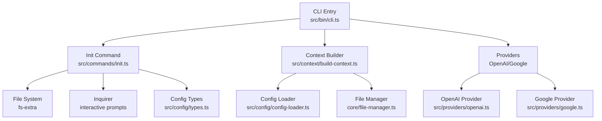

# Installation and Setup

<cite>
**Referenced Files in This Document**
- [package.json](file://package.json)
- [README.md](file://README.md)
- [tsconfig.json](file://tsconfig.json)
- [tsup.config.ts](file://tsup.config.ts)
- [src/bin/cli.ts](file://src/bin/cli.ts)
- [src/commands/init.ts](file://src/commands/init.ts)
- [src/config/config-loader.ts](file://src/config/config-loader.ts)
- [src/config/types.ts](file://src/config/types.ts)
- [src/context/build-context.ts](file://src/context/build-context.ts)
- [src/providers/openai.ts](file://src/providers/openai.ts)
- [src/providers/google.ts](file://src/providers/google.ts)
- [src/core/confirmation.ts](file://src/core/confirmation.ts)
- [unit-testing/commands/init.test.ts](file://unit-testing/commands/init.test.ts)
- [unit-testing/config/config-loader.test.ts](file://unit-testing/config/config-loader.test.ts)
</cite>

## Table of Contents
1. [Introduction](#introduction)
2. [System Requirements](#system-requirements)
3. [Installation Methods](#installation-methods)
4. [Initialization and Configuration](#initialization-and-configuration)
5. [Environment Variables and Provider Setup](#environment-variables-and-provider-setup)
6. [Verification Procedures](#verification-procedures)
7. [Troubleshooting](#troubleshooting)
8. [Architecture Overview](#architecture-overview)
9. [Conclusion](#conclusion)

## Introduction
This document provides comprehensive installation and setup guidance for i18n-ai-cli. It covers all supported installation methods (global npm installation, local development dependency installation, and npx usage), system requirements, platform considerations, initialization with the init command, configuration file creation and validation, environment variable requirements for AI providers, optional setup for translation services, and step-by-step verification procedures to ensure proper installation and setup.

## System Requirements
- Node.js version: 18 or higher
- Operating systems: Windows, macOS, and Linux (all modern POSIX-compliant environments)
- Package manager: npm (tested with npm; yarn may work but is not officially documented)

These requirements are enforced by the project metadata and verified during development and packaging.

**Section sources**
- [package.json:42-44](file://package.json#L42-L44)
- [README.md:30](file://README.md#L30)
- [tsconfig.json:1-25](file://tsconfig.json#L1-L25)

## Installation Methods
You can install and use i18n-ai-cli in multiple ways:

- Global installation (not recommended for most projects)
  - Install globally with npm: npm install -g i18n-ai-cli
  - Invoke globally installed binary: i18n-ai-cli --help

- Local development dependency (recommended)
  - Install as a development dependency: npm install --save-dev i18n-ai-cli
  - Use via npx: npx i18n-ai-cli --help
  - Add to package.json scripts for team-wide usage

- Using npx directly
  - Run without installing: npx i18n-ai-cli --help

Platform-specific considerations:
- Ensure your PATH includes the npm bin directory if using global installation.
- On Unix-like systems, permissions for global binaries are managed by npm; on Windows, ensure your shell has access to the npm bin location.
- When using npx, npm downloads and runs the package without persisting it locally.

Verification tip:
- After installation, run i18n-ai-cli --help to confirm availability and version.

**Section sources**
- [README.md:17-28](file://README.md#L17-L28)
- [package.json:45-47](file://package.json#L45-L47)

## Initialization and Configuration
The init command generates the configuration file and initializes the default locale file.

What init does:
- Creates i18n-cli.config.json in the project root with defaults or interactive prompts.
- Ensures the locales directory exists and creates the default locale file if it does not exist.
- Supports non-interactive modes via flags.

Interactive vs non-interactive:
- Interactive mode prompts for localesPath, defaultLocale, supportedLocales, keyStyle, autoSort, and usagePatterns.
- Non-interactive mode uses sensible defaults and skips prompts.

Important flags:
- -f, --force: Overwrite existing configuration without prompting.
- -y, --yes: Skip confirmation prompts.
- --dry-run: Preview changes without writing files.
- --ci: CI mode; requires explicit --yes to apply changes.

Configuration file structure:
- localesPath: Directory containing translation files.
- defaultLocale: Default/source language code.
- supportedLocales: List of supported language codes (must include defaultLocale).
- keyStyle: "flat" or "nested".
- usagePatterns: Regex patterns to detect key usage.
- autoSort: Boolean to auto-sort keys.

Validation:
- The configuration loader validates presence, JSON validity, required fields, logical consistency (defaultLocale in supportedLocales, no duplicates), and regex usagePatterns correctness.

**Section sources**
- [README.md:54-84](file://README.md#L54-L84)
- [src/commands/init.ts:25-182](file://src/commands/init.ts#L25-L182)
- [src/config/config-loader.ts:24-67](file://src/config/config-loader.ts#L24-L67)
- [src/config/config-loader.ts:84-109](file://src/config/config-loader.ts#L84-L109)
- [src/config/types.ts:3-11](file://src/config/types.ts#L3-L11)
- [unit-testing/commands/init.test.ts:50-317](file://unit-testing/commands/init.test.ts#L50-L317)
- [unit-testing/config/config-loader.test.ts:28-172](file://unit-testing/config/config-loader.test.ts#L28-L172)

## Environment Variables and Provider Setup
Provider selection and environment variables:

- Explicit provider flag takes highest priority:
  - --provider openai or --provider google

- OPENAI_API_KEY environment variable:
  - If set, OpenAI is used automatically when no explicit provider is given.
  - Required for OpenAI; the provider throws if missing.

- Fallback behavior:
  - If OPENAI_API_KEY is not set, Google Translate is used automatically.

- Optional OpenAI configuration:
  - Model selection and base URL can be configured via constructor options (not exposed as environment variables).

- Google Translate:
  - No setup required; uses @vitalets/google-translate-api under the hood.

- CI/CD considerations:
  - In CI mode (--ci), interactive prompts are disabled and confirmation requires --yes.

**Section sources**
- [README.md:268-304](file://README.md#L268-L304)
- [src/bin/cli.ts:82-98](file://src/bin/cli.ts#L82-L98)
- [src/bin/cli.ts:118-136](file://src/bin/cli.ts#L118-L136)
- [src/bin/cli.ts:178-194](file://src/bin/cli.ts#L178-L194)
- [src/providers/openai.ts:14-28](file://src/providers/openai.ts#L14-L28)
- [src/providers/google.ts:13-48](file://src/providers/google.ts#L13-L48)

## Verification Procedures
Follow these steps to verify a successful installation and setup:

1. Verify installation
   - Run: i18n-ai-cli --help
   - Expect to see the CLI help output and version information.

2. Initialize configuration
   - Run: i18n-ai-cli init
   - Confirm i18n-cli.config.json exists in the project root.
   - Confirm the locales directory exists and the default locale file is created.

3. Validate configuration
   - Run: i18n-ai-cli validate
   - Without OPENAI_API_KEY, this uses Google Translate.
   - With OPENAI_API_KEY set, this uses OpenAI.

4. Test translation provider selection
   - Without OPENAI_API_KEY: i18n-ai-cli add:key welcome --value "Welcome" should succeed using Google Translate.
   - With OPENAI_API_KEY set: Same command should succeed using OpenAI.

5. CI mode verification
   - Run: i18n-ai-cli clean:unused --ci --dry-run
   - Run: i18n-ai-cli validate --ci --dry-run
   - To apply changes in CI, add --yes after verifying with --dry-run.

6. Non-interactive setup
   - Run: i18n-ai-cli init --yes
   - Confirm configuration file is created without prompts.

7. Dry-run verification
   - Run: i18n-ai-cli init --dry-run
   - Confirm no files are written.

**Section sources**
- [README.md:32-52](file://README.md#L32-L52)
- [README.md:188-218](file://README.md#L188-L218)
- [README.md:258-266](file://README.md#L258-L266)
- [src/commands/init.ts:170-177](file://src/commands/init.ts#L170-L177)
- [src/context/build-context.ts:5-16](file://src/context/build-context.ts#L5-L16)
- [src/config/config-loader.ts:24-67](file://src/config/config-loader.ts#L24-L67)

## Troubleshooting
Common installation and setup issues:

- Node.js version mismatch
  - Symptom: Errors indicating unsupported engine.
  - Resolution: Upgrade to Node.js 18 or higher.

- Permission problems (global installation)
  - Symptom: Permission denied when running the global binary.
  - Resolution: Use local installation (npm install --save-dev i18n-ai-cli) or fix npm global permissions.

- PATH conflicts (global installation)
  - Symptom: Command not found despite global installation.
  - Resolution: Ensure npm’s bin directory is on PATH; reinstall or rehash shell profile.

- Configuration file already exists
  - Symptom: Error stating i18n-cli.config.json already exists.
  - Resolution: Use --force to overwrite or remove the existing file.

- CI mode requires explicit confirmation
  - Symptom: Error requiring --yes in CI mode.
  - Resolution: Add --yes to approve changes in CI pipelines.

- Invalid configuration file
  - Symptom: Errors about missing fields, invalid JSON, or regex issues.
  - Resolution: Fix i18n-cli.config.json according to validation messages; ensure defaultLocale is included in supportedLocales and usagePatterns contain capturing groups.

- Missing default locale file
  - Symptom: Errors referencing missing default locale file.
  - Resolution: Ensure locales directory exists and default locale file is created during init.

- OpenAI API key missing
  - Symptom: Error stating API key is required.
  - Resolution: Set OPENAI_API_KEY environment variable or explicitly specify --provider google.

- Network or rate limiting with Google Translate
  - Symptom: Failures when using Google Translate.
  - Resolution: Retry later or switch to OpenAI provider.

**Section sources**
- [package.json:42-44](file://package.json#L42-L44)
- [src/commands/init.ts:32-37](file://src/commands/init.ts#L32-L37)
- [src/core/confirmation.ts:20-25](file://src/core/confirmation.ts#L20-L25)
- [src/config/config-loader.ts:27-54](file://src/config/config-loader.ts#L27-L54)
- [src/config/config-loader.ts:84-109](file://src/config/config-loader.ts#L84-L109)
- [src/providers/openai.ts:17-21](file://src/providers/openai.ts#L17-L21)

## Architecture Overview
The CLI orchestrates commands, loads configuration, and delegates to providers for translation. The init command creates configuration and initializes locale files. Validation and other commands depend on loaded configuration.

**Diagram sources**
- [src/bin/cli.ts:18-209](file://src/bin/cli.ts#L18-L209)
- [src/commands/init.ts:25-182](file://src/commands/init.ts#L25-L182)
- [src/context/build-context.ts:5-16](file://src/context/build-context.ts#L5-L16)
- [src/config/config-loader.ts:24-67](file://src/config/config-loader.ts#L24-L67)
- [src/config/types.ts:3-11](file://src/config/types.ts#L3-L11)
- [src/providers/openai.ts:9-60](file://src/providers/openai.ts#L9-L60)
- [src/providers/google.ts:9-50](file://src/providers/google.ts#L9-L50)

## Conclusion
You can install i18n-ai-cli globally or locally (recommended), use npx for one-off runs, and initialize configuration with the init command. Configure environment variables for AI providers as needed, validate your setup with the validate command, and use CI-friendly flags for automation. Follow the verification procedures to ensure everything works as expected, and consult the troubleshooting section for common issues.