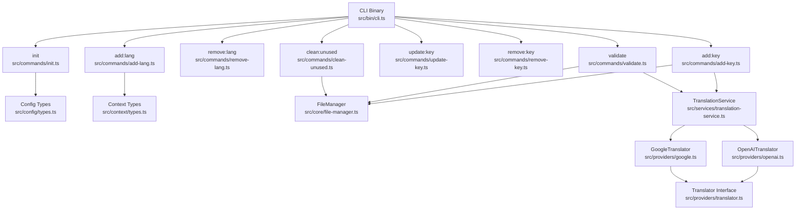
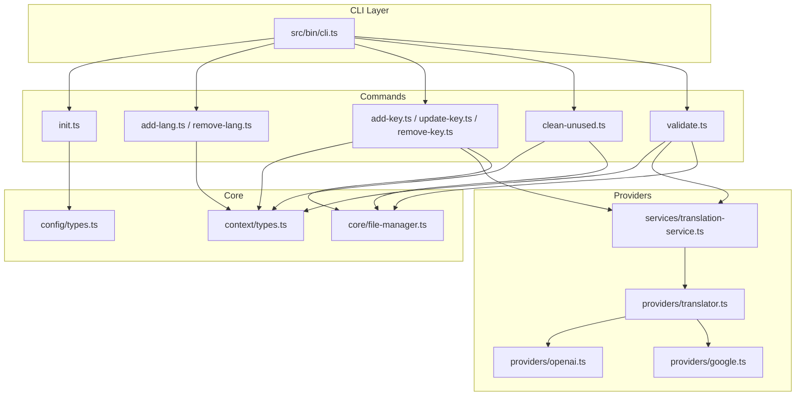
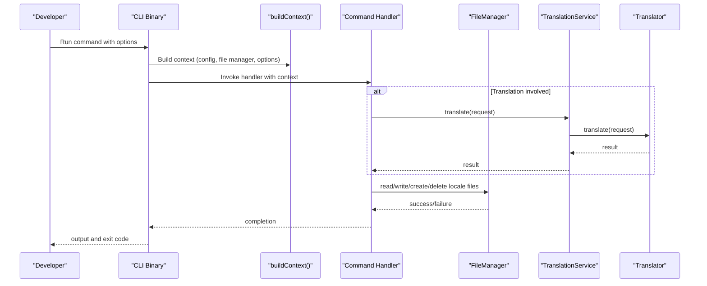
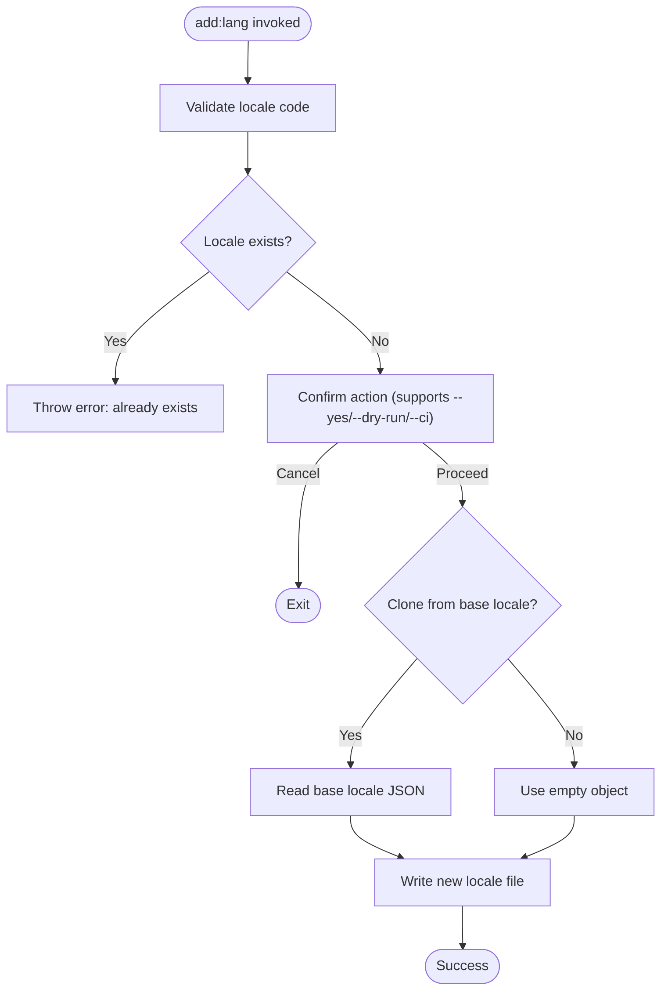
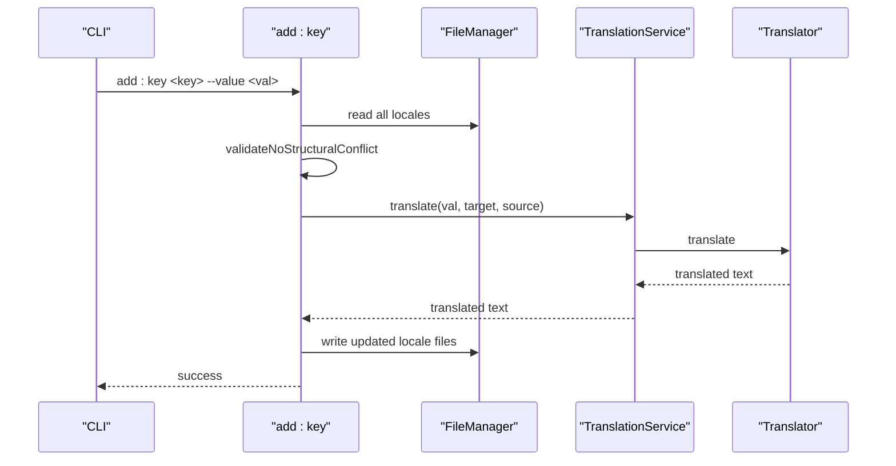
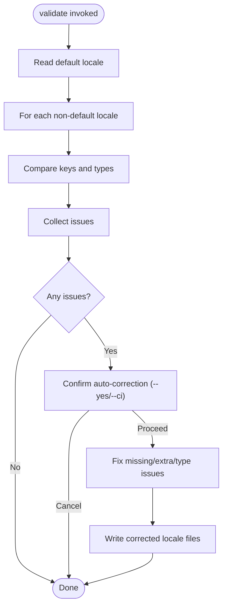
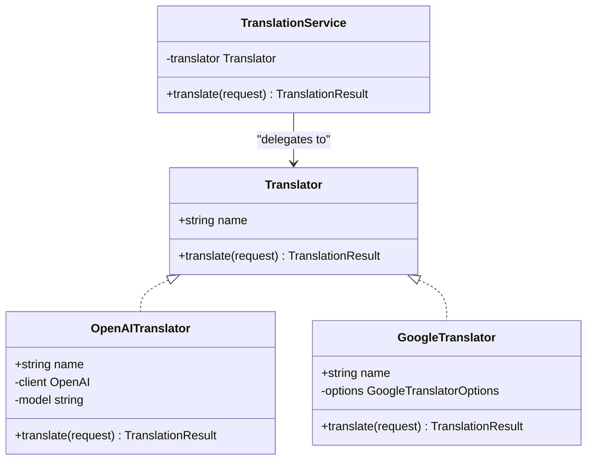
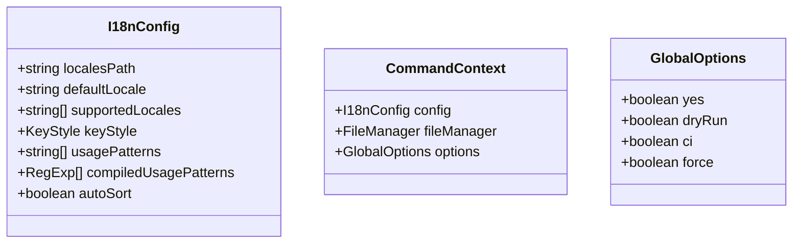
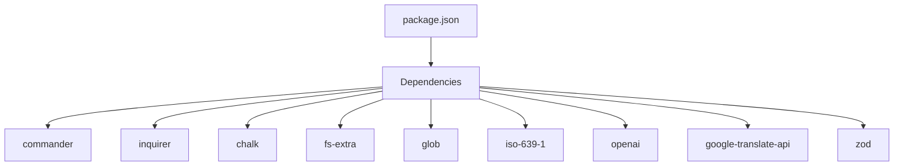

# Project Overview

<cite>
**Referenced Files in This Document**
- [README.md](file://README.md)
- [package.json](file://package.json)
- [src/bin/cli.ts](file://src/bin/cli.ts)
- [src/commands/init.ts](file://src/commands/init.ts)
- [src/commands/add-lang.ts](file://src/commands/add-lang.ts)
- [src/commands/add-key.ts](file://src/commands/add-key.ts)
- [src/commands/validate.ts](file://src/commands/validate.ts)
- [src/commands/clean-unused.ts](file://src/commands/clean-unused.ts)
- [src/config/types.ts](file://src/config/types.ts)
- [src/context/types.ts](file://src/context/types.ts)
- [src/providers/translator.ts](file://src/providers/translator.ts)
- [src/providers/openai.ts](file://src/providers/openai.ts)
- [src/providers/google.ts](file://src/providers/google.ts)
- [src/services/translation-service.ts](file://src/services/translation-service.ts)
- [src/core/file-manager.ts](file://src/core/file-manager.ts)
</cite>

## Table of Contents
1. [Introduction](#introduction)
2. [Project Structure](#project-structure)
3. [Core Components](#core-components)
4. [Architecture Overview](#architecture-overview)
5. [Detailed Component Analysis](#detailed-component-analysis)
6. [Dependency Analysis](#dependency-analysis)
7. [Performance Considerations](#performance-considerations)
8. [Troubleshooting Guide](#troubleshooting-guide)
9. [Conclusion](#conclusion)

## Introduction
i18n-ai-cli is an AI-powered CLI tool designed to streamline internationalization (i18n) workflows for applications that manage translation files. Its mission is to reduce manual effort and human error by automating key tasks such as:
- Automated key management across locales
- Unused key detection and cleanup
- AI-powered translations powered by OpenAI and Google Translate
- Flexible configuration tailored to your project’s structure

The tool integrates seamlessly into development and CI/CD pipelines, offering dry-run previews, non-interactive modes, and robust validation to keep translation files consistent and up-to-date.

## Project Structure
At a high level, the project follows a modular CLI architecture:
- A central CLI binary defines commands and global options
- Commands encapsulate specific operations (init, language management, key operations, validation, cleanup)
- A configuration loader and typed config define project-wide settings
- A context builder shares configuration, file manager, and options across commands
- A provider abstraction enables pluggable translation engines (OpenAI, Google)
- A translation service wraps provider logic for consistent translation requests
- A file manager handles reading, writing, and maintaining locale files

**Diagram sources**
- [src/bin/cli.ts:1-209](file://src/bin/cli.ts#L1-L209)
- [src/commands/init.ts:1-239](file://src/commands/init.ts#L1-L239)
- [src/commands/add-lang.ts:1-98](file://src/commands/add-lang.ts#L1-L98)
- [src/commands/add-key.ts:1-120](file://src/commands/add-key.ts#L1-L120)
- [src/commands/validate.ts:1-254](file://src/commands/validate.ts#L1-L254)
- [src/commands/clean-unused.ts:1-138](file://src/commands/clean-unused.ts#L1-L138)
- [src/config/types.ts:1-12](file://src/config/types.ts#L1-L12)
- [src/context/types.ts:1-15](file://src/context/types.ts#L1-L15)
- [src/services/translation-service.ts:1-18](file://src/services/translation-service.ts#L1-L18)
- [src/providers/openai.ts:1-60](file://src/providers/openai.ts#L1-L60)
- [src/providers/google.ts:1-50](file://src/providers/google.ts#L1-L50)
- [src/providers/translator.ts:1-60](file://src/providers/translator.ts#L1-L60)
- [src/core/file-manager.ts:1-118](file://src/core/file-manager.ts#L1-L118)

**Section sources**
- [README.md:1-381](file://README.md#L1-L381)
- [package.json:1-68](file://package.json#L1-L68)
- [src/bin/cli.ts:1-209](file://src/bin/cli.ts#L1-L209)

## Core Components
- CLI entrypoint and command wiring: Defines commands, global options, and provider selection logic.
- Commands: Encapsulate operations for initialization, language management, key operations, validation, and cleanup.
- Configuration: Typed configuration for locales path, default locale, supported locales, key style, usage patterns, and sorting behavior.
- Context: Provides shared access to configuration, file manager, and parsed global options across commands.
- Translation providers: Abstractions for OpenAI and Google Translate with a unified interface.
- Translation service: Thin wrapper around providers to expose a consistent translation API.
- File manager: Handles reading, writing, creating, deleting, and validating locale files, with optional auto-sorting.

Practical examples (see Usage Reference in README for full commands):
- Initialize configuration and default locale file
- Add a language and optionally clone from an existing locale
- Add a translation key with auto-translation to other locales
- Update a key and optionally sync translations across locales
- Detect and remove unused keys based on configured usage patterns
- Validate files and auto-correct issues (including missing/extra keys and type mismatches)

**Section sources**
- [README.md:85-235](file://README.md#L85-L235)
- [src/bin/cli.ts:18-198](file://src/bin/cli.ts#L18-L198)
- [src/commands/init.ts:25-182](file://src/commands/init.ts#L25-L182)
- [src/commands/add-lang.ts:26-97](file://src/commands/add-lang.ts#L26-L97)
- [src/commands/add-key.ts:8-119](file://src/commands/add-key.ts#L8-L119)
- [src/commands/validate.ts:121-253](file://src/commands/validate.ts#L121-L253)
- [src/commands/clean-unused.ts:8-137](file://src/commands/clean-unused.ts#L8-L137)
- [src/config/types.ts:3-11](file://src/config/types.ts#L3-L11)
- [src/context/types.ts:11-15](file://src/context/types.ts#L11-L15)
- [src/providers/translator.ts:14-17](file://src/providers/translator.ts#L14-L17)
- [src/services/translation-service.ts:7-17](file://src/services/translation-service.ts#L7-L17)
- [src/core/file-manager.ts:5-117](file://src/core/file-manager.ts#L5-L117)

## Architecture Overview
The CLI is organized around a command-driven architecture with a clear separation of concerns:
- CLI binary registers commands and global options
- Each command builds a runtime context (configuration, file manager, options)
- Commands delegate to providers and services for translation and file operations
- Configuration and context types enforce consistency across modules

**Diagram sources**
- [src/bin/cli.ts:1-209](file://src/bin/cli.ts#L1-L209)
- [src/commands/init.ts:1-239](file://src/commands/init.ts#L1-L239)
- [src/commands/add-lang.ts:1-98](file://src/commands/add-lang.ts#L1-L98)
- [src/commands/add-key.ts:1-120](file://src/commands/add-key.ts#L1-L120)
- [src/commands/validate.ts:1-254](file://src/commands/validate.ts#L1-L254)
- [src/commands/clean-unused.ts:1-138](file://src/commands/clean-unused.ts#L1-L138)
- [src/config/types.ts:1-12](file://src/config/types.ts#L1-L12)
- [src/context/types.ts:1-15](file://src/context/types.ts#L1-L15)
- [src/services/translation-service.ts:1-18](file://src/services/translation-service.ts#L1-L18)
- [src/providers/translator.ts:1-60](file://src/providers/translator.ts#L1-L60)
- [src/providers/openai.ts:1-60](file://src/providers/openai.ts#L1-L60)
- [src/providers/google.ts:1-50](file://src/providers/google.ts#L1-L50)
- [src/core/file-manager.ts:1-118](file://src/core/file-manager.ts#L1-L118)

## Detailed Component Analysis

### CLI and Command Wiring
- Registers global options: yes, dry-run, ci, force
- Defines commands: init, add:lang, remove:lang, add:key, update:key, remove:key, clean:unused, validate
- Builds a command context per invocation and delegates to respective handlers
- Selects translation provider based on explicit flag, environment variable, or falls back to Google Translate

**Diagram sources**
- [src/bin/cli.ts:18-198](file://src/bin/cli.ts#L18-L198)
- [src/commands/add-key.ts:67-104](file://src/commands/add-key.ts#L67-L104)
- [src/commands/validate.ts:192-240](file://src/commands/validate.ts#L192-L240)
- [src/services/translation-service.ts:14-16](file://src/services/translation-service.ts#L14-L16)
- [src/providers/openai.ts:30-58](file://src/providers/openai.ts#L30-L58)
- [src/providers/google.ts:17-48](file://src/providers/google.ts#L17-L48)
- [src/core/file-manager.ts:31-61](file://src/core/file-manager.ts#L31-L61)

**Section sources**
- [src/bin/cli.ts:18-198](file://src/bin/cli.ts#L18-L198)

### Language Management
- Validates language codes against ISO standards (accepts both simple and region variants)
- Supports cloning from an existing locale and pre-populating new locale content
- Integrates with configuration to track supported locales and writes locale files

**Diagram sources**
- [src/commands/add-lang.ts:34-96](file://src/commands/add-lang.ts#L34-L96)

**Section sources**
- [src/commands/add-lang.ts:26-97](file://src/commands/add-lang.ts#L26-L97)

### Key Operations
- Add key: Ensures no structural conflicts, translates to other locales, and writes updated files respecting key style (flat/nested)
- Update key: Updates a single key or syncs changes across locales using the selected provider
- Remove key: Removes a key from all supported locales

**Diagram sources**
- [src/commands/add-key.ts:34-104](file://src/commands/add-key.ts#L34-L104)
- [src/services/translation-service.ts:14-16](file://src/services/translation-service.ts#L14-L16)
- [src/providers/openai.ts:30-58](file://src/providers/openai.ts#L30-L58)
- [src/providers/google.ts:17-48](file://src/providers/google.ts#L17-L48)
- [src/core/file-manager.ts:45-61](file://src/core/file-manager.ts#L45-L61)

**Section sources**
- [src/commands/add-key.ts:8-119](file://src/commands/add-key.ts#L8-L119)

### Validation and Cleanup
- Validation compares each locale to the default locale to detect missing keys, extra keys, and type mismatches
- Auto-correction can translate missing/type-mismatched keys or fill with empty strings if no provider is available
- Cleanup scans project files using configured usage patterns to find unused keys and removes them from all locales

**Diagram sources**
- [src/commands/validate.ts:121-253](file://src/commands/validate.ts#L121-L253)

**Section sources**
- [src/commands/validate.ts:11-29](file://src/commands/validate.ts#L11-L29)
- [src/commands/validate.ts:121-253](file://src/commands/validate.ts#L121-L253)

### Translation Providers and Services
- Translator interface defines a uniform contract for translation
- OpenAI provider uses chat completions with a concise system prompt
- Google provider uses a community API for free translations
- TranslationService wraps provider calls for consistent behavior

**Diagram sources**
- [src/providers/translator.ts:14-17](file://src/providers/translator.ts#L14-L17)
- [src/providers/openai.ts:9-58](file://src/providers/openai.ts#L9-L58)
- [src/providers/google.ts:9-48](file://src/providers/google.ts#L9-L48)
- [src/services/translation-service.ts:7-17](file://src/services/translation-service.ts#L7-L17)

**Section sources**
- [src/providers/translator.ts:1-60](file://src/providers/translator.ts#L1-L60)
- [src/providers/openai.ts:1-60](file://src/providers/openai.ts#L1-L60)
- [src/providers/google.ts:1-50](file://src/providers/google.ts#L1-L50)
- [src/services/translation-service.ts:1-18](file://src/services/translation-service.ts#L1-L18)

### Configuration and Context
- Typed configuration includes locales path, default locale, supported locales, key style, usage patterns, compiled patterns, and auto-sort
- Context carries configuration, file manager, and parsed global options to commands

**Diagram sources**
- [src/config/types.ts:3-11](file://src/config/types.ts#L3-L11)
- [src/context/types.ts:4-15](file://src/context/types.ts#L4-L15)

**Section sources**
- [src/config/types.ts:1-12](file://src/config/types.ts#L1-L12)
- [src/context/types.ts:1-15](file://src/context/types.ts#L1-L15)

## Dependency Analysis
External dependencies include:
- Command parsing and UX: commander, inquirer, chalk
- File system operations: fs-extra, glob
- ISO locale validation: iso-639-1
- Translation providers: openai, @vitalets/google-translate-api
- Type validation: zod
- TypeScript toolchain and testing: tsup, typescript, vitest

These dependencies map cleanly to the CLI’s responsibilities:
- CLI argument parsing and prompting
- File system operations and globbing
- Locale validation and translation
- Type-safe configuration and validation

**Diagram sources**
- [package.json:48-59](file://package.json#L48-L59)

**Section sources**
- [package.json:1-68](file://package.json#L1-L68)

## Performance Considerations
- Dry-run mode prevents unnecessary disk writes during planning and CI checks
- Auto-sorting can add overhead when writing large locale files; consider disabling for very large datasets if needed
- Translation calls are asynchronous; batching or rate limiting is handled by provider libraries
- Globbing scans project files; restrict usage patterns to minimize scanning scope

[No sources needed since this section provides general guidance]

## Troubleshooting Guide
Common issues and resolutions:
- Missing or invalid configuration: Use init to generate a configuration file and ensure supported locales include the default locale
- Invalid language code: Ensure codes conform to ISO standards; the tool accepts simple and region variants
- Translation provider errors: Set OPENAI_API_KEY for OpenAI or rely on Google Translate fallback; verify network connectivity
- JSON parsing errors: Validate locale files; the file manager throws descriptive errors for malformed JSON
- CI mode failures: Use --yes to auto-apply changes or --dry-run to preview; --force overrides validation prompts

**Section sources**
- [src/commands/init.ts:32-37](file://src/commands/init.ts#L32-L37)
- [src/commands/add-lang.ts:36-38](file://src/commands/add-lang.ts#L36-L38)
- [src/bin/cli.ts:84-98](file://src/bin/cli.ts#L84-L98)
- [src/core/file-manager.ts:34-42](file://src/core/file-manager.ts#L34-L42)
- [README.md:220-235](file://README.md#L220-L235)

## Conclusion
i18n-ai-cli simplifies internationalization workflows by combining automation, validation, and AI-powered translation into a cohesive CLI. Its modular design, typed configuration, and provider abstraction make it adaptable to diverse projects while maintaining developer ergonomics and CI readiness. Whether you are adding languages, managing keys, detecting unused content, or validating consistency, the tool offers predictable, composable operations backed by robust defaults and flexible options.