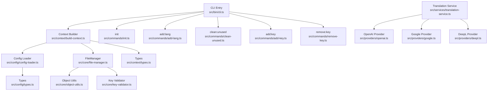
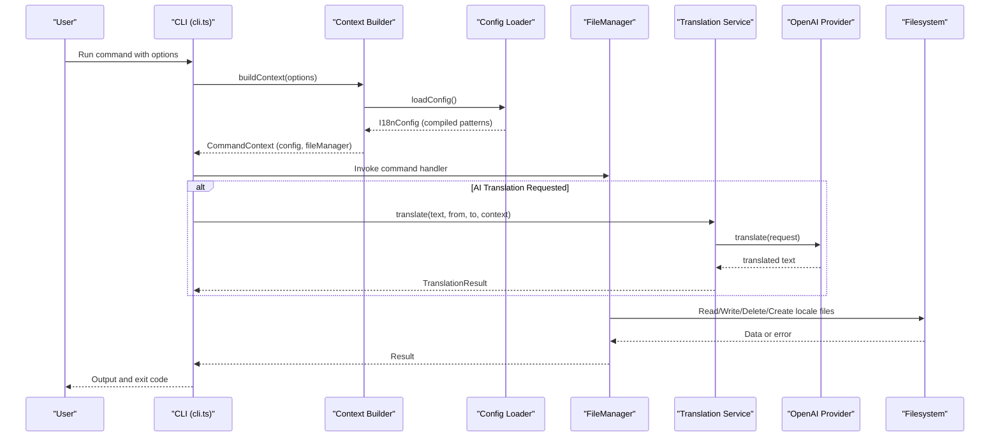
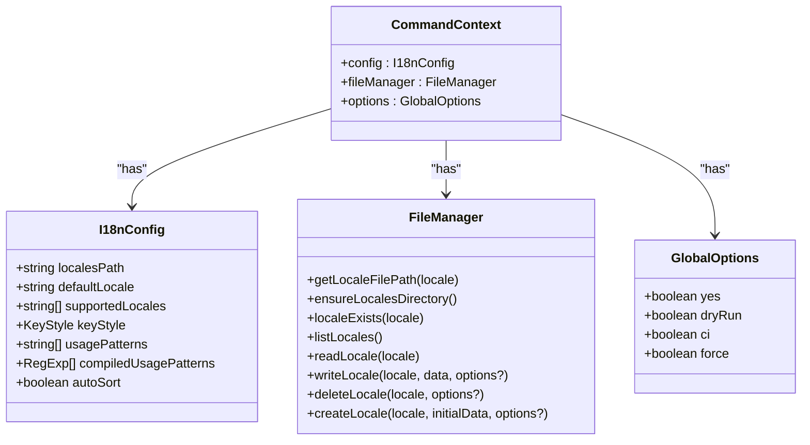
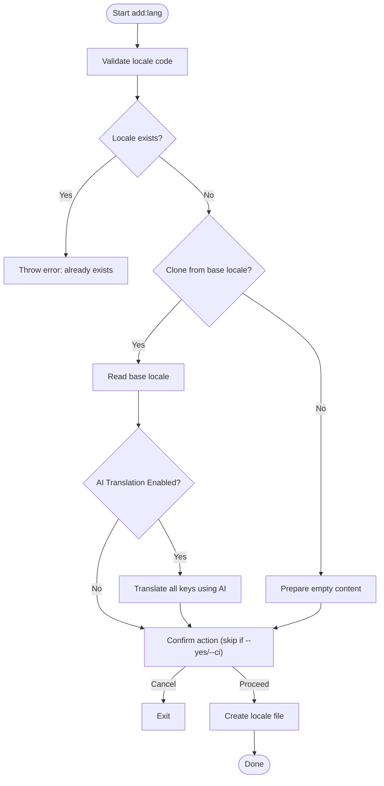
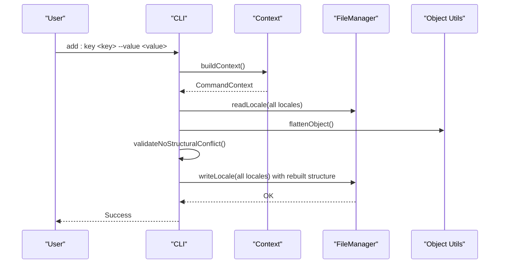
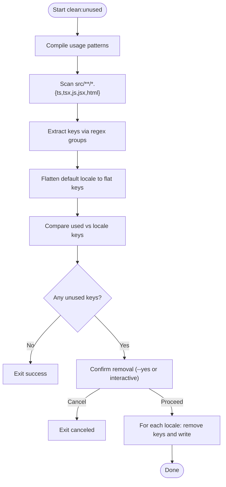
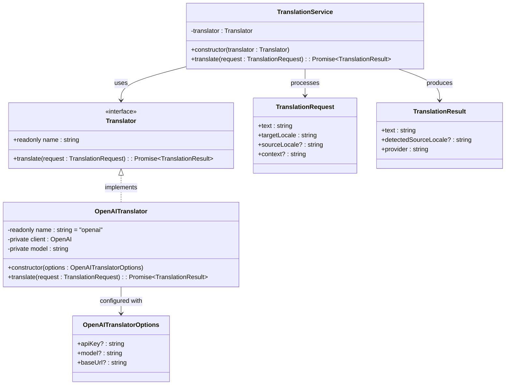
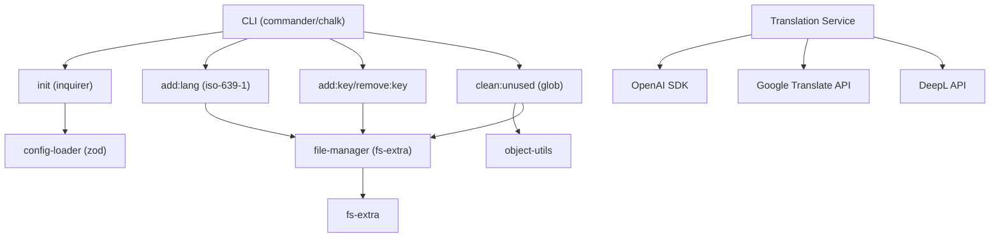

# Project Overview

<cite>
**Referenced Files in This Document**
- [README.md](file://README.md)
- [package.json](file://package.json)
- [package-lock.json](file://package-lock.json)
- [src/bin/cli.ts](file://src/bin/cli.ts)
- [src/config/config-loader.ts](file://src/config/config-loader.ts)
- [src/config/types.ts](file://src/config/types.ts)
- [src/context/build-context.ts](file://src/context/build-context.ts)
- [src/context/types.ts](file://src/context/types.ts)
- [src/core/file-manager.ts](file://src/core/file-manager.ts)
- [src/core/key-validator.ts](file://src/core/key-validator.ts)
- [src/core/object-utils.ts](file://src/core/object-utils.ts)
- [src/commands/init.ts](file://src/commands/init.ts)
- [src/commands/add-lang.ts](file://src/commands/add-lang.ts)
- [src/commands/clean-unused.ts](file://src/commands/clean-unused.ts)
- [src/commands/add-key.ts](file://src/commands/add-key.ts)
- [src/commands/remove-key.ts](file://src/commands/remove-key.ts)
- [src/providers/openai.ts](file://src/providers/openai.ts)
- [src/services/translation-service.ts](file://src/services/translation-service.ts)
- [src/providers/translator.ts](file://src/providers/translator.ts)
</cite>

## Update Summary
**Changes Made**
- Updated version references from 1.0.1 to 1.0.2 throughout the documentation
- Updated CLI version display to reflect the new version
- Updated package.json and package-lock.json version identifiers
- Maintained all existing functionality and architectural descriptions

## Table of Contents
1. [Introduction](#introduction)
2. [Project Structure](#project-structure)
3. [Core Components](#core-components)
4. [Architecture Overview](#architecture-overview)
5. [Detailed Component Analysis](#detailed-component-analysis)
6. [AI-Powered Translation Capabilities](#ai-powered-translation-capabilities)
7. [Dependency Analysis](#dependency-analysis)
8. [Performance Considerations](#performance-considerations)
9. [Troubleshooting Guide](#troubleshooting-guide)
10. [Conclusion](#conclusion)

## Introduction
i18n-ai-cli is a professional AI-powered CLI tool designed to streamline internationalization (i18n) workflows for applications that manage translation files. As the evolution of i18n-pro, this tool introduces cutting-edge AI capabilities while maintaining the robust foundation for automating and simplifying the lifecycle of translation assets across locales.

**Key AI-Powered Value Propositions:**
- **AI-Powered Translation**: Leverage OpenAI GPT models for context-aware, high-quality translations with automatic key cloning and translation workflows
- **Intelligent Key Management**: Enhanced key management with AI-assisted suggestions and validation
- **Smart Cleanup**: Advanced unused key detection with AI-powered context analysis
- **Flexible AI Providers**: Support for multiple translation providers including OpenAI, Google Translate, and DeepL stub implementations

**Traditional Capabilities:**
- Automated key management: Add, update, and remove translation keys consistently across all supported locales
- Unused key detection: Scan source code using configurable usage patterns to identify and remove orphaned translation keys
- Flexible configuration: Define locales path, default locale, supported locales, key styles (flat or nested), usage patterns, and auto-sort behavior
- CI/CD friendly: Non-interactive mode with deterministic exit codes and dry-run previews to prevent unintended changes
- TypeScript foundation: Built with TypeScript for strong typing and developer ergonomics
- Global or local installation: Install globally or locally and use with npx for quick access

**Position in the internationalization ecosystem:**
- Acts as a command-line orchestrator for translation assets with AI assistance, complementing frontend frameworks and backend localization stacks
- Provides structural safeguards (e.g., preventing conflicts between flat and nested key styles) and operational controls (e.g., strict mode, dry runs, CI mode)
- Integrates seamlessly with modern AI translation workflows for enhanced translation quality

## Project Structure
The project follows a modular, feature-oriented layout with enhanced AI capabilities:
- CLI entry point defines commands and global options with AI-aware operations
- Commands encapsulate specific operations (init, add/remove language, add/update/remove key, clean unused)
- Context builds a shared runtime with configuration and file manager
- Core utilities handle file operations, key flattening/unflattening, and structural validation
- Configuration loader validates and compiles user-defined settings
- AI translation services provide context-aware translation capabilities
- Provider system supports multiple translation engines (OpenAI, Google, DeepL)

**Diagram sources**
- [src/bin/cli.ts:1-122](file://src/bin/cli.ts#L1-L122)
- [src/context/build-context.ts:1-16](file://src/context/build-context.ts#L1-L16)
- [src/config/config-loader.ts:1-176](file://src/config/config-loader.ts#L1-L176)
- [src/core/file-manager.ts:1-118](file://src/core/file-manager.ts#L1-L118)
- [src/core/object-utils.ts:1-95](file://src/core/object-utils.ts#L1-L95)
- [src/core/key-validator.ts:1-33](file://src/core/key-validator.ts#L1-L33)
- [src/config/types.ts:1-12](file://src/config/types.ts#L1-L12)
- [src/context/types.ts:1-15](file://src/context/types.ts#L1-L15)
- [src/commands/init.ts:1-236](file://src/commands/init.ts#L1-L236)
- [src/commands/add-lang.ts:1-98](file://src/commands/add-lang.ts#L1-L98)
- [src/commands/clean-unused.ts:1-138](file://src/commands/clean-unused.ts#L1-L138)
- [src/commands/add-key.ts:1-93](file://src/commands/add-key.ts#L1-L93)
- [src/commands/remove-key.ts:1-96](file://src/commands/remove-key.ts#L1-L96)
- [src/services/translation-service.ts:1-18](file://src/services/translation-service.ts#L1-L18)
- [src/providers/openai.ts:1-60](file://src/providers/openai.ts#L1-L60)

**Section sources**
- [README.md:1-499](file://README.md#L1-L499)
- [package.json:1-60](file://package.json#L1-L60)
- [src/bin/cli.ts:1-122](file://src/bin/cli.ts#L1-L122)

## Core Components
- **CLI entrypoint**: Declares commands, global options, and error handling with AI-aware operations. It delegates to command handlers after building a shared context.
- **Context builder**: Loads configuration and instantiates the file manager to provide a consistent runtime for commands.
- **Configuration loader**: Validates and parses the configuration file, compiles usage patterns into regular expressions, and performs logical checks (e.g., default locale inclusion, duplicates).
- **File manager**: Encapsulates filesystem operations for locales, including reading, writing, creating, deleting, and recursive key sorting.
- **Object utilities**: Provide safe flattening/unflattening of nested translation objects and helpers to maintain structural integrity.
- **Key validator**: Enforces structural compatibility when adding keys to prevent conflicts between flat and nested styles.
- **Translation Service**: Orchestrates AI-powered translation operations with provider abstraction.
- **AI Providers**: Implement translation interfaces for different AI services (OpenAI, Google, DeepL).
- **Commands**:
  - **init**: Interactive or non-interactive generation of configuration and default locale initialization.
  - **add:lang**: Adds a new locale with optional cloning from an existing locale and AI-powered translation capabilities.
  - **clean:unused**: Scans source files using compiled usage patterns, computes unused keys, and updates all locales accordingly.
  - **add:key / remove:key**: Manage translation keys across locales with structural validation and optional strict mode.

**Section sources**
- [src/bin/cli.ts:1-122](file://src/bin/cli.ts#L1-L122)
- [src/context/build-context.ts:1-16](file://src/context/build-context.ts#L1-L16)
- [src/config/config-loader.ts:1-176](file://src/config/config-loader.ts#L1-L176)
- [src/core/file-manager.ts:1-118](file://src/core/file-manager.ts#L1-L118)
- [src/core/object-utils.ts:1-95](file://src/core/object-utils.ts#L1-L95)
- [src/core/key-validator.ts:1-33](file://src/core/key-validator.ts#L1-L33)
- [src/commands/init.ts:1-236](file://src/commands/init.ts#L1-L236)
- [src/commands/add-lang.ts:1-98](file://src/commands/add-lang.ts#L1-L98)
- [src/commands/clean-unused.ts:1-138](file://src/commands/clean-unused.ts#L1-L138)
- [src/commands/add-key.ts:1-93](file://src/commands/add-key.ts#L1-L93)
- [src/commands/remove-key.ts:1-96](file://src/commands/remove-key.ts#L1-L96)
- [src/services/translation-service.ts:1-18](file://src/services/translation-service.ts#L1-L18)
- [src/providers/openai.ts:1-60](file://src/providers/openai.ts#L1-L60)

## Architecture Overview
The CLI architecture centers around a command-driven design with AI integration and a shared context:
- The CLI registers commands and global options with AI-aware capabilities.
- Each command receives a context containing configuration and a file manager.
- Commands rely on configuration validation and compiled usage patterns.
- File operations are delegated to the file manager, which ensures consistent key sorting and safe JSON handling.
- AI translation services provide contextual translation capabilities when requested.

**Diagram sources**
- [src/bin/cli.ts:1-122](file://src/bin/cli.ts#L1-L122)
- [src/context/build-context.ts:1-16](file://src/context/build-context.ts#L1-L16)
- [src/config/config-loader.ts:1-176](file://src/config/config-loader.ts#L1-L176)
- [src/core/file-manager.ts:1-118](file://src/core/file-manager.ts#L1-L118)
- [src/services/translation-service.ts:1-18](file://src/services/translation-service.ts#L1-L18)
- [src/providers/openai.ts:1-60](file://src/providers/openai.ts#L1-L60)

## Detailed Component Analysis

### CLI Entry and Global Options
- Registers commands: init, add:lang, remove:lang, add:key, update:key, remove:key, clean:unused.
- Defines global options: skip confirmation, dry-run preview, CI mode, force operations.
- Uses commander for parsing and chalk for colored output.
- Centralizes error handling with exit override.
- **Updated**: Now displays version 1.0.2 and maintains AI-aware operations.

**Section sources**
- [src/bin/cli.ts:1-122](file://src/bin/cli.ts#L1-L122)

### Context and Configuration
- Context provides config, file manager, and global options to all commands.
- Configuration loader validates required fields, default locale inclusion, duplicates, and compiles usage patterns into RegExp instances.
- Types define key styles and configuration shape.

**Diagram sources**
- [src/context/types.ts:1-15](file://src/context/types.ts#L1-L15)
- [src/config/types.ts:1-12](file://src/config/types.ts#L1-L12)
- [src/core/file-manager.ts:1-118](file://src/core/file-manager.ts#L1-L118)

**Section sources**
- [src/context/build-context.ts:1-16](file://src/context/build-context.ts#L1-L16)
- [src/config/config-loader.ts:1-176](file://src/config/config-loader.ts#L1-L176)
- [src/config/types.ts:1-12](file://src/config/types.ts#L1-L12)
- [src/context/types.ts:1-15](file://src/context/types.ts#L1-L15)

### Language Management (add:lang)
- Validates locale codes against ISO 639-1 (accepts language-region forms).
- Optionally clones content from an existing locale.
- Supports CI mode and dry-run previews.
- Emphasizes manual addition of new locales to supportedLocales in configuration.
- **Enhanced**: Now includes AI-powered translation capabilities through the TranslationService integration.

**Diagram sources**
- [src/commands/add-lang.ts:1-98](file://src/commands/add-lang.ts#L1-L98)

**Section sources**
- [src/commands/add-lang.ts:1-98](file://src/commands/add-lang.ts#L1-L98)

### Key Management (add:key, remove:key)
- **add:key**:
  - Validates presence of key and value.
  - Checks structural conflicts for flat/nested styles.
  - Updates all locales; default locale receives the provided value, others receive empty strings.
  - Respects key style and auto-sort settings.
- **remove:key**:
  - Scans all locales to locate keys.
  - Removes keys from all locales and rebuilds structures, pruning empty objects for nested style.

**Diagram sources**
- [src/commands/add-key.ts:1-93](file://src/commands/add-key.ts#L1-L93)
- [src/core/key-validator.ts:1-33](file://src/core/key-validator.ts#L1-L33)
- [src/core/object-utils.ts:1-95](file://src/core/object-utils.ts#L1-L95)
- [src/core/file-manager.ts:1-118](file://src/core/file-manager.ts#L1-L118)

**Section sources**
- [src/commands/add-key.ts:1-93](file://src/commands/add-key.ts#L1-L93)
- [src/commands/remove-key.ts:1-96](file://src/commands/remove-key.ts#L1-L96)
- [src/core/key-validator.ts:1-33](file://src/core/key-validator.ts#L1-L33)
- [src/core/object-utils.ts:1-95](file://src/core/object-utils.ts#L1-L95)
- [src/core/file-manager.ts:1-118](file://src/core/file-manager.ts#L1-L118)

### Unused Key Detection (clean:unused)
- Scans source files matching a set of compiled usage patterns.
- Compares discovered keys with the default locale's flattened keys to compute unused keys.
- Confirms removal and updates all locales, preserving key style and auto-sort behavior.

**Diagram sources**
- [src/commands/clean-unused.ts:1-138](file://src/commands/clean-unused.ts#L1-L138)
- [src/core/object-utils.ts:1-95](file://src/core/object-utils.ts#L1-L95)
- [src/config/config-loader.ts:84-109](file://src/config/config-loader.ts#L84-L109)

**Section sources**
- [src/commands/clean-unused.ts:1-138](file://src/commands/clean-unused.ts#L1-L138)
- [src/core/object-utils.ts:1-95](file://src/core/object-utils.ts#L1-L95)
- [src/config/config-loader.ts:84-109](file://src/config/config-loader.ts#L84-L109)

### Initialization Wizard (init)
- Creates configuration file with interactive prompts or non-interactive defaults.
- Validates supported locales, normalizes entries, and compiles usage patterns.
- Optionally initializes the default locale file if missing.

**Section sources**
- [src/commands/init.ts:1-236](file://src/commands/init.ts#L1-L236)

## AI-Powered Translation Capabilities

### Translation Service Architecture
i18n-ai-cli introduces a sophisticated translation service that provides AI-powered capabilities through a unified interface:

**Diagram sources**
- [src/services/translation-service.ts:1-18](file://src/services/translation-service.ts#L1-L18)
- [src/providers/translator.ts:1-44](file://src/providers/translator.ts#L1-L44)
- [src/providers/openai.ts:1-60](file://src/providers/openai.ts#L1-L60)

### AI Provider Integration
The CLI supports multiple translation providers with OpenAI as the primary AI-powered option:

**OpenAI Integration Features:**
- **Context-Aware Translation**: Uses system messages with source and target locale context
- **Model Flexibility**: Supports various GPT models (gpt-4o, gpt-4o-mini, gpt-4-turbo, gpt-3.5-turbo)
- **Custom Endpoints**: Supports Azure OpenAI and custom OpenAI-compatible APIs
- **Environment Configuration**: Automatic API key detection from environment variables
- **Quality Control**: Temperature settings optimized for translation accuracy

**Provider System Benefits:**
- **Extensible Architecture**: Easy to add new AI providers
- **Consistent Interface**: Unified API across all translation providers
- **Fallback Support**: Graceful degradation when AI services are unavailable
- **Programmatic Access**: Full API access for custom integrations

**Section sources**
- [src/services/translation-service.ts:1-18](file://src/services/translation-service.ts#L1-L18)
- [src/providers/translator.ts:1-44](file://src/providers/translator.ts#L1-L44)
- [src/providers/openai.ts:1-60](file://src/providers/openai.ts#L1-L60)

## Dependency Analysis
- CLI depends on commander for argument parsing, chalk for output, and inquirer for interactive prompts.
- Configuration loading uses zod for schema validation and regex compilation.
- File operations rely on fs-extra for robust JSON handling and glob for file discovery.
- ISO 639-1 validation ensures locale code correctness.
- **Enhanced**: AI translation capabilities depend on OpenAI SDK and environment configuration.

**Diagram sources**
- [src/bin/cli.ts:1-122](file://src/bin/cli.ts#L1-L122)
- [src/commands/init.ts:1-236](file://src/commands/init.ts#L1-L236)
- [src/commands/add-lang.ts:1-98](file://src/commands/add-lang.ts#L1-L98)
- [src/commands/clean-unused.ts:1-138](file://src/commands/clean-unused.ts#L1-L138)
- [src/core/file-manager.ts:1-118](file://src/core/file-manager.ts#L1-L118)
- [src/config/config-loader.ts:1-176](file://src/config/config-loader.ts#L1-L176)
- [src/services/translation-service.ts:1-18](file://src/services/translation-service.ts#L1-L18)
- [src/providers/openai.ts:1-60](file://src/providers/openai.ts#L1-L60)

**Section sources**
- [package.json:1-60](file://package.json#L1-L60)
- [src/bin/cli.ts:1-122](file://src/bin/cli.ts#L1-L122)

## Performance Considerations
- Regex compilation happens once during configuration load; usage patterns are reused across scans.
- File I/O is minimized by reading/writing per locale rather than per key.
- Auto-sorting is recursive but bounded by the size of translation objects; consider disabling for very large files if needed.
- Dry-run mode avoids filesystem writes, enabling fast previews.
- **Enhanced**: AI translation operations are asynchronous and may introduce network latency; consider batching operations for bulk translations.

## Troubleshooting Guide
Common issues and resolutions:
- **Configuration not found or invalid**:
  - Ensure the configuration file exists in the project root and contains valid JSON.
  - Use the initialization wizard to generate a baseline configuration.
- **Invalid locale code**:
  - Locale codes must conform to ISO 639-1 standards; region variants are accepted.
- **Structural conflicts when adding keys**:
  - Avoid creating keys that conflict with existing nested or flat structures.
- **Usage patterns misconfiguration**:
  - Ensure patterns include a capturing group for the key; invalid regex triggers explicit errors.
- **CI mode behavior**:
  - Without --yes, CI mode throws errors instead of applying changes; use --dry-run to preview.
- **AI Translation Issues**:
  - **OpenAI API Key Required**: Ensure OPENAI_API_KEY environment variable is set or apiKey option is provided.
  - **API Key Validation**: Verify the key starts with 'sk-' and has proper permissions.
  - **Rate Limit Exceeded**: Implement backoff strategies or upgrade OpenAI plan.
  - **Model Access**: Verify your account has access to the requested GPT model.

Operational tips:
- Use --dry-run to preview changes before applying.
- Use --ci with --yes to automatically apply changes in pipelines.
- Use --force with init to overwrite existing configuration.
- **AI Integration Tips**: Set OPENAI_API_KEY environment variable for seamless AI operations.

**Section sources**
- [src/config/config-loader.ts:24-67](file://src/config/config-loader.ts#L24-L67)
- [src/commands/add-lang.ts:36-47](file://src/commands/add-lang.ts#L36-L47)
- [src/core/key-validator.ts:1-33](file://src/core/key-validator.ts#L1-L33)
- [src/config/config-loader.ts:84-109](file://src/config/config-loader.ts#L84-L109)
- [src/commands/init.ts:151-156](file://src/commands/init.ts#L151-L156)
- [src/providers/openai.ts:14-28](file://src/providers/openai.ts#L14-L28)

## Conclusion
i18n-ai-cli represents the next evolution of i18n-pro, delivering a robust, AI-powered CLI for managing translation assets across locales. The transformation to an AI-focused tool enhances traditional capabilities with intelligent translation services, while maintaining the command-driven architecture, strong configuration validation, and CI-friendly controls that make it a reliable tool for teams seeking to automate and standardize their i18n workflows.

**Key Advantages of the AI Transformation:**
- **Enhanced Translation Quality**: AI-powered context-aware translations improve accuracy and cultural appropriateness
- **Seamless Integration**: AI capabilities integrate naturally with existing workflows without disrupting established processes
- **Future-Ready Architecture**: Extensible provider system prepares for additional AI services and advanced translation features
- **Developer Experience**: Maintains familiar CLI interface while adding powerful AI capabilities

**Version Information:**
- Current version: 1.0.2 (patch release with no functional changes)
- Maintains backward compatibility with previous versions
- Updated dependency tracking in package-lock.json for consistent package resolution

Whether you are adding languages, managing keys, cleaning unused translations, or leveraging AI-powered translations, i18n-ai-cli provides predictable, safe operations with flexible customization and deterministic behavior in automated environments. The AI integration represents a significant enhancement while preserving the reliability and developer-friendly approach that made the original i18n-pro successful.