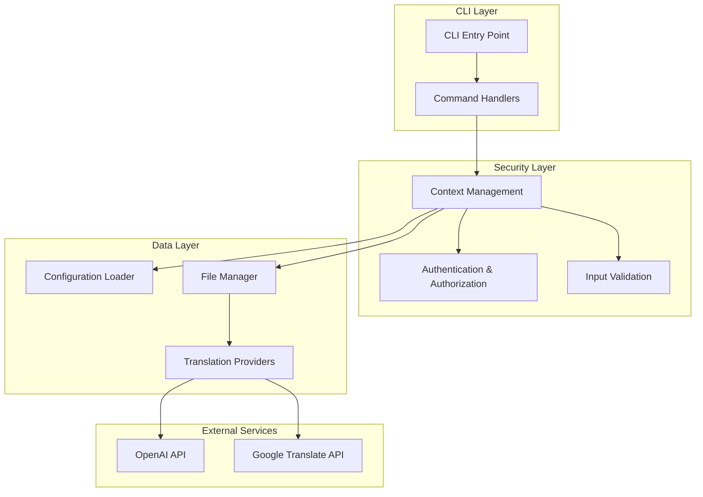
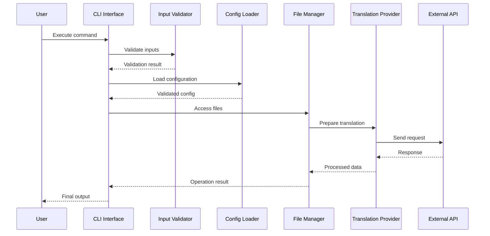
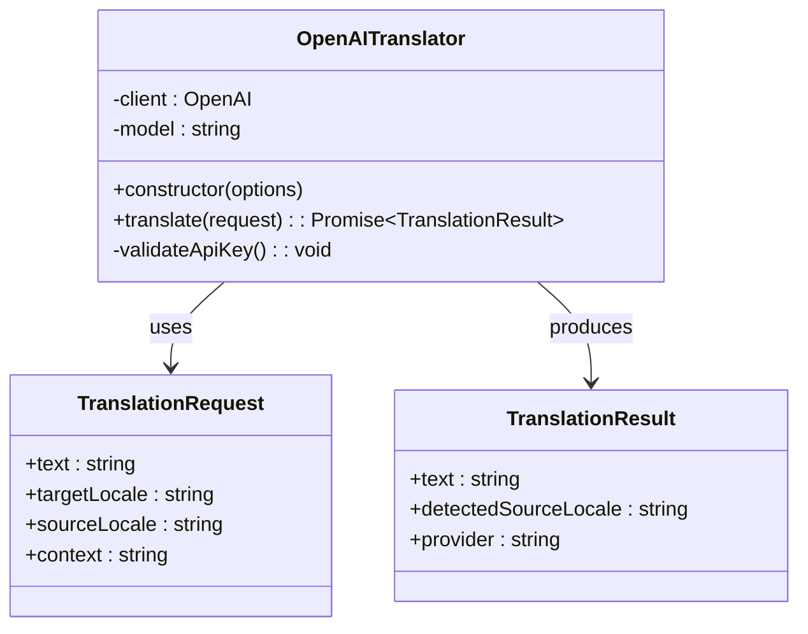
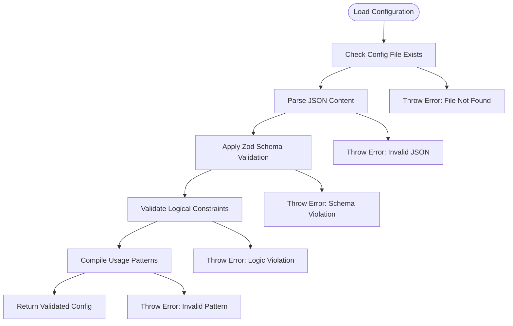
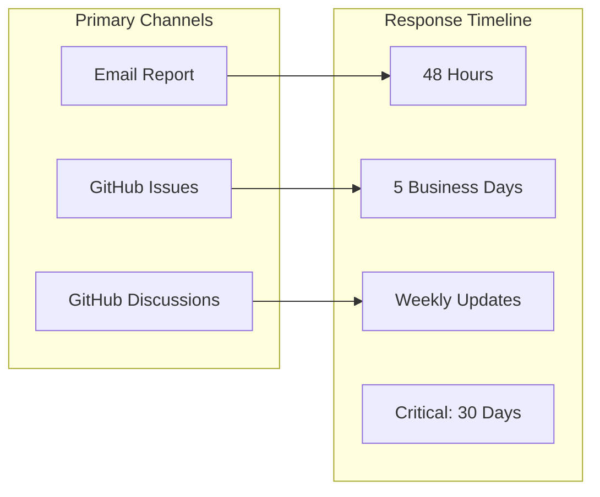
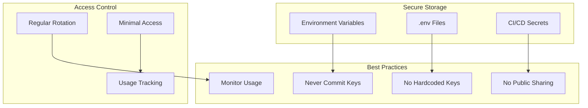
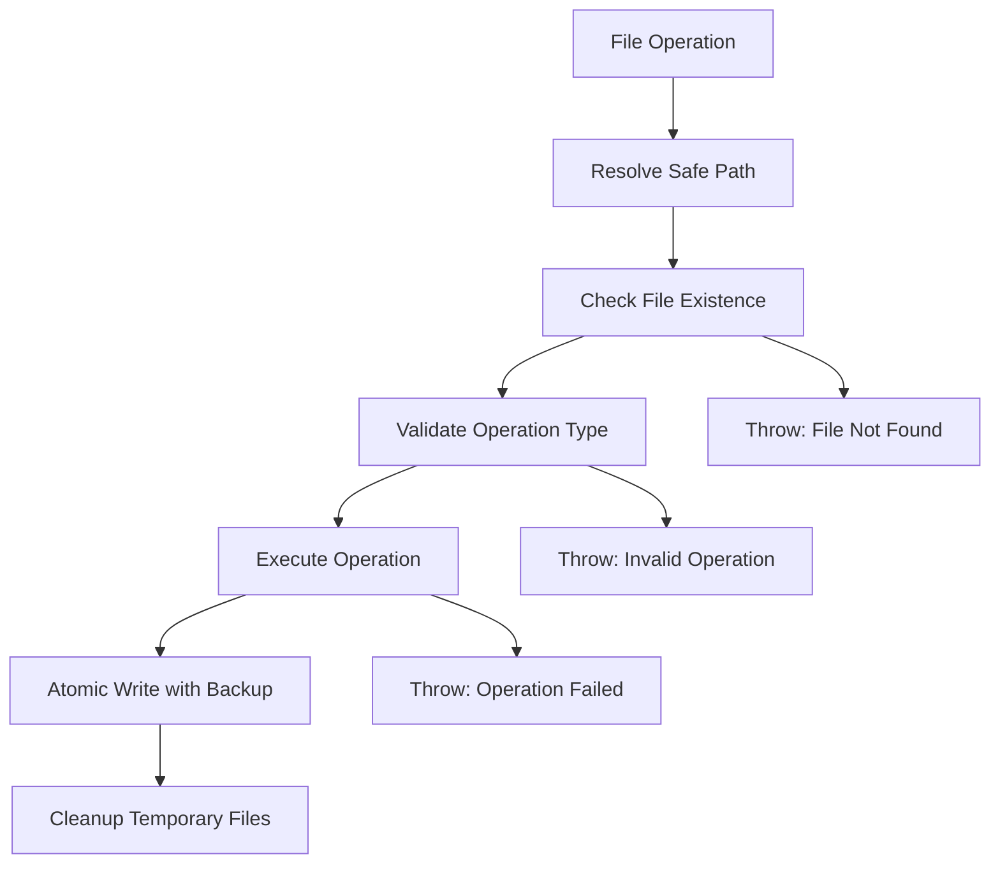
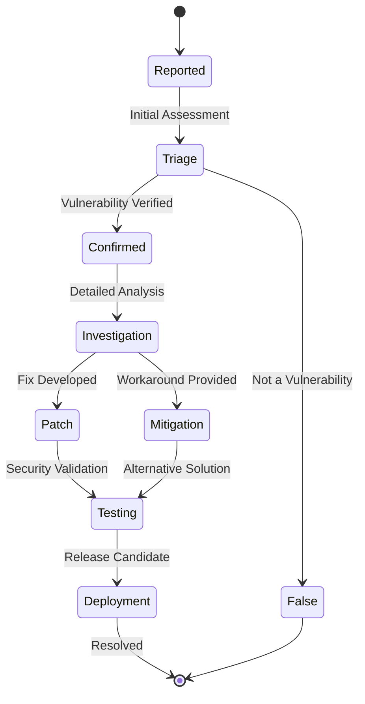

# Security Policy & Vulnerability Reporting

<cite>
**Referenced Files in This Document**
- [SECURITY.md](file://SECURITY.md)
- [README.md](file://README.md)
- [CONTRIBUTING.md](file://CONTRIBUTING.md)
- [CODE_OF_CONDUCT.md](file://CODE_OF_CONDUCT.md)
- [package.json](file://package.json)
- [src/bin/cli.ts](file://src/bin/cli.ts)
- [src/providers/openai.ts](file://src/providers/openai.ts)
- [src/providers/google.ts](file://src/providers/google.ts)
- [src/providers/translator.ts](file://src/providers/translator.ts)
- [src/config/config-loader.ts](file://src/config/config-loader.ts)
- [src/context/build-context.ts](file://src/context/build-context.ts)
- [src/core/file-manager.ts](file://src/core/file-manager.ts)
- [src/core/key-validator.ts](file://src/core/key-validator.ts)
- [src/commands/validate.ts](file://src/commands/validate.ts)
</cite>

## Table of Contents
1. [Introduction](#introduction)
2. [Project Structure](#project-structure)
3. [Core Security Components](#core-security-components)
4. [Architecture Overview](#architecture-overview)
5. [Detailed Security Analysis](#detailed-security-analysis)
6. [Vulnerability Reporting Process](#vulnerability-reporting-process)
7. [Security Best Practices](#security-best-practices)
8. [Dependency Security](#dependency-security)
9. [API Key Management](#api-key-management)
10. [File System Security](#file-system-security)
11. [Data Handling Security](#data-handling-security)
12. [Incident Response](#incident-response)
13. [Security Features](#security-features)
14. [Known Security Considerations](#known-security-considerations)
15. [Legal Compliance](#legal-compliance)
16. [Conclusion](#conclusion)

## Introduction

The i18n-ai-cli Security Policy & Vulnerability Reporting document establishes comprehensive security protocols for protecting user data, maintaining API key confidentiality, and ensuring secure operations across all CLI commands. This policy governs how security vulnerabilities are identified, reported, assessed, and resolved within the internationalization workflow management tool.

The project prioritizes security through multiple layers of protection including input validation, secure API key handling, file system access controls, and transparent vulnerability disclosure processes. All stakeholders, from individual users to enterprise organizations, can trust that their translation data and configuration files are handled with industry-standard security practices.

## Project Structure

The security implementation spans multiple architectural layers within the i18n-ai-cli codebase:

**Diagram sources**
- [src/bin/cli.ts:1-209](file://src/bin/cli.ts#L1-L209)
- [src/context/build-context.ts:1-16](file://src/context/build-context.ts#L1-L16)
- [src/config/config-loader.ts:1-176](file://src/config/config-loader.ts#L1-L176)

**Section sources**
- [src/bin/cli.ts:1-209](file://src/bin/cli.ts#L1-L209)
- [src/context/build-context.ts:1-16](file://src/context/build-context.ts#L1-L16)

## Core Security Components

### Authentication & Authorization

The CLI implements robust authentication mechanisms for external translation services:

- **OpenAI API Key Management**: Secure handling of API keys through environment variables and constructor options
- **Provider Selection Priority**: Automatic fallback mechanisms with explicit override capabilities
- **Environment Variable Validation**: Comprehensive checking for required credentials

### Input Validation & Sanitization

Multiple validation layers protect against malformed inputs and structural conflicts:

- **Configuration Schema Validation**: Zod-based validation for all configuration parameters
- **Language Code Validation**: ISO 639-1 standard compliance for locale codes
- **Key Structure Validation**: Prevention of nested vs flat key conflicts
- **Regex Pattern Validation**: Safe compilation and execution of usage patterns

### File System Security

The file manager implements comprehensive security measures:

- **Path Resolution**: Safe path handling to prevent directory traversal attacks
- **Permission Management**: Controlled read/write operations on locale files
- **Atomic Operations**: Safe file writing with rollback capabilities

**Section sources**
- [src/providers/openai.ts:1-60](file://src/providers/openai.ts#L1-L60)
- [src/providers/google.ts:1-50](file://src/providers/google.ts#L1-L50)
- [src/config/config-loader.ts:1-176](file://src/config/config-loader.ts#L1-L176)
- [src/core/file-manager.ts:1-118](file://src/core/file-manager.ts#L1-L118)

## Architecture Overview

The security architecture follows a multi-layered approach with clear separation of concerns:

**Diagram sources**
- [src/bin/cli.ts:1-209](file://src/bin/cli.ts#L1-L209)
- [src/commands/validate.ts:1-254](file://src/commands/validate.ts#L1-L254)
- [src/providers/translator.ts:1-60](file://src/providers/translator.ts#L1-L60)

## Detailed Security Analysis

### API Key Security Implementation

The OpenAI provider implements comprehensive security measures:

**Diagram sources**
- [src/providers/openai.ts:1-60](file://src/providers/openai.ts#L1-L60)
- [src/providers/translator.ts:1-60](file://src/providers/translator.ts#L1-L60)

### Configuration Security

The configuration loader implements multiple security validation layers:

**Diagram sources**
- [src/config/config-loader.ts:1-176](file://src/config/config-loader.ts#L1-L176)

**Section sources**
- [src/providers/openai.ts:1-60](file://src/providers/openai.ts#L1-L60)
- [src/config/config-loader.ts:1-176](file://src/config/config-loader.ts#L1-L176)

### File System Security Measures

The file manager implements comprehensive security controls:

| Security Aspect | Implementation | Purpose |
|----------------|----------------|---------|
| Path Resolution | Safe path joining with process.cwd() | Prevents directory traversal attacks |
| Atomic Operations | Write to temporary files then rename | Ensures data consistency |
| Permission Checking | Validate file existence before operations | Prevents unauthorized access |
| Recursive Sorting | Safe key sorting with type preservation | Maintains data integrity |

**Section sources**
- [src/core/file-manager.ts:1-118](file://src/core/file-manager.ts#L1-L118)

## Vulnerability Reporting Process

### Reporting Channels

The project supports multiple secure reporting channels:

**Diagram sources**
- [SECURITY.md:12-46](file://SECURITY.md#L12-L46)

### Reporting Requirements

When reporting vulnerabilities, include comprehensive information:

- **Technical Details**: Clear description of the vulnerability and potential impact
- **Reproduction Steps**: Complete, step-by-step instructions to reproduce the issue
- **Affected Versions**: Specific versions impacted by the vulnerability
- **Proof of Concept**: Minimal reproducible example demonstrating the issue
- **Environment Details**: Operating system, Node.js version, and dependency versions

### Response Protocol

The vulnerability response follows a structured timeline:

1. **Acknowledgment**: Within 48 hours of receipt
2. **Initial Assessment**: Within 5 business days for severity classification
3. **Investigation**: Dedicated timeframe based on complexity
4. **Patch Development**: Parallel to investigation for critical issues
5. **Testing**: Comprehensive validation of the fix
6. **Disclosure**: Coordinated release with reporter's consent

**Section sources**
- [SECURITY.md:12-46](file://SECURITY.md#L12-L46)

## Security Best Practices

### API Key Management

The project emphasizes secure API key handling:

**Diagram sources**
- [SECURITY.md:51-68](file://SECURITY.md#L51-L68)

### File Permissions

Implement proper file system security:

- **Locale Files**: Restrict write access to authorized users only
- **Configuration Files**: Protect i18n-cli.config.json with appropriate permissions
- **Source Code**: Ensure clean:unused command operates with minimal required permissions
- **Temporary Files**: Clean up temporary files immediately after use

### Network Security

Protect data transmission:

- **Direct API Calls**: All translation requests go directly to provider APIs
- **No Intermediate Servers**: Eliminates man-in-the-middle attack vectors
- **HTTPS Encryption**: All external communications use encrypted connections
- **Rate Limiting**: Respect provider rate limits to prevent abuse detection

**Section sources**
- [SECURITY.md:70-94](file://SECURITY.md#L70-L94)

## Dependency Security

### Security Auditing

The project maintains secure dependencies through:

- **Regular Audits**: Continuous monitoring via npm audit
- **Automated Updates**: Prompt application of security patches
- **Locked Versions**: Use of package-lock.json for reproducible builds
- **Supply Chain Protection**: Verification of dependency integrity

### Dependency Management

Current security-focused dependencies include:

| Dependency | Purpose | Security Considerations |
|------------|---------|------------------------|
| @vitalets/google-translate-api | Free translation service | MIT license, active maintenance |
| openai | AI-powered translations | Enterprise-grade security, rate limiting |
| commander | CLI framework | Well-maintained, security-reviewed |
| fs-extra | File system operations | Robust error handling, atomic operations |
| zod | Schema validation | Compile-time type safety, runtime validation |

**Section sources**
- [package.json:48-59](file://package.json#L48-L59)

## API Key Management

### OpenAI Integration Security

The OpenAI provider implements comprehensive security measures:

- **Multiple Input Methods**: Environment variables, constructor options, or explicit parameters
- **Runtime Validation**: Immediate validation of API key presence and format
- **Error Handling**: Descriptive error messages without exposing sensitive information
- **Base URL Flexibility**: Support for custom endpoints including Azure OpenAI

### Google Translate Security

The Google Translate provider focuses on:

- **No Authentication Required**: Free service eliminates credential management
- **Rate Limit Awareness**: Built-in handling of provider limitations
- **Privacy Protection**: No data retention beyond translation requests
- **Fallback Capability**: Automatic switching when OpenAI credentials unavailable

**Section sources**
- [src/providers/openai.ts:1-60](file://src/providers/openai.ts#L1-L60)
- [src/providers/google.ts:1-50](file://src/providers/google.ts#L1-L50)

## File System Security

### Safe File Operations

The file manager implements secure file handling:

**Diagram sources**
- [src/core/file-manager.ts:1-118](file://src/core/file-manager.ts#L1-L118)

### Path Security Measures

- **Absolute Path Resolution**: All paths resolved relative to process.cwd()
- **Directory Traversal Prevention**: Input sanitization for all file operations
- **Recursive Directory Creation**: Safe creation of nested directory structures
- **File Extension Validation**: Prevention of double extensions and invalid formats

**Section sources**
- [src/core/file-manager.ts:1-118](file://src/core/file-manager.ts#L1-L118)

## Data Handling Security

### Local Data Processing

The CLI ensures data remains local and secure:

- **Local Processing Only**: All translation operations occur on user's machine
- **No Data Exfiltration**: Translation files are processed locally, never uploaded
- **Memory Management**: Proper cleanup of sensitive data from memory
- **Temporary File Handling**: Secure creation and deletion of temporary files

### Data Validation

Comprehensive validation protects against malformed data:

- **JSON Structure Validation**: Prevents corrupted translation files
- **Key Format Validation**: Ensures proper key naming conventions
- **Type Consistency**: Maintains data type integrity across locales
- **Nested Structure Validation**: Prevents structural conflicts in key hierarchies

**Section sources**
- [SECURITY.md:83-86](file://SECURITY.md#L83-L86)
- [src/core/key-validator.ts:1-33](file://src/core/key-validator.ts#L1-L33)

## Incident Response Process

### Security Incident Classification

The project uses a structured incident response approach:

### Post-Resolution Activities

- **Security Advisory**: Publication of vulnerability details and mitigation steps
- **User Communication**: Notification to affected users with remediation guidance
- **Process Improvement**: Updates to security procedures based on lessons learned
- **Monitoring**: Ongoing surveillance for similar vulnerabilities

**Section sources**
- [SECURITY.md:152-161](file://SECURITY.md#L152-L161)

## Security Features

### Input Validation System

The CLI implements comprehensive input validation:

- **Language Code Validation**: ISO 639-1 standard compliance
- **Key Structure Validation**: Prevention of conflicting key formats
- **JSON Schema Validation**: Complete structure verification
- **Regex Pattern Validation**: Safe compilation and execution of usage patterns

### Confirmation Systems

Multiple confirmation layers prevent accidental destructive operations:

- **Interactive Prompts**: Explicit user confirmation for risky operations
- **Non-Interactive Mode**: Deterministic behavior for automated environments
- **Dry Run Mode**: Preview capability before executing changes
- **Batch Operation Controls**: Safe handling of bulk operations

### Programmatic Security

The library provides secure programmatic interfaces:

- **Type Safety**: Comprehensive TypeScript definitions prevent runtime errors
- **Error Boundaries**: Proper error handling and propagation
- **Resource Management**: Automatic cleanup of resources and connections
- **Logging Security**: Sensitive data redaction in log output

**Section sources**
- [src/core/key-validator.ts:1-33](file://src/core/key-validator.ts#L1-L33)
- [src/commands/validate.ts:1-254](file://src/commands/validate.ts#L1-L254)

## Known Security Considerations

### Translation Provider Limitations

Understanding provider-specific security constraints:

- **OpenAI Rate Limits**: Implementation of retry logic and exponential backoff
- **Google Translate Restrictions**: Awareness of usage quotas and limitations
- **Context Awareness**: Secure handling of contextual information
- **Model Security**: Protection against prompt injection attacks

### File System Access Requirements

The CLI requires specific file system permissions:

- **Read Access**: All locale files must be readable
- **Write Access**: Locale directories must be writable for modifications
- **Configuration Access**: i18n-cli.config.json requires read/write permissions
- **Source Code Scanning**: Clean:unused command requires read access to source files

### External API Security

Third-party service security considerations:

- **API Endpoint Security**: Direct connections to provider APIs eliminate intermediaries
- **Credential Exposure**: Minimization of API key exposure through environment variables
- **Network Security**: HTTPS encryption for all external communications
- **Service Availability**: Graceful handling of provider downtime and rate limiting

**Section sources**
- [SECURITY.md:111-131](file://SECURITY.md#L111-L131)

## Legal Compliance

### Compliance Framework

The project adheres to legal and ethical standards:

- **Responsible Disclosure**: Encourages reporting of vulnerabilities through proper channels
- **No Malicious Use**: Prohibits exploitation of discovered vulnerabilities
- **Compliance with Laws**: Adherence to applicable laws and regulations
- **Intellectual Property**: Respect for third-party intellectual property rights

### Contributor Agreements

All contributors must agree to:

- **Good Faith Reporting**: Honest disclosure of security issues
- **Cooperative Remediation**: Assistance in fixing reported vulnerabilities
- **Non-Disparagement**: Respectful handling of security discussions
- **Legal Compliance**: Adherence to all applicable legal requirements

**Section sources**
- [SECURITY.md:184-192](file://SECURITY.md#L184-L192)

## Conclusion

The i18n-ai-cli security framework provides comprehensive protection through multiple layers of defense, secure API key management, and transparent vulnerability reporting processes. The project's commitment to security is evident in its robust validation systems, secure file handling, and responsible disclosure practices.

Users can confidently use the CLI for managing translation files knowing that their data remains local, API keys are handled securely, and any security issues are addressed through a structured, timely response process. The combination of technical security measures and community-driven security practices creates a reliable foundation for internationalization workflows.

The security policy serves as both a protective framework and a guide for responsible security research, ensuring that the project continues to evolve with emerging security challenges while maintaining its commitment to user privacy and data protection.