# Usage Examples and Workflows

<cite>
**Referenced Files in This Document**
- [README.md](file://README.md)
- [package.json](file://package.json)
- [src/bin/cli.ts](file://src/bin/cli.ts)
- [src/commands/init.ts](file://src/commands/init.ts)
- [src/commands/add-lang.ts](file://src/commands/add-lang.ts)
- [src/commands/remove-lang.ts](file://src/commands/remove-lang.ts)
- [src/commands/add-key.ts](file://src/commands/add-key.ts)
- [src/commands/update-key.ts](file://src/commands/update-key.ts)
- [src/commands/remove-key.ts](file://src/commands/remove-key.ts)
- [src/commands/clean-unused.ts](file://src/commands/clean-unused.ts)
- [src/commands/validate.ts](file://src/commands/validate.ts)
- [src/config/config-loader.ts](file://src/config/config-loader.ts)
- [src/context/build-context.ts](file://src/context/build-context.ts)
- [src/core/file-manager.ts](file://src/core/file-manager.ts)
- [src/providers/translator.ts](file://src/providers/translator.ts)
- [src/providers/openai.ts](file://src/providers/openai.ts)
- [src/providers/google.ts](file://src/providers/google.ts)
- [src/services/translation-service.ts](file://src/services/translation-service.ts)
</cite>

## Table of Contents
1. [Introduction](#introduction)
2. [Project Structure](#project-structure)
3. [Core Components](#core-components)
4. [Architecture Overview](#architecture-overview)
5. [Detailed Component Analysis](#detailed-component-analysis)
6. [Dependency Analysis](#dependency-analysis)
7. [Performance Considerations](#performance-considerations)
8. [Troubleshooting Guide](#troubleshooting-guide)
9. [Conclusion](#conclusion)
10. [Appendices](#appendices)

## Introduction
This document provides comprehensive usage examples and workflows for i18n-ai-cli. It covers end-to-end scenarios such as initial project setup, adding new languages with optional cloning and translation, managing translation keys across development cycles, and maintaining translation consistency. Advanced CI/CD integration patterns are documented, including dry-run modes, automated validation, and batch operations. Best practices for React, Vue, and Node.js projects are included, along with team collaboration and translation management strategies. Troubleshooting steps, performance tips, and migration guidance from manual translation processes are also provided.

## Project Structure
The CLI is organized around a command-driven architecture with clear separation of concerns:
- CLI entrypoint defines commands and global options
- Commands encapsulate workflows for init, language/key operations, validation, and cleanup
- Context builds a shared runtime with loaded config and file manager
- Providers implement translation backends (OpenAI, Google)
- Services and core utilities handle translation orchestration and file operations

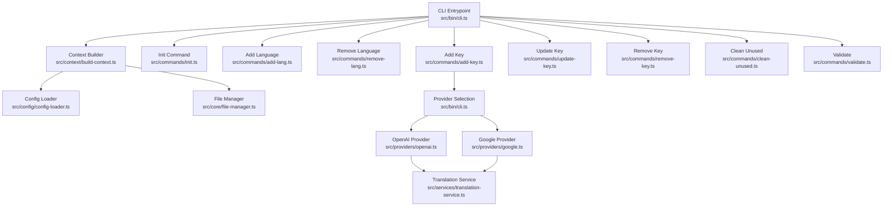

**Diagram sources**
- [src/bin/cli.ts:1-209](file://src/bin/cli.ts#L1-L209)
- [src/context/build-context.ts:1-16](file://src/context/build-context.ts#L1-L16)
- [src/config/config-loader.ts:1-176](file://src/config/config-loader.ts#L1-L176)
- [src/core/file-manager.ts:1-118](file://src/core/file-manager.ts#L1-L118)
- [src/commands/init.ts:1-239](file://src/commands/init.ts#L1-L239)
- [src/commands/add-lang.ts:1-98](file://src/commands/add-lang.ts#L1-L98)
- [src/commands/remove-lang.ts:1-74](file://src/commands/remove-lang.ts#L1-L74)
- [src/commands/add-key.ts:1-120](file://src/commands/add-key.ts#L1-L120)
- [src/commands/update-key.ts:1-178](file://src/commands/update-key.ts#L1-L178)
- [src/commands/remove-key.ts:1-96](file://src/commands/remove-key.ts#L1-L96)
- [src/commands/clean-unused.ts:1-138](file://src/commands/clean-unused.ts#L1-L138)
- [src/commands/validate.ts:1-254](file://src/commands/validate.ts#L1-L254)
- [src/providers/openai.ts:1-60](file://src/providers/openai.ts#L1-L60)
- [src/providers/google.ts:1-50](file://src/providers/google.ts#L1-L50)
- [src/services/translation-service.ts:1-18](file://src/services/translation-service.ts#L1-L18)

**Section sources**
- [README.md:17-52](file://README.md#L17-L52)
- [package.json:1-68](file://package.json#L1-L68)

## Core Components
- CLI Entrypoint: Defines commands, global options, and provider selection logic
- Context Builder: Loads configuration and constructs a FileManager instance
- Commands: Encapsulate workflows for initialization, language/key operations, validation, and cleanup
- Providers: Implement translation interfaces for OpenAI and Google Translate
- Translation Service: Thin wrapper around translators
- File Manager: Reads/writes locale files, ensures directories, sorts keys recursively

Key capabilities:
- AI-powered translation via OpenAI or Google Translate
- Language management with ISO 639-1 validation and optional cloning
- Key management with structural conflict checks and nested/flat key styles
- Validation and auto-correction of missing/extra/type-mismatched keys
- Unused key detection and removal across locales
- Dry-run and CI modes for safe automation

**Section sources**
- [src/bin/cli.ts:25-32](file://src/bin/cli.ts#L25-L32)
- [src/context/build-context.ts:5-16](file://src/context/build-context.ts#L5-L16)
- [src/config/config-loader.ts:24-67](file://src/config/config-loader.ts#L24-L67)
- [src/core/file-manager.ts:31-78](file://src/core/file-manager.ts#L31-L78)
- [src/providers/translator.ts:14-60](file://src/providers/translator.ts#L14-L60)
- [src/services/translation-service.ts:7-17](file://src/services/translation-service.ts#L7-L17)

## Architecture Overview
The CLI follows a layered architecture:
- Presentation Layer: Commander-based CLI with global options
- Application Layer: Commands orchestrate operations and delegate to providers
- Domain Layer: Translation interfaces and services
- Infrastructure Layer: File system operations via FileManager

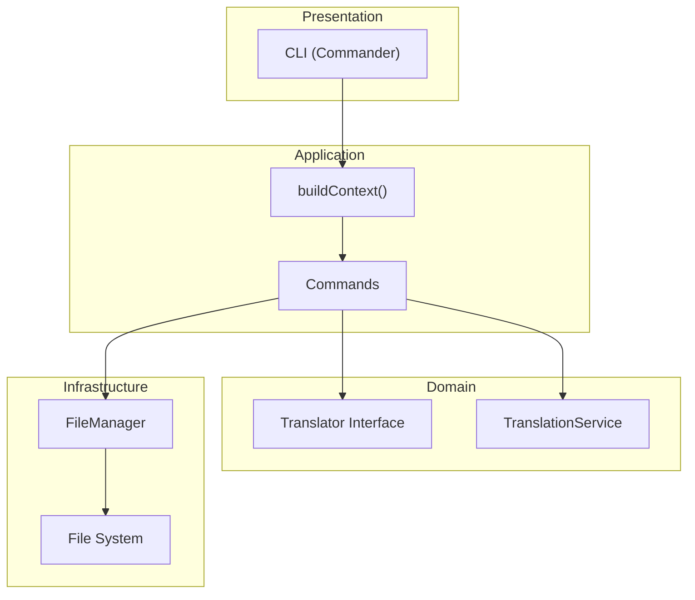

**Diagram sources**
- [src/bin/cli.ts:18-209](file://src/bin/cli.ts#L18-L209)
- [src/context/build-context.ts:5-16](file://src/context/build-context.ts#L5-L16)
- [src/providers/translator.ts:14-17](file://src/providers/translator.ts#L14-L17)
- [src/services/translation-service.ts:7-17](file://src/services/translation-service.ts#L7-L17)
- [src/core/file-manager.ts:5-118](file://src/core/file-manager.ts#L5-L118)

## Detailed Component Analysis

### Initialization Workflow
End-to-end setup for a new project:
- Create configuration file with interactive prompts or defaults
- Initialize locales directory and default locale file
- Compile usage patterns for unused key detection

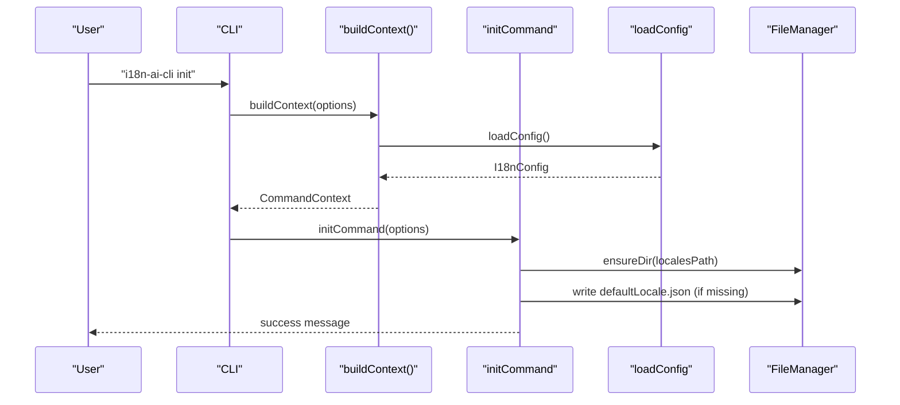

**Diagram sources**
- [src/bin/cli.ts:37-42](file://src/bin/cli.ts#L37-L42)
- [src/context/build-context.ts:5-16](file://src/context/build-context.ts#L5-L16)
- [src/commands/init.ts:25-182](file://src/commands/init.ts#L25-L182)
- [src/core/file-manager.ts:18-20](file://src/core/file-manager.ts#L18-L20)
- [src/core/file-manager.ts:236-238](file://src/core/file-manager.ts#L236-L238)

**Section sources**
- [README.md:32-52](file://README.md#L32-L52)
- [src/commands/init.ts:25-182](file://src/commands/init.ts#L25-L182)

### Adding a New Language
Add a language with optional cloning from an existing locale and validation:
- Validate locale code against ISO 639-1
- Optionally clone base locale content
- Confirm and create locale file
- Note: add to supportedLocales in config manually

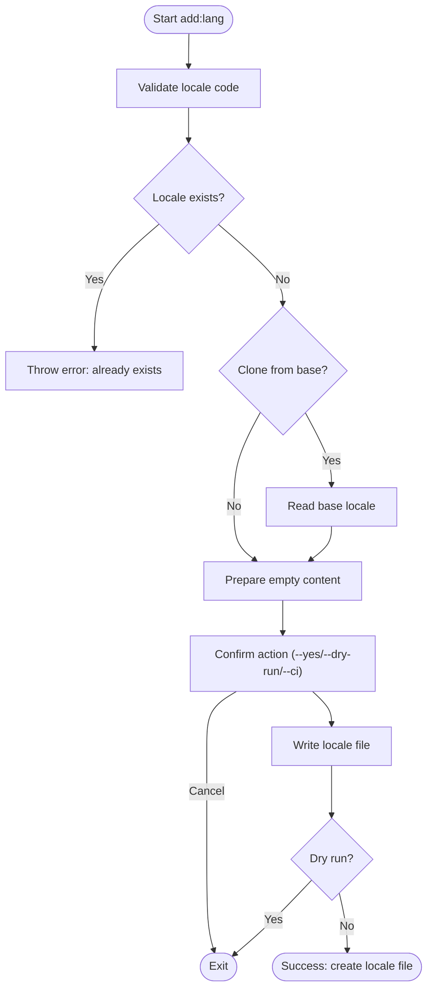

**Diagram sources**
- [src/commands/add-lang.ts:26-98](file://src/commands/add-lang.ts#L26-L98)
- [src/core/file-manager.ts:80-98](file://src/core/file-manager.ts#L80-L98)

**Section sources**
- [README.md:97-118](file://README.md#L97-L118)
- [src/commands/add-lang.ts:26-98](file://src/commands/add-lang.ts#L26-L98)

### Removing a Language
Safe removal of a language file with safeguards:
- Verify locale is supported and not default
- Confirm deletion
- Delete file and inform manual config update

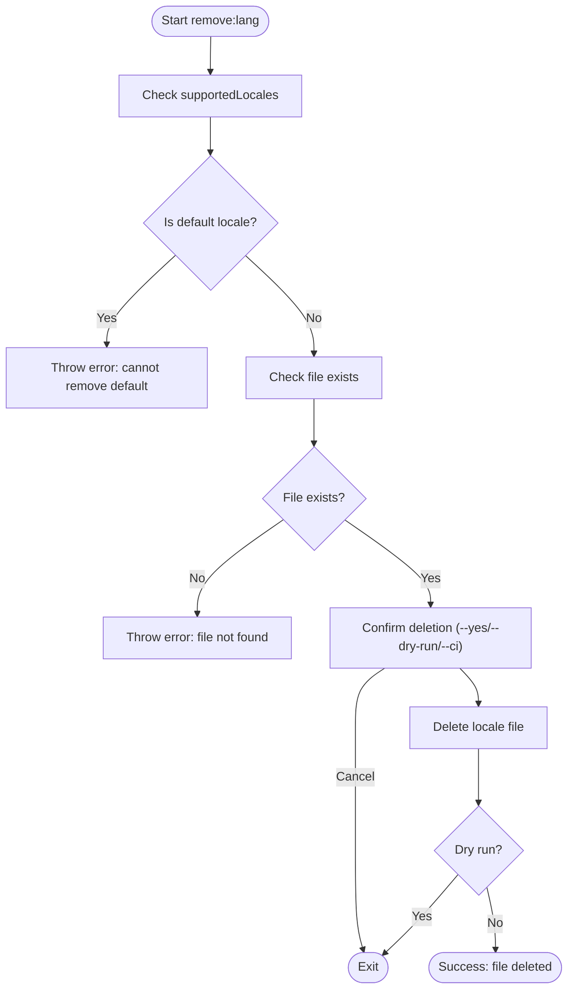

**Diagram sources**
- [src/commands/remove-lang.ts:5-74](file://src/commands/remove-lang.ts#L5-L74)
- [src/core/file-manager.ts:63-78](file://src/core/file-manager.ts#L63-L78)

**Section sources**
- [README.md:118-131](file://README.md#L118-L131)
- [src/commands/remove-lang.ts:5-74](file://src/commands/remove-lang.ts#L5-L74)

### Adding a Translation Key
Add a key to all locales with optional AI translation:
- Validate key does not exist in any locale
- Confirm operation
- Translate value per locale (default locale receives provided value)
- Write updated locale files

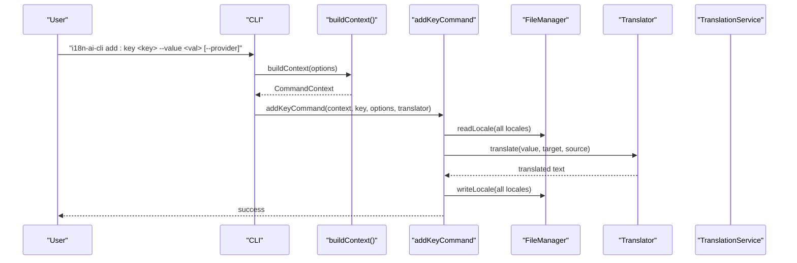

**Diagram sources**
- [src/bin/cli.ts:70-102](file://src/bin/cli.ts#L70-L102)
- [src/commands/add-key.ts:8-120](file://src/commands/add-key.ts#L8-L120)
- [src/providers/translator.ts:14-17](file://src/providers/translator.ts#L14-L17)
- [src/services/translation-service.ts:7-17](file://src/services/translation-service.ts#L7-L17)
- [src/core/file-manager.ts:31-61](file://src/core/file-manager.ts#L31-L61)

**Section sources**
- [README.md:133-152](file://README.md#L133-L152)
- [src/commands/add-key.ts:8-120](file://src/commands/add-key.ts#L8-L120)

### Updating a Translation Key
Update a key with optional synchronization across locales:
- Validate target locale and key presence
- Show old/new values
- Optional sync mode translates to all other locales
- Confirm and write updated files

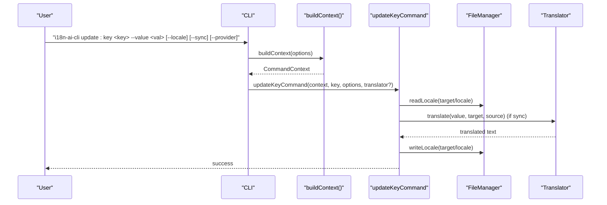

**Diagram sources**
- [src/bin/cli.ts:104-140](file://src/bin/cli.ts#L104-L140)
- [src/commands/update-key.ts:17-178](file://src/commands/update-key.ts#L17-L178)
- [src/providers/translator.ts:14-17](file://src/providers/translator.ts#L14-L17)
- [src/core/file-manager.ts:31-61](file://src/core/file-manager.ts#L31-L61)

**Section sources**
- [README.md:153-174](file://README.md#L153-L174)
- [src/commands/update-key.ts:17-178](file://src/commands/update-key.ts#L17-L178)

### Removing a Translation Key
Remove a key from all locales with safety checks:
- Verify key exists in any locale
- Confirm bulk removal
- Remove key and rebuild locale files

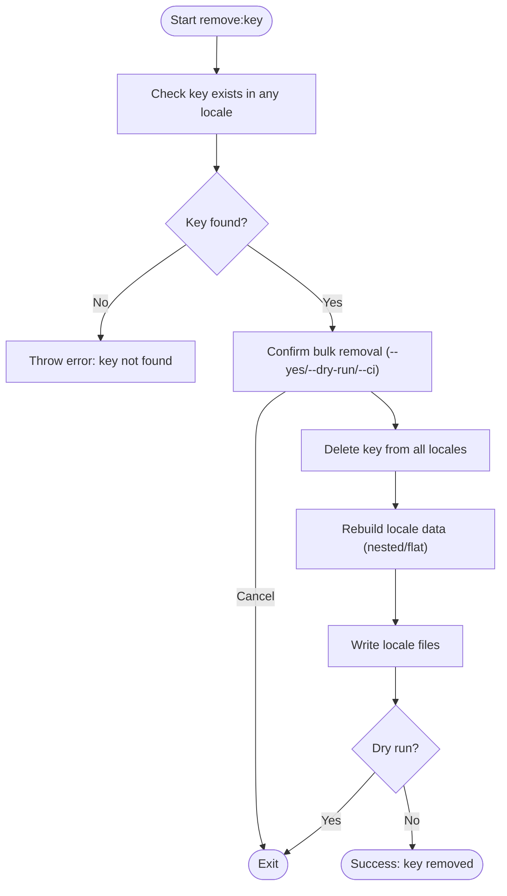

**Diagram sources**
- [src/commands/remove-key.ts:10-96](file://src/commands/remove-key.ts#L10-L96)
- [src/core/file-manager.ts:31-61](file://src/core/file-manager.ts#L31-L61)

**Section sources**
- [README.md:175-187](file://README.md#L175-L187)
- [src/commands/remove-key.ts:10-96](file://src/commands/remove-key.ts#L10-L96)

### Cleaning Unused Keys
Scan project files and remove unused keys from all locales:
- Compile usage patterns from config
- Glob source files and extract keys
- Compare with default locale keys
- Confirm and remove from all locales

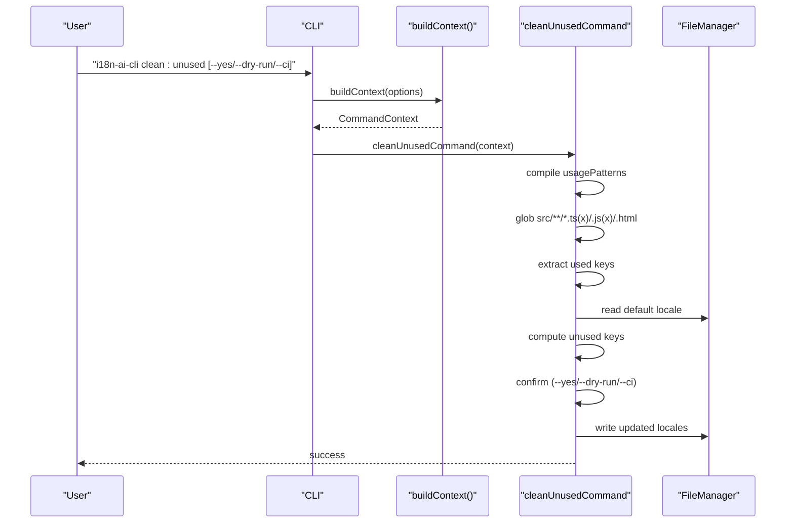

**Diagram sources**
- [src/bin/cli.ts:153-162](file://src/bin/cli.ts#L153-L162)
- [src/commands/clean-unused.ts:8-138](file://src/commands/clean-unused.ts#L8-L138)
- [src/config/config-loader.ts:84-109](file://src/config/config-loader.ts#L84-L109)
- [src/core/file-manager.ts:31-61](file://src/core/file-manager.ts#L31-L61)

**Section sources**
- [README.md:210-219](file://README.md#L210-L219)
- [src/commands/clean-unused.ts:8-138](file://src/commands/clean-unused.ts#L8-L138)

### Validating Translation Files
Validate locales against the default locale and auto-correct issues:
- Flatten default locale as reference
- Compare other locales for missing/extra/type mismatches
- Print report and confirm auto-correction
- Translate missing/type-mismatched keys if provider configured

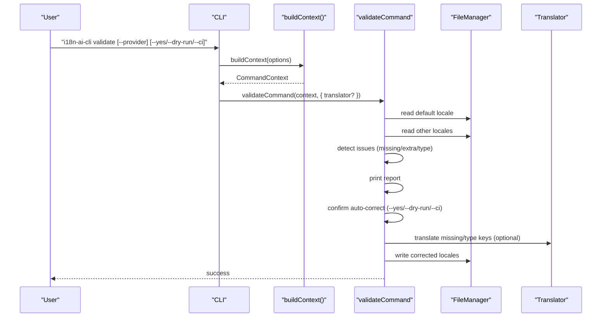

**Diagram sources**
- [src/bin/cli.ts:164-198](file://src/bin/cli.ts#L164-L198)
- [src/commands/validate.ts:121-254](file://src/commands/validate.ts#L121-L254)
- [src/providers/translator.ts:14-17](file://src/providers/translator.ts#L14-L17)
- [src/core/file-manager.ts:31-61](file://src/core/file-manager.ts#L31-L61)

**Section sources**
- [README.md:190-209](file://README.md#L190-L209)
- [src/commands/validate.ts:121-254](file://src/commands/validate.ts#L121-L254)

### Provider Selection and Translation
Provider resolution order:
- Explicit provider flag takes precedence
- Environment variable for OpenAI API key
- Fallback to Google Translate

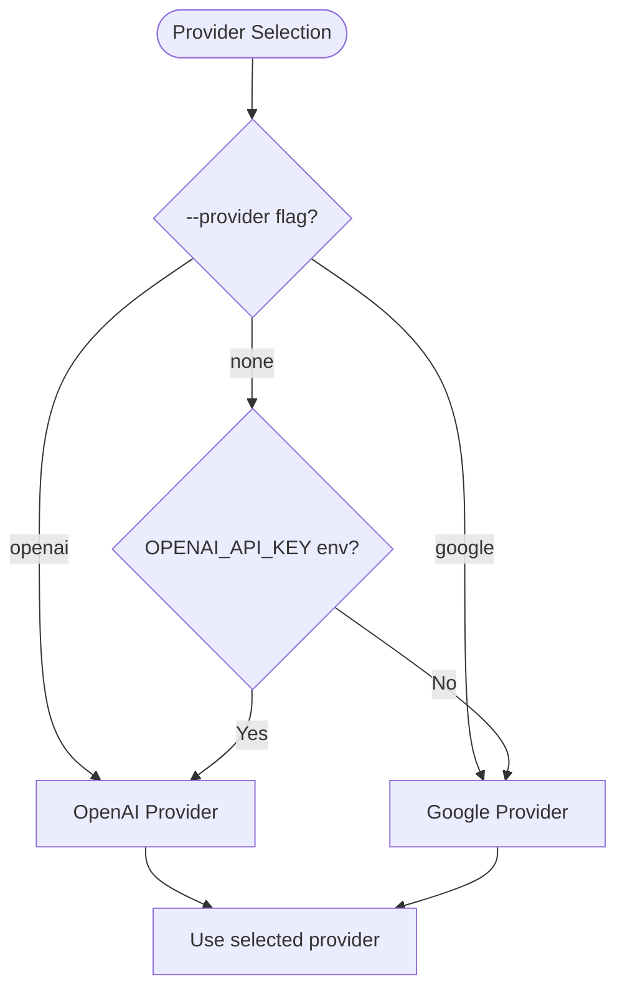

**Diagram sources**
- [src/bin/cli.ts:82-98](file://src/bin/cli.ts#L82-L98)
- [src/bin/cli.ts:118-136](file://src/bin/cli.ts#L118-L136)
- [src/bin/cli.ts:178-194](file://src/bin/cli.ts#L178-L194)
- [src/providers/openai.ts:14-28](file://src/providers/openai.ts#L14-L28)
- [src/providers/google.ts:13-48](file://src/providers/google.ts#L13-L48)

**Section sources**
- [README.md:277-282](file://README.md#L277-L282)
- [src/bin/cli.ts:82-98](file://src/bin/cli.ts#L82-L98)
- [src/bin/cli.ts:118-136](file://src/bin/cli.ts#L118-L136)
- [src/bin/cli.ts:178-194](file://src/bin/cli.ts#L178-L194)

## Dependency Analysis
High-level dependencies among core modules:

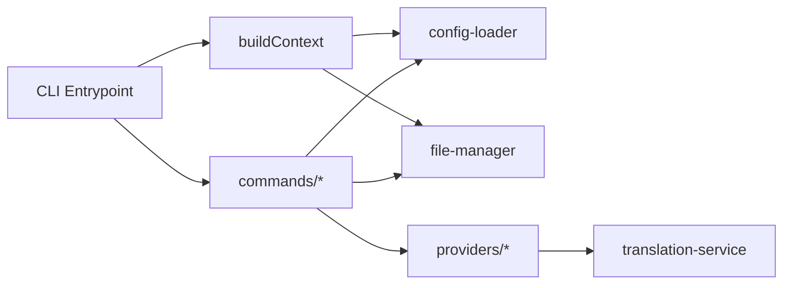

**Diagram sources**
- [src/bin/cli.ts:18-209](file://src/bin/cli.ts#L18-L209)
- [src/context/build-context.ts:5-16](file://src/context/build-context.ts#L5-L16)
- [src/config/config-loader.ts:24-67](file://src/config/config-loader.ts#L24-L67)
- [src/core/file-manager.ts:5-118](file://src/core/file-manager.ts#L5-L118)
- [src/providers/translator.ts:14-17](file://src/providers/translator.ts#L14-L17)
- [src/services/translation-service.ts:7-17](file://src/services/translation-service.ts#L7-L17)

**Section sources**
- [package.json:48-66](file://package.json#L48-L66)

## Performance Considerations
- Use dry-run mode to preview changes before applying them in CI/CD pipelines
- Prefer flat key style for simpler diffs and faster processing when appropriate
- Limit usagePatterns to precise regex captures to reduce scanning overhead
- Batch operations: combine validate and clean:unused in CI to minimize repeated scans
- Cache translation results externally if running frequent validations in short intervals
- Avoid overly broad glob patterns in source scanning to limit I/O

[No sources needed since this section provides general guidance]

## Troubleshooting Guide
Common issues and resolutions:
- Configuration not found: Ensure i18n-cli.config.json exists in project root; run init if missing
- Invalid locale code: Use ISO 639-1 codes or language-region variants; validation rejects invalid formats
- Key already exists: Use update:key instead of add:key for existing keys
- Locale file not found: Verify localesPath and that the file exists
- Missing usagePatterns: Define usagePatterns in config or rely on defaults
- CI mode failures: Re-run with --yes to apply changes or --dry-run to preview
- Provider errors: Set OPENAI_API_KEY or choose google provider; verify network connectivity

**Section sources**
- [src/config/config-loader.ts:24-67](file://src/config/config-loader.ts#L24-L67)
- [src/commands/add-lang.ts:36-47](file://src/commands/add-lang.ts#L36-L47)
- [src/commands/add-key.ts:37-44](file://src/commands/add-key.ts#L37-L44)
- [src/core/file-manager.ts:34-43](file://src/core/file-manager.ts#L34-L43)
- [src/commands/clean-unused.ts:19-23](file://src/commands/clean-unused.ts#L19-L23)
- [src/bin/cli.ts:200-209](file://src/bin/cli.ts#L200-L209)
- [src/providers/openai.ts:17-21](file://src/providers/openai.ts#L17-L21)

## Conclusion
i18n-ai-cli streamlines internationalization workflows with AI-powered translation, robust validation, and safe automation. By leveraging dry-run and CI modes, teams can integrate reliable translation maintenance into their development lifecycle. The modular architecture supports extensibility and safe experimentation with translation providers and configuration strategies.

[No sources needed since this section summarizes without analyzing specific files]

## Appendices

### Command Syntax and Options Reference
- Global options: --yes, --dry-run, --ci, -f/--force
- init: create configuration and initialize default locale file
- add:lang: add new language, optional --from base locale, --strict, --dry-run
- remove:lang: remove language file, --dry-run
- add:key: add key to all locales, --value required, optional --provider
- update:key: update key, --value required, --locale, --sync, optional --provider
- remove:key: remove key from all locales
- clean:unused: scan and remove unused keys, --dry-run
- validate: validate and auto-correct, optional --provider

**Section sources**
- [README.md:93-235](file://README.md#L93-L235)
- [src/bin/cli.ts:25-32](file://src/bin/cli.ts#L25-L32)

### CI/CD Integration Patterns
- Dry-run checks: run clean:unused --ci --dry-run and validate --ci --dry-run to preview changes
- Automated correction: run clean:unused --ci --yes and validate --ci --yes to apply corrections
- Provider configuration: set OPENAI_API_KEY for OpenAI or rely on Google Translate fallback

**Section sources**
- [README.md:258-267](file://README.md#L258-L267)

### Best Practices by Project Type
- React/Vue: Configure usagePatterns to match your framework’s translation helpers; keep patterns precise to avoid false positives
- Node.js: Ensure usagePatterns capture server-side translation calls; validate frequently during development
- Team collaboration: Establish a single source of truth for default locale; enforce PR reviews for translation changes; use --dry-run for peer review

[No sources needed since this section provides general guidance]

### Migration from Manual Translation Processes
- Generate initial configuration and default locale file
- Add new keys via add:key to populate all locales consistently
- Use validate to detect and auto-correct drift after feature branches merge
- Automate clean:unused to prune orphaned keys post-refactoring
- Integrate --dry-run into pre-commit hooks for early detection

**Section sources**
- [README.md:236-257](file://README.md#L236-L257)