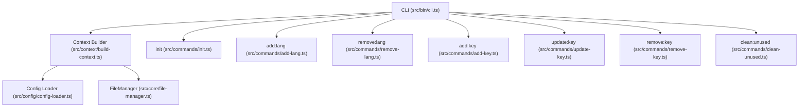
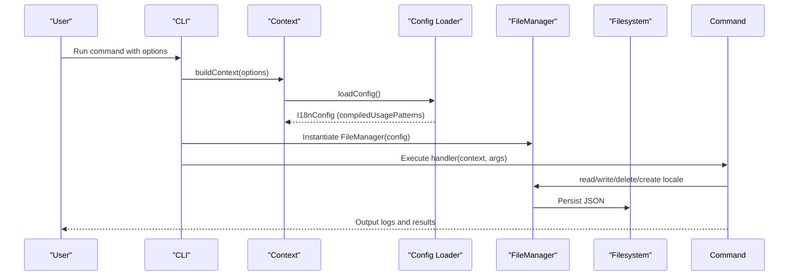
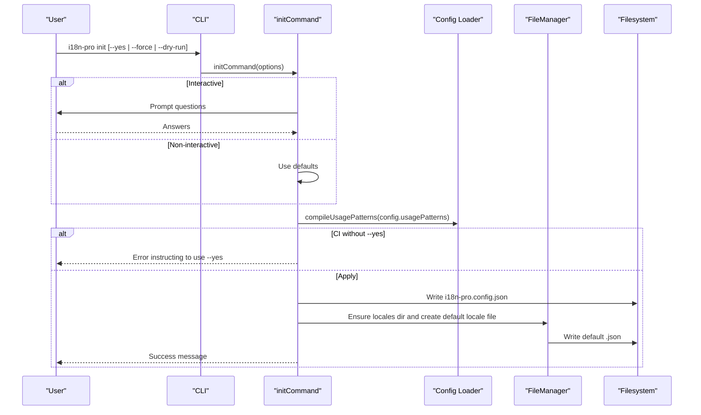
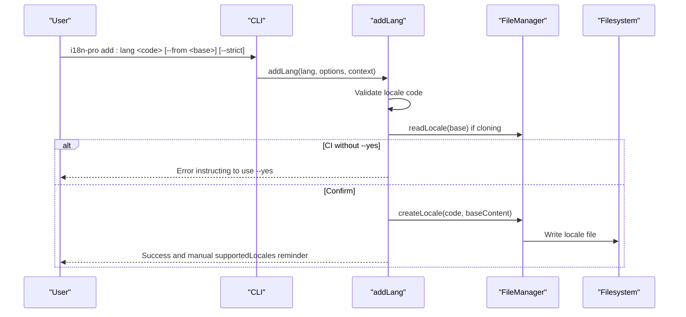
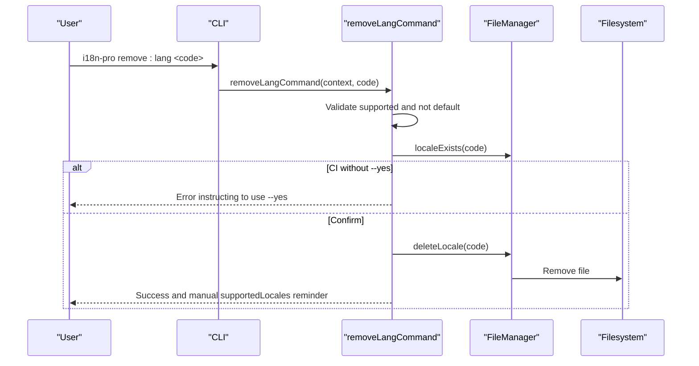
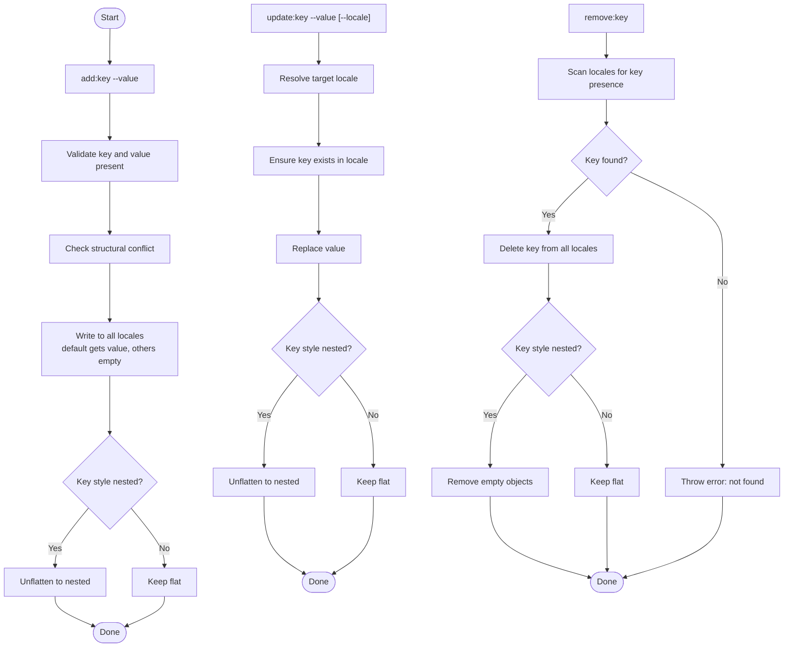
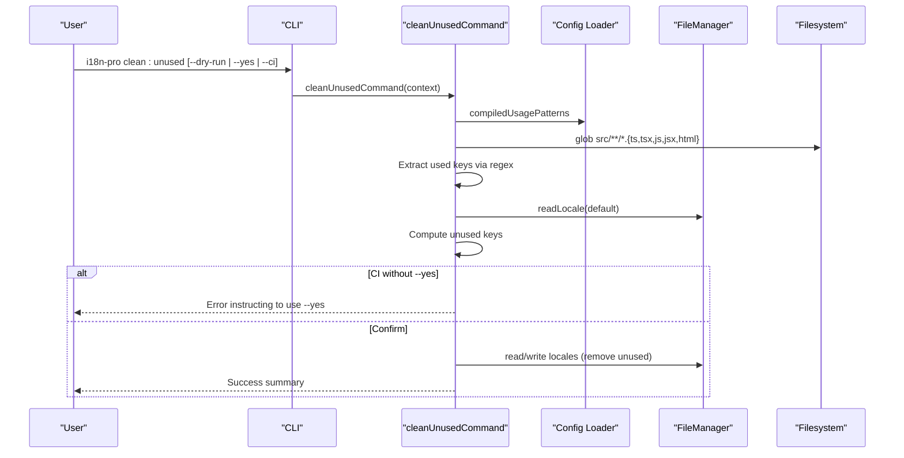
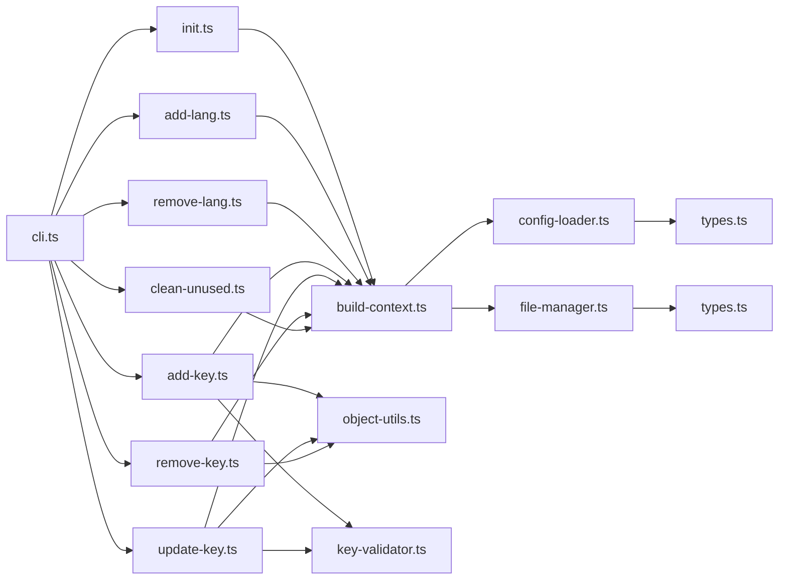

# Usage Examples

<cite>
**Referenced Files in This Document**
- [README.md](file://README.md)
- [package.json](file://package.json)
- [src/bin/cli.ts](file://src/bin/cli.ts)
- [src/commands/init.ts](file://src/commands/init.ts)
- [src/commands/add-lang.ts](file://src/commands/add-lang.ts)
- [src/commands/remove-lang.ts](file://src/commands/remove-lang.ts)
- [src/commands/add-key.ts](file://src/commands/add-key.ts)
- [src/commands/update-key.ts](file://src/commands/update-key.ts)
- [src/commands/remove-key.ts](file://src/commands/remove-key.ts)
- [src/commands/clean-unused.ts](file://src/commands/clean-unused.ts)
- [src/context/build-context.ts](file://src/context/build-context.ts)
- [src/context/types.ts](file://src/context/types.ts)
- [src/config/config-loader.ts](file://src/config/config-loader.ts)
- [src/config/types.ts](file://src/config/types.ts)
- [src/core/file-manager.ts](file://src/core/file-manager.ts)
- [src/core/key-validator.ts](file://src/core/key-validator.ts)
- [src/core/object-utils.ts](file://src/core/object-utils.ts)
</cite>

## Table of Contents
1. [Introduction](#introduction)
2. [Project Structure](#project-structure)
3. [Core Components](#core-components)
4. [Architecture Overview](#architecture-overview)
5. [Detailed Component Analysis](#detailed-component-analysis)
6. [Dependency Analysis](#dependency-analysis)
7. [Performance Considerations](#performance-considerations)
8. [Troubleshooting Guide](#troubleshooting-guide)
9. [Conclusion](#conclusion)
10. [Appendices](#appendices)

## Introduction
This document provides comprehensive, actionable usage examples for i18n-pro covering real-world workflows from project initialization to CI/CD integration. It includes step-by-step tutorials, command sequences, expected outcomes, best practices, and troubleshooting guidance. You will find end-to-end scenarios such as multi-language setup, key management, cleanup operations, automation, and performance optimization for large-scale projects.

## Project Structure
i18n-pro is a TypeScript CLI organized around commands, configuration loading, and a core file manager. The CLI registers commands and global options, builds a runtime context, and delegates to command handlers. Configuration is validated and compiled before use.

**Diagram sources**
- [src/bin/cli.ts:1-122](file://src/bin/cli.ts#L1-L122)
- [src/context/build-context.ts:1-16](file://src/context/build-context.ts#L1-L16)
- [src/config/config-loader.ts:1-176](file://src/config/config-loader.ts#L1-L176)
- [src/core/file-manager.ts:1-118](file://src/core/file-manager.ts#L1-L118)
- [src/commands/init.ts:1-236](file://src/commands/init.ts#L1-L236)
- [src/commands/add-lang.ts:1-98](file://src/commands/add-lang.ts#L1-L98)
- [src/commands/remove-lang.ts:1-74](file://src/commands/remove-lang.ts#L1-L74)
- [src/commands/add-key.ts:1-93](file://src/commands/add-key.ts#L1-L93)
- [src/commands/update-key.ts:1-103](file://src/commands/update-key.ts#L1-L103)
- [src/commands/remove-key.ts:1-96](file://src/commands/remove-key.ts#L1-L96)
- [src/commands/clean-unused.ts:1-138](file://src/commands/clean-unused.ts#L1-L138)

**Section sources**
- [src/bin/cli.ts:1-122](file://src/bin/cli.ts#L1-L122)
- [src/context/build-context.ts:1-16](file://src/context/build-context.ts#L1-L16)
- [src/config/config-loader.ts:1-176](file://src/config/config-loader.ts#L1-L176)
- [src/core/file-manager.ts:1-118](file://src/core/file-manager.ts#L1-L118)

## Core Components
- CLI entrypoint defines commands and global options, then parses arguments and routes to command handlers.
- Context builder loads configuration and instantiates the file manager for each command.
- Config loader validates and compiles configuration, including usage patterns.
- File manager encapsulates filesystem operations for locale files and sorting.
- Object utilities handle flattening/unflattening and safe key operations.
- Key validator prevents structural conflicts between flat and nested key styles.
- Commands implement user-facing operations with dry-run, CI, and confirmation support.

**Section sources**
- [src/bin/cli.ts:1-122](file://src/bin/cli.ts#L1-L122)
- [src/context/build-context.ts:1-16](file://src/context/build-context.ts#L1-L16)
- [src/config/config-loader.ts:1-176](file://src/config/config-loader.ts#L1-L176)
- [src/core/file-manager.ts:1-118](file://src/core/file-manager.ts#L1-L118)
- [src/core/object-utils.ts:1-95](file://src/core/object-utils.ts#L1-L95)
- [src/core/key-validator.ts:1-33](file://src/core/key-validator.ts#L1-L33)

## Architecture Overview
The CLI orchestrates commands that rely on a shared context. Each command reads and writes translation files through the file manager, respecting configuration such as key style and auto-sorting. Cleanup scans source files using compiled usage patterns to remove unused keys.

**Diagram sources**
- [src/bin/cli.ts:1-122](file://src/bin/cli.ts#L1-L122)
- [src/context/build-context.ts:1-16](file://src/context/build-context.ts#L1-L16)
- [src/config/config-loader.ts:1-176](file://src/config/config-loader.ts#L1-L176)
- [src/core/file-manager.ts:1-118](file://src/core/file-manager.ts#L1-L118)

## Detailed Component Analysis

### Initialization Workflow
End-to-end tutorial to initialize configuration and set up a default locale.

Steps:
1. Install globally or locally and run the help to confirm installation.
2. Initialize configuration interactively or non-interactively.
3. Optionally overwrite existing configuration with force.
4. Verify that the default locale file is created.

Expected outputs:
- Interactive wizard prompts for locales path, default locale, supported locales, key style, auto-sort, and usage patterns.
- Non-interactive mode creates a minimal config with defaults.
- Dry-run preview shows what would be written.
- Default locale file created if missing.

**Diagram sources**
- [src/bin/cli.ts:33-38](file://src/bin/cli.ts#L33-L38)
- [src/commands/init.ts:25-182](file://src/commands/init.ts#L25-L182)
- [src/config/config-loader.ts:84-109](file://src/config/config-loader.ts#L84-L109)
- [src/core/file-manager.ts:18-98](file://src/core/file-manager.ts#L18-L98)

**Section sources**
- [README.md:19-37](file://README.md#L19-L37)
- [README.md:131-134](file://README.md#L131-L134)
- [README.md:267-275](file://README.md#L267-L275)
- [src/bin/cli.ts:33-38](file://src/bin/cli.ts#L33-L38)
- [src/commands/init.ts:25-182](file://src/commands/init.ts#L25-L182)
- [src/config/config-loader.ts:84-109](file://src/config/config-loader.ts#L84-L109)
- [src/core/file-manager.ts:18-98](file://src/core/file-manager.ts#L18-L98)

### Multi-Language Setup
Add a new language and optionally clone content from an existing locale.

Steps:
1. Add a language with optional base locale cloning.
2. Confirm creation in interactive mode or with --yes in CI.
3. Manually update supportedLocales in configuration after successful creation.

Expected outputs:
- Validation ensures the locale code is acceptable and not duplicated.
- Optional cloning copies all keys from the base locale.
- Dry-run previews without writing files.
- Post-creation note to add the locale to supportedLocales.

**Diagram sources**
- [src/bin/cli.ts:42-50](file://src/bin/cli.ts#L42-L50)
- [src/commands/add-lang.ts:26-98](file://src/commands/add-lang.ts#L26-L98)
- [src/core/file-manager.ts:80-98](file://src/core/file-manager.ts#L80-L98)

**Section sources**
- [README.md:139-151](file://README.md#L139-L151)
- [README.md:242-245](file://README.md#L242-L245)
- [src/bin/cli.ts:42-50](file://src/bin/cli.ts#L42-L50)
- [src/commands/add-lang.ts:26-98](file://src/commands/add-lang.ts#L26-L98)

### Removing a Language
Remove an existing language file with safety checks.

Steps:
1. Ensure the locale is supported and not the default.
2. Confirm deletion or run with --yes in CI.
3. Remove the locale file; remember to edit supportedLocales manually.

Expected outputs:
- Validation prevents removal of default locale.
- Error if the file does not exist.
- Dry-run preview without changes.
- Success message and manual supportedLocales reminder.

**Diagram sources**
- [src/bin/cli.ts:54-61](file://src/bin/cli.ts#L54-L61)
- [src/commands/remove-lang.ts:5-74](file://src/commands/remove-lang.ts#L5-L74)
- [src/core/file-manager.ts:63-78](file://src/core/file-manager.ts#L63-L78)

**Section sources**
- [README.md:153-157](file://README.md#L153-L157)
- [src/bin/cli.ts:54-61](file://src/bin/cli.ts#L54-L61)
- [src/commands/remove-lang.ts:5-74](file://src/commands/remove-lang.ts#L5-L74)

### Key Management Workflows
Add, update, and remove translation keys across locales.

Add a key:
- Validates presence of key and value.
- Enforces structural conflict prevention.
- Writes to all locales; default locale gets the provided value, others get empty strings.
- Supports nested or flat key styles based on configuration.

Update a key:
- Validates target locale membership.
- Shows old and new values.
- Updates only the specified locale or default locale if none provided.

Remove a key:
- Confirms removal across all locales containing the key.
- Cleans up nested structures by removing empty objects after deletion.

**Diagram sources**
- [src/commands/add-key.ts:7-93](file://src/commands/add-key.ts#L7-L93)
- [src/commands/update-key.ts:15-103](file://src/commands/update-key.ts#L15-L103)
- [src/commands/remove-key.ts:10-96](file://src/commands/remove-key.ts#L10-L96)
- [src/core/key-validator.ts:1-33](file://src/core/key-validator.ts#L1-L33)
- [src/core/object-utils.ts:17-95](file://src/core/object-utils.ts#L17-L95)

**Section sources**
- [README.md:159-184](file://README.md#L159-L184)
- [README.md:247-255](file://README.md#L247-L255)
- [src/commands/add-key.ts:7-93](file://src/commands/add-key.ts#L7-L93)
- [src/commands/update-key.ts:15-103](file://src/commands/update-key.ts#L15-L103)
- [src/commands/remove-key.ts:10-96](file://src/commands/remove-key.ts#L10-L96)
- [src/core/key-validator.ts:1-33](file://src/core/key-validator.ts#L1-L33)
- [src/core/object-utils.ts:17-95](file://src/core/object-utils.ts#L17-L95)

### Cleanup Unused Keys
Scan source files using configured usage patterns and remove unused keys from all locales.

Steps:
1. Ensure usage patterns are defined and compiled.
2. Glob source files and extract keys using regex patterns.
3. Compare against default locale keys to compute unused keys.
4. Confirm removal or run with --yes in CI.
5. Write updated locales with nested reconstruction if needed.

**Diagram sources**
- [src/bin/cli.ts:105-111](file://src/bin/cli.ts#L105-L111)
- [src/commands/clean-unused.ts:8-138](file://src/commands/clean-unused.ts#L8-L138)
- [src/config/config-loader.ts:84-109](file://src/config/config-loader.ts#L84-L109)
- [src/core/file-manager.ts:31-61](file://src/core/file-manager.ts#L31-L61)

**Section sources**
- [README.md:185-201](file://README.md#L185-L201)
- [README.md:257-266](file://README.md#L257-L266)
- [src/bin/cli.ts:105-111](file://src/bin/cli.ts#L105-L111)
- [src/commands/clean-unused.ts:8-138](file://src/commands/clean-unused.ts#L8-L138)

### CI/CD Integration
Run i18n-pro in non-interactive CI environments with deterministic behavior.

Common scenarios:
- Dry-run check to surface unused keys without changes.
- Auto-apply changes with --yes when approved.
- Fail-fast behavior when changes would occur without --yes.

Best practices:
- Use --dry-run in pre-merge checks.
- Use --ci --yes in automated cleanup jobs.
- Combine with linters and formatters to maintain consistent key ordering.

**Section sources**
- [README.md:222-231](file://README.md#L222-L231)
- [README.md:257-266](file://README.md#L257-L266)
- [src/bin/cli.ts:21-28](file://src/bin/cli.ts#L21-L28)

### Advanced Scenarios

#### Bulk Operations
- Use loops in shell scripts to iterate over keys or locales.
- Combine with --yes and --dry-run to stage changes safely.
- Example patterns:
  - Iterate locales to add a batch of keys.
  - Iterate keys to update values across locales.

[No sources needed since this section provides general guidance]

#### Custom Configuration Patterns
- Define custom usage patterns for framework-specific helpers.
- Compile patterns at runtime; invalid regex triggers explicit errors.
- Use named capturing groups for clarity.

**Section sources**
- [README.md:111-127](file://README.md#L111-L127)
- [src/config/config-loader.ts:84-109](file://src/config/config-loader.ts#L84-L109)

#### Integration with Popular Frameworks
- Configure usage patterns to match framework APIs (e.g., hooks or composables).
- Ensure patterns capture keys consistently across files.

**Section sources**
- [README.md:111-127](file://README.md#L111-L127)

#### Programmatic API
- Load configuration and manipulate locales programmatically.
- Useful for custom tooling and build pipelines.

**Section sources**
- [README.md:301-318](file://README.md#L301-L318)
- [src/config/config-loader.ts:24-67](file://src/config/config-loader.ts#L24-L67)
- [src/core/file-manager.ts:31-61](file://src/core/file-manager.ts#L31-L61)

### Best Practices by Project Type
- Small apps: keep supportedLocales minimal; use nested keys for readability.
- Large monorepos: define precise usage patterns; enforce CI checks.
- Teams: standardize key naming; automate cleanup in CI; document configuration.

[No sources needed since this section provides general guidance]

### Automation and Scripting Examples
- Pre-commit hook to run clean:unused --dry-run.
- Nightly job to remove unused keys with --ci --yes.
- Post-install script to initialize configuration if missing.

[No sources needed since this section provides general guidance]

## Dependency Analysis
The CLI depends on command modules, which depend on the context builder, configuration loader, and file manager. The configuration loader compiles usage patterns and validates logical constraints. Object utilities and validators underpin key operations.

**Diagram sources**
- [src/bin/cli.ts:1-122](file://src/bin/cli.ts#L1-L122)
- [src/commands/init.ts:1-236](file://src/commands/init.ts#L1-L236)
- [src/commands/add-lang.ts:1-98](file://src/commands/add-lang.ts#L1-L98)
- [src/commands/remove-lang.ts:1-74](file://src/commands/remove-lang.ts#L1-L74)
- [src/commands/add-key.ts:1-93](file://src/commands/add-key.ts#L1-L93)
- [src/commands/update-key.ts:1-103](file://src/commands/update-key.ts#L1-L103)
- [src/commands/remove-key.ts:1-96](file://src/commands/remove-key.ts#L1-L96)
- [src/commands/clean-unused.ts:1-138](file://src/commands/clean-unused.ts#L1-L138)
- [src/context/build-context.ts:1-16](file://src/context/build-context.ts#L1-L16)
- [src/config/config-loader.ts:1-176](file://src/config/config-loader.ts#L1-L176)
- [src/core/file-manager.ts:1-118](file://src/core/file-manager.ts#L1-L118)
- [src/core/object-utils.ts:1-95](file://src/core/object-utils.ts#L1-L95)
- [src/core/key-validator.ts:1-33](file://src/core/key-validator.ts#L1-L33)
- [src/context/types.ts:1-15](file://src/context/types.ts#L1-L15)
- [src/config/types.ts:1-12](file://src/config/types.ts#L1-L12)

**Section sources**
- [src/bin/cli.ts:1-122](file://src/bin/cli.ts#L1-L122)
- [src/context/build-context.ts:1-16](file://src/context/build-context.ts#L1-L16)
- [src/config/config-loader.ts:1-176](file://src/config/config-loader.ts#L1-L176)
- [src/core/file-manager.ts:1-118](file://src/core/file-manager.ts#L1-L118)
- [src/core/object-utils.ts:1-95](file://src/core/object-utils.ts#L1-L95)
- [src/core/key-validator.ts:1-33](file://src/core/key-validator.ts#L1-L33)
- [src/context/types.ts:1-15](file://src/context/types.ts#L1-L15)
- [src/config/types.ts:1-12](file://src/config/types.ts#L1-L12)

## Performance Considerations
- Prefer flat keys for very large dictionaries to reduce nesting traversal overhead.
- Keep usage patterns concise and targeted to limit regex scanning cost.
- Use --dry-run to estimate impact before running destructive operations.
- For large repos, cache compiled usage patterns and avoid repeated filesystem reads by reusing the context.

[No sources needed since this section provides general guidance]

## Troubleshooting Guide
Common mistakes and corrections:
- Missing configuration file: run initialization or ensure the config exists in the project root.
  - Reference: [src/config/config-loader.ts:24-32](file://src/config/config-loader.ts#L24-L32)
- Invalid locale code: ensure ISO 639-1 compliance or extended codes like xx-YY.
  - Reference: [src/commands/add-lang.ts:11-24](file://src/commands/add-lang.ts#L11-L24)
- Structural conflict when adding keys: resolve parent-child conflicts before retrying.
  - Reference: [src/core/key-validator.ts:1-33](file://src/core/key-validator.ts#L1-L33)
- Usage patterns without capturing groups: fix regex to include a capturing group.
  - Reference: [src/config/config-loader.ts:100-105](file://src/config/config-loader.ts#L100-L105)
- Attempting to remove default locale: change defaultLocale first.
  - Reference: [src/commands/remove-lang.ts:22-27](file://src/commands/remove-lang.ts#L22-L27)
- Invalid JSON in locale files: fix malformed JSON.
  - Reference: [src/core/file-manager.ts:38-42](file://src/core/file-manager.ts#L38-L42)

**Section sources**
- [src/config/config-loader.ts:24-32](file://src/config/config-loader.ts#L24-L32)
- [src/commands/add-lang.ts:11-24](file://src/commands/add-lang.ts#L11-L24)
- [src/core/key-validator.ts:1-33](file://src/core/key-validator.ts#L1-L33)
- [src/config/config-loader.ts:100-105](file://src/config/config-loader.ts#L100-L105)
- [src/commands/remove-lang.ts:22-27](file://src/commands/remove-lang.ts#L22-L27)
- [src/core/file-manager.ts:38-42](file://src/core/file-manager.ts#L38-L42)

## Conclusion
With i18n-pro, you can automate and standardize internationalization workflows across teams and projects. Use initialization to bootstrap configuration, manage languages and keys with confidence, and enforce cleanup in CI. Combine dry-run previews, structured configuration, and robust validation to scale safely.

[No sources needed since this section summarizes without analyzing specific files]

## Appendices

### Command Reference and Examples
- Initialize configuration:
  - Interactive: [src/bin/cli.ts:33-38](file://src/bin/cli.ts#L33-L38)
  - Non-interactive: [src/commands/init.ts:133-142](file://src/commands/init.ts#L133-L142)
  - Force overwrite: [src/commands/init.ts:32-37](file://src/commands/init.ts#L32-L37)
- Add language:
  - With clone: [src/bin/cli.ts:42-50](file://src/bin/cli.ts#L42-L50)
  - Validation and creation: [src/commands/add-lang.ts:26-98](file://src/commands/add-lang.ts#L26-L98)
- Remove language:
  - Safety checks and deletion: [src/bin/cli.ts:54-61](file://src/bin/cli.ts#L54-L61), [src/commands/remove-lang.ts:5-74](file://src/commands/remove-lang.ts#L5-L74)
- Manage keys:
  - Add: [src/bin/cli.ts:68-76](file://src/bin/cli.ts#L68-L76), [src/commands/add-key.ts:7-93](file://src/commands/add-key.ts#L7-L93)
  - Update: [src/bin/cli.ts:80-89](file://src/bin/cli.ts#L80-L89), [src/commands/update-key.ts:15-103](file://src/commands/update-key.ts#L15-L103)
  - Remove: [src/bin/cli.ts:92-100](file://src/bin/cli.ts#L92-L100), [src/commands/remove-key.ts:10-96](file://src/commands/remove-key.ts#L10-L96)
- Cleanup:
  - Scan and remove: [src/bin/cli.ts:105-111](file://src/bin/cli.ts#L105-L111), [src/commands/clean-unused.ts:8-138](file://src/commands/clean-unused.ts#L8-L138)

**Section sources**
- [src/bin/cli.ts:33-111](file://src/bin/cli.ts#L33-L111)
- [src/commands/init.ts:25-182](file://src/commands/init.ts#L25-L182)
- [src/commands/add-lang.ts:26-98](file://src/commands/add-lang.ts#L26-L98)
- [src/commands/remove-lang.ts:5-74](file://src/commands/remove-lang.ts#L5-L74)
- [src/commands/add-key.ts:7-93](file://src/commands/add-key.ts#L7-L93)
- [src/commands/update-key.ts:15-103](file://src/commands/update-key.ts#L15-L103)
- [src/commands/remove-key.ts:10-96](file://src/commands/remove-key.ts#L10-L96)
- [src/commands/clean-unused.ts:8-138](file://src/commands/clean-unused.ts#L8-L138)