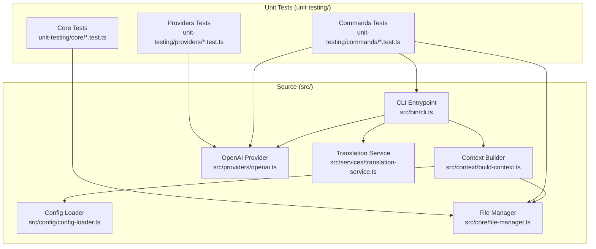
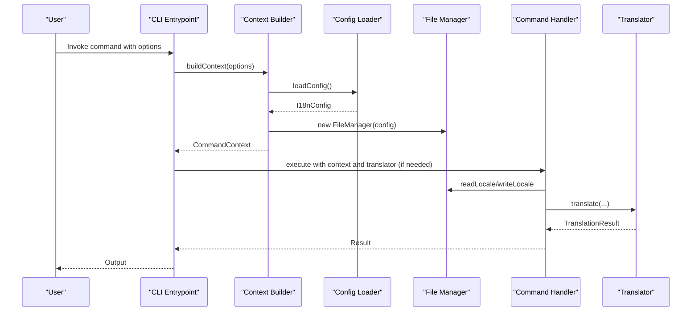
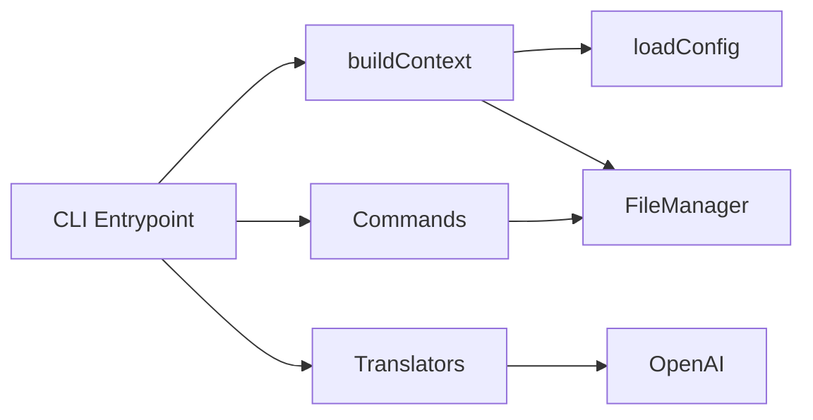
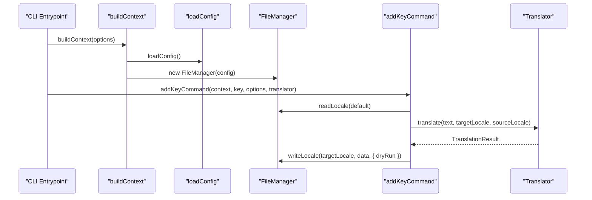

# Testing and Development

<cite>
**Referenced Files in This Document**
- [vitest.config.ts](file://vitest.config.ts)
- [package.json](file://package.json)
- [tsup.config.ts](file://tsup.config.ts)
- [README.md](file://README.md)
- [CONTRIBUTING.md](file://CONTRIBUTING.md)
- [src/bin/cli.ts](file://src/bin/cli.ts)
- [src/context/build-context.ts](file://src/context/build-context.ts)
- [src/config/config-loader.ts](file://src/config/config-loader.ts)
- [src/core/file-manager.ts](file://src/core/file-manager.ts)
- [src/providers/openai.ts](file://src/providers/openai.ts)
- [src/services/translation-service.ts](file://src/services/translation-service.ts)
- [unit-testing/commands/add-key.test.ts](file://unit-testing/commands/add-key.test.ts)
- [unit-testing/core/file-manager.test.ts](file://unit-testing/core/file-manager.test.ts)
- [unit-testing/providers/translator.test.ts](file://unit-testing/providers/translator.test.ts)
</cite>

## Table of Contents
1. [Introduction](#introduction)
2. [Project Structure](#project-structure)
3. [Core Components](#core-components)
4. [Architecture Overview](#architecture-overview)
5. [Detailed Component Analysis](#detailed-component-analysis)
6. [Dependency Analysis](#dependency-analysis)
7. [Performance Considerations](#performance-considerations)
8. [Troubleshooting Guide](#troubleshooting-guide)
9. [Conclusion](#conclusion)
10. [Appendices](#appendices)

## Introduction
This document provides comprehensive testing and development guidance for i18n-ai-cli. It covers the Vitest-based testing architecture, test organization mirroring the source structure, unit testing patterns for commands, services, and utilities, and robust mock strategies for external dependencies such as AI providers and the file system. It also documents development setup, build processes, debugging techniques, contribution guidelines, code standards, pull request procedures, continuous integration expectations, test coverage requirements, and quality assurance processes. Guidance is included for extending test coverage and adding new test scenarios.

## Project Structure
The project follows a clear separation between source code under src/ and unit tests under unit-testing/. The test suite targets all core modules and command handlers, ensuring high confidence in functionality and reliability.

**Diagram sources**
- [src/bin/cli.ts:1-209](file://src/bin/cli.ts#L1-L209)
- [src/context/build-context.ts:1-16](file://src/context/build-context.ts#L1-L16)
- [src/config/config-loader.ts:1-176](file://src/config/config-loader.ts#L1-L176)
- [src/core/file-manager.ts:1-118](file://src/core/file-manager.ts#L1-L118)
- [src/providers/openai.ts:1-60](file://src/providers/openai.ts#L1-L60)
- [src/services/translation-service.ts:1-18](file://src/services/translation-service.ts#L1-L18)
- [unit-testing/commands/add-key.test.ts:1-307](file://unit-testing/commands/add-key.test.ts#L1-L307)
- [unit-testing/core/file-manager.test.ts:1-297](file://unit-testing/core/file-manager.test.ts#L1-L297)
- [unit-testing/providers/translator.test.ts:1-410](file://unit-testing/providers/translator.test.ts#L1-L410)

**Section sources**
- [README.md:333-360](file://README.md#L333-L360)
- [CONTRIBUTING.md:133-153](file://CONTRIBUTING.md#L133-L153)

## Core Components
- CLI Entrypoint: Defines commands, global options, and orchestrates command execution with a context built from configuration and file manager.
- Context Builder: Loads configuration and constructs a command context with options for downstream commands.
- Config Loader: Validates and loads configuration with Zod, compiles usage patterns, and ensures logical constraints.
- File Manager: Handles locale file operations (read, write, create, delete) with dry-run support and recursive key sorting.
- Translation Service: Thin wrapper delegating translation requests to pluggable translators.
- OpenAI Provider: Implements translator interface using the official OpenAI SDK with configurable model and base URL.

**Section sources**
- [src/bin/cli.ts:1-209](file://src/bin/cli.ts#L1-L209)
- [src/context/build-context.ts:1-16](file://src/context/build-context.ts#L1-L16)
- [src/config/config-loader.ts:1-176](file://src/config/config-loader.ts#L1-L176)
- [src/core/file-manager.ts:1-118](file://src/core/file-manager.ts#L1-L118)
- [src/services/translation-service.ts:1-18](file://src/services/translation-service.ts#L1-L18)
- [src/providers/openai.ts:1-60](file://src/providers/openai.ts#L1-L60)

## Architecture Overview
The CLI composes a context per command invocation, which includes configuration and a file manager. Commands delegate translation to provider implementations through a unified translator interface. Unit tests isolate each component and mock external dependencies to validate behavior deterministically.

**Diagram sources**
- [src/bin/cli.ts:1-209](file://src/bin/cli.ts#L1-L209)
- [src/context/build-context.ts:1-16](file://src/context/build-context.ts#L1-L16)
- [src/config/config-loader.ts:1-176](file://src/config/config-loader.ts#L1-L176)
- [src/core/file-manager.ts:1-118](file://src/core/file-manager.ts#L1-L118)
- [src/providers/openai.ts:1-60](file://src/providers/openai.ts#L1-L60)

## Detailed Component Analysis

### Testing Architecture with Vitest
- Test Runner Configuration: Includes all unit-testing/**/*.test.ts files, enables Node environment, and sets up coverage reporting for src/**/*.ts excluding type declarations and the CLI binary.
- Scripts: Provides dedicated scripts for building, watching, testing, and type-checking.
- Build Tooling: Bundles ESM output with tsup while marking production dependencies as external to avoid bundling them.

**Section sources**
- [vitest.config.ts:1-16](file://vitest.config.ts#L1-L16)
- [package.json:9-14](file://package.json#L9-L14)
- [tsup.config.ts:1-29](file://tsup.config.ts#L1-L29)

### Test Organization and Patterns
- Mirrored Structure: unit-testing mirrors src/, easing navigation and maintenance.
- Framework: Vitest is used for assertions, mocking, and test lifecycle hooks.
- Mock Strategies:
  - Module mocks for external libraries (e.g., fs-extra, @vitalets/google-translate-api, OpenAI SDK).
  - Inline mock objects for interfaces (e.g., Translator).
  - Reset mocks per test to ensure isolation.
- Test Categories:
  - Commands: Validate CLI command logic, option handling, and integration with FileManager and Translator.
  - Core Utilities: Validate FileManager operations, recursion, and error paths.
  - Providers: Validate translator implementations, API interactions, and error handling.

**Section sources**
- [unit-testing/commands/add-key.test.ts:1-307](file://unit-testing/commands/add-key.test.ts#L1-L307)
- [unit-testing/core/file-manager.test.ts:1-297](file://unit-testing/core/file-manager.test.ts#L1-L297)
- [unit-testing/providers/translator.test.ts:1-410](file://unit-testing/providers/translator.test.ts#L1-L410)
- [CONTRIBUTING.md:165-246](file://CONTRIBUTING.md#L165-L246)

### Unit Testing Patterns for Commands
- Example Pattern: add-key command tests demonstrate:
  - Preparing a mock CommandContext with a mock FileManager and Translator.
  - Verifying required arguments and throwing descriptive errors.
  - Confirming action flow with dry-run, CI, and yes flags.
  - Structural conflict checks and nested vs flat key styles.
  - Graceful handling of translation failures.
- Best Practices:
  - Use beforeEach to reset mocks and stub confirmAction.
  - Assert exact calls to file manager and translator.
  - Validate both success and failure branches.

**Section sources**
- [unit-testing/commands/add-key.test.ts:1-307](file://unit-testing/commands/add-key.test.ts#L1-L307)

### Unit Testing Patterns for Services and Utilities
- FileManager:
  - Mock fs-extra methods to simulate existence checks, read/write, and removal.
  - Validate recursive key sorting behavior and dry-run semantics.
  - Verify directory creation and path resolution.
- Translation Service:
  - Wrap translator implementations and assert delegation.
- OpenAI Provider:
  - Mock OpenAI SDK chat.completions.create.
  - Validate model selection, base URL, API key precedence, and error propagation.
  - Assert system/user messages and context inclusion.

**Section sources**
- [unit-testing/core/file-manager.test.ts:1-297](file://unit-testing/core/file-manager.test.ts#L1-L297)
- [unit-testing/providers/translator.test.ts:1-410](file://unit-testing/providers/translator.test.ts#L1-L410)
- [src/services/translation-service.ts:1-18](file://src/services/translation-service.ts#L1-L18)
- [src/providers/openai.ts:1-60](file://src/providers/openai.ts#L1-L60)

### Mock Strategies for External Dependencies
- File System:
  - Replace fs-extra with vi.mock(...) and stub pathExists, readJson, writeJson, remove, ensureDir.
  - Control behavior per test case to exercise error paths and success paths.
- AI Providers:
  - Google Translate: Mock @vitalets/google-translate-api translate function.
  - OpenAI: Mock OpenAI class constructor and chat.completions.create method.
  - Validate options precedence (constructor options vs environment variables) and error handling.
- Console and Interactions:
  - Stub confirmAction to control interactive flows during tests.

**Section sources**
- [unit-testing/core/file-manager.test.ts:7-16](file://unit-testing/core/file-manager.test.ts#L7-L16)
- [unit-testing/providers/translator.test.ts:7-26](file://unit-testing/providers/translator.test.ts#L7-L26)
- [unit-testing/commands/add-key.test.ts:8-11](file://unit-testing/commands/add-key.test.ts#L8-L11)

### Development Setup, Build, and Debugging
- Setup:
  - Install dependencies and run build/watch/test/typecheck scripts.
  - Link globally for local testing and unlink after verification.
- Build:
  - ESM bundle with tsup; externalizes production dependencies.
- Debugging:
  - Use watch mode for iterative development.
  - Inspect coverage reports and HTML output for deeper insights.
  - Leverage descriptive test names and targeted runs to narrow down issues.

**Section sources**
- [README.md:333-360](file://README.md#L333-L360)
- [CONTRIBUTING.md:42-86](file://CONTRIBUTING.md#L42-L86)
- [tsup.config.ts:1-29](file://tsup.config.ts#L1-L29)
- [vitest.config.ts:1-16](file://vitest.config.ts#L1-L16)

### Contribution Guidelines, Code Standards, and Pull Requests
- Branching and Committing:
  - Use semantic prefixes (feature/, fix/, docs/, refactor/, test/, chore/).
  - Keep commits focused and descriptive.
- Code Standards:
  - Strict TypeScript usage, proper type annotations, and meaningful error messages.
  - Follow SOLID principles and leverage TypeScript features.
- Testing Requirements:
  - Add tests for new features and bug fixes.
  - Aim for high coverage, especially for critical paths.
  - Mock external dependencies; keep tests independent.
- PR Process:
  - Ensure build, typecheck, and tests pass locally.
  - Update documentation and add tests before submission.
  - Complete PR checklist and respond to feedback promptly.

**Section sources**
- [CONTRIBUTING.md:101-164](file://CONTRIBUTING.md#L101-L164)
- [CONTRIBUTING.md:256-370](file://CONTRIBUTING.md#L256-L370)

### Continuous Integration and Quality Assurance
- Coverage:
  - Coverage configured via Vitest to report text, json, html for src/**/*.ts excluding d.ts and CLI binary.
- CI Expectations:
  - Enforce type safety, successful builds, and passing tests.
  - Encourage dry-run and CI-mode validations in automated pipelines.
- Quality Gates:
  - PRs must include adequate tests and documentation updates.
  - Maintain code quality and adherence to style.

**Section sources**
- [vitest.config.ts:8-14](file://vitest.config.ts#L8-L14)
- [README.md:258-266](file://README.md#L258-L266)
- [CONTRIBUTING.md:356-370](file://CONTRIBUTING.md#L356-L370)

### Extending Test Coverage and Adding New Scenarios
- New Command Tests:
  - Mirror the add-key.test.ts pattern: create mock context, stub file manager and translator, and assert behavior for success, failure, and edge cases.
- New Utility Tests:
  - For core utilities, mock underlying dependencies and validate deterministic outcomes.
- New Provider Tests:
  - Mock provider SDKs and validate request shaping, error handling, and option precedence.
- Coverage Targets:
  - Focus on branching, error paths, and boundary conditions.
  - Ensure dry-run and CI modes are covered.

**Section sources**
- [unit-testing/commands/add-key.test.ts:1-307](file://unit-testing/commands/add-key.test.ts#L1-L307)
- [unit-testing/core/file-manager.test.ts:1-297](file://unit-testing/core/file-manager.test.ts#L1-L297)
- [unit-testing/providers/translator.test.ts:1-410](file://unit-testing/providers/translator.test.ts#L1-L410)
- [CONTRIBUTING.md:189-246](file://CONTRIBUTING.md#L189-L246)

## Dependency Analysis
The CLI depends on a context builder that loads configuration and instantiates a file manager. Commands orchestrate operations using this context and may delegate translation to provider implementations. Tests isolate these dependencies using mocks.

**Diagram sources**
- [src/bin/cli.ts:1-209](file://src/bin/cli.ts#L1-L209)
- [src/context/build-context.ts:1-16](file://src/context/build-context.ts#L1-L16)
- [src/config/config-loader.ts:1-176](file://src/config/config-loader.ts#L1-L176)
- [src/core/file-manager.ts:1-118](file://src/core/file-manager.ts#L1-L118)
- [src/providers/openai.ts:1-60](file://src/providers/openai.ts#L1-L60)

**Section sources**
- [src/bin/cli.ts:1-209](file://src/bin/cli.ts#L1-L209)
- [src/context/build-context.ts:1-16](file://src/context/build-context.ts#L1-L16)
- [src/config/config-loader.ts:1-176](file://src/config/config-loader.ts#L1-L176)
- [src/core/file-manager.ts:1-118](file://src/core/file-manager.ts#L1-L118)
- [src/providers/openai.ts:1-60](file://src/providers/openai.ts#L1-L60)

## Performance Considerations
- Mocking external I/O and network calls improves test performance and determinism.
- Prefer targeted tests over broad integration tests to keep feedback loops fast.
- Use dry-run mode in tests to validate logic without disk writes.

[No sources needed since this section provides general guidance]

## Troubleshooting Guide
- Tests Failing Due to Missing Configuration:
  - Ensure configuration is present and valid; tests that depend on config should simulate presence or trigger appropriate errors.
- File System Errors in Tests:
  - Verify mocks for fs-extra are properly set up and reset between tests.
- Provider API Errors:
  - Mock provider SDKs to reject with specific errors and assert error propagation.
- Coverage Gaps:
  - Run coverage reports and focus on uncovered branches and error paths.

**Section sources**
- [unit-testing/core/file-manager.test.ts:105-120](file://unit-testing/core/file-manager.test.ts#L105-L120)
- [unit-testing/providers/translator.test.ts:156-166](file://unit-testing/providers/translator.test.ts#L156-L166)
- [vitest.config.ts:8-14](file://vitest.config.ts#L8-L14)

## Conclusion
The i18n-ai-cli employs a robust Vitest-driven testing strategy with a mirrored unit-testing structure, comprehensive mock strategies for external dependencies, and clear patterns for commands, services, and utilities. Contributors can reliably extend coverage by following established patterns, focusing on edge cases and error paths, and maintaining high-quality tests alongside code changes.

[No sources needed since this section summarizes without analyzing specific files]

## Appendices

### Appendix A: CLI Command Flow (Sequence)

**Diagram sources**
- [src/bin/cli.ts:1-209](file://src/bin/cli.ts#L1-L209)
- [src/context/build-context.ts:1-16](file://src/context/build-context.ts#L1-L16)
- [src/config/config-loader.ts:1-176](file://src/config/config-loader.ts#L1-L176)
- [src/core/file-manager.ts:1-118](file://src/core/file-manager.ts#L1-L118)
- [src/providers/openai.ts:1-60](file://src/providers/openai.ts#L1-L60)
- [src/commands/add-key.ts:1-120](file://src/commands/add-key.ts#L1-L120)