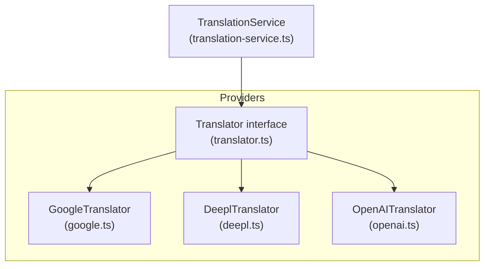
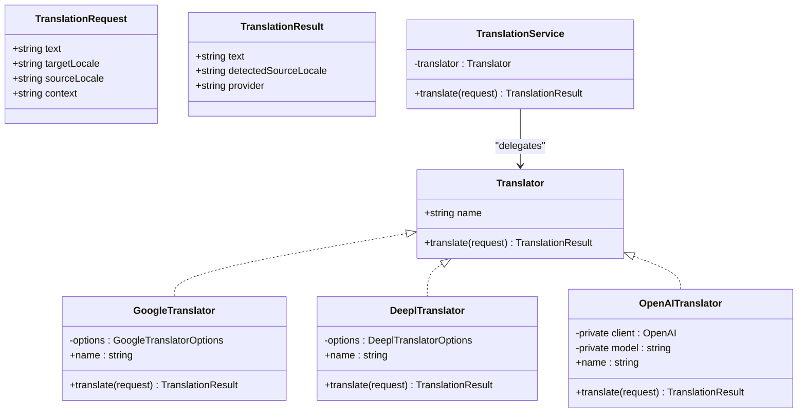
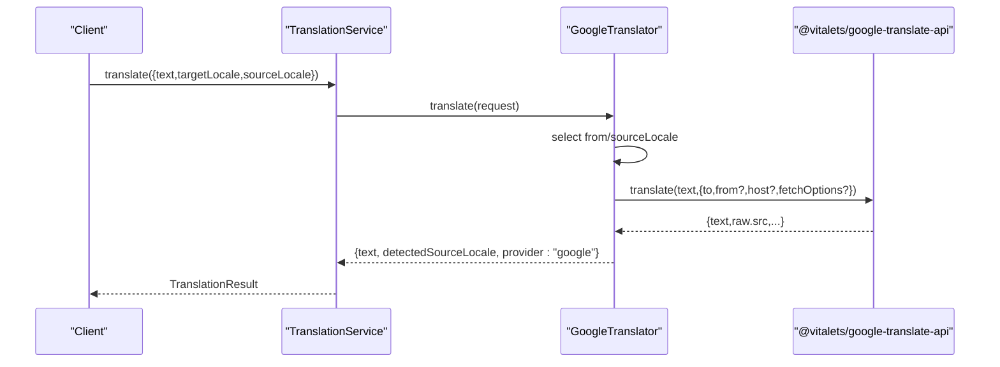
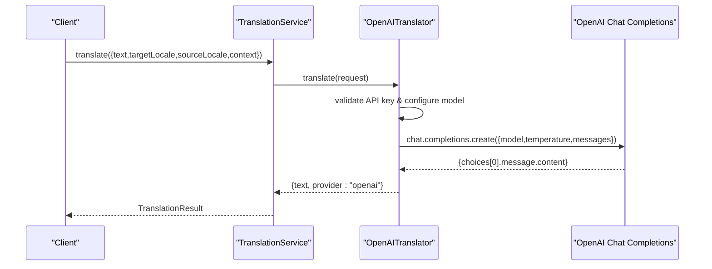
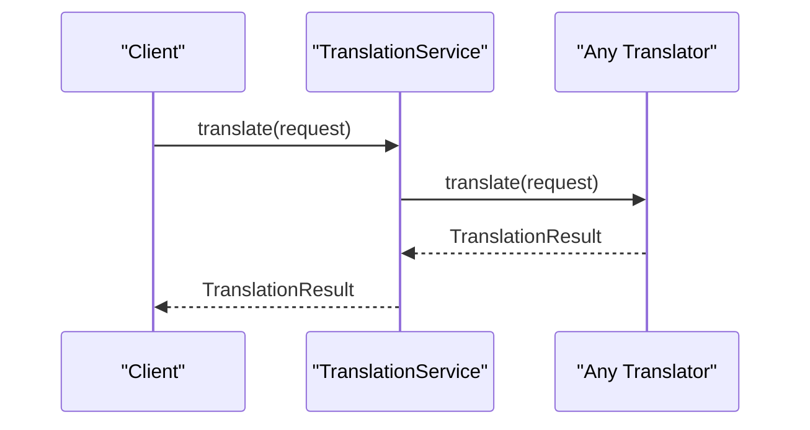
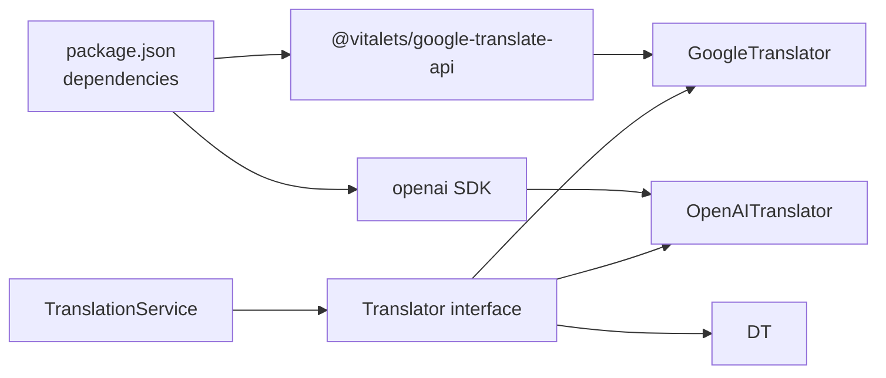

# Built-in Providers

<cite>
**Referenced Files in This Document**
- [google.ts](file://src/providers/google.ts)
- [deepl.ts](file://src/providers/deepl.ts)
- [openai.ts](file://src/providers/openai.ts)
- [translator.ts](file://src/providers/translator.ts)
- [translation-service.ts](file://src/services/translation-service.ts)
- [translator.test.ts](file://src/providers/translator.test.ts)
- [translation-service.test.ts](file://src/services/translation-service.test.ts)
- [README.md](file://README.md)
- [package.json](file://package.json)
</cite>

## Update Summary
**Changes Made**
- Updated OpenAI provider section to reflect the fully implemented AI translation features
- Added comprehensive documentation for OpenAI provider's model selection, API key management, custom base URLs, and context-aware translations
- Updated provider status indicators to show OpenAI is now fully functional
- Enhanced error handling and configuration sections for OpenAI provider
- Added practical examples demonstrating OpenAI provider capabilities

## Table of Contents
1. [Introduction](#introduction)
2. [Project Structure](#project-structure)
3. [Core Components](#core-components)
4. [Architecture Overview](#architecture-overview)
5. [Detailed Component Analysis](#detailed-component-analysis)
6. [Dependency Analysis](#dependency-analysis)
7. [Performance Considerations](#performance-considerations)
8. [Troubleshooting Guide](#troubleshooting-guide)
9. [Conclusion](#conclusion)

## Introduction
This document explains the built-in translation provider implementations for Google Translate, DeepL, and OpenAI. It focuses on how each provider is structured, what configuration options are available, how they integrate with the TranslationService, and how to use them programmatically. The OpenAI provider is now fully implemented with comprehensive AI translation features, while Google Translate remains fully functional and DeepL continues as a stub for future implementation.

## Project Structure
The provider system is organized around a shared interface and a small set of provider implementations. The TranslationService acts as a thin wrapper around any Translator implementation, enabling pluggable providers.

**Diagram sources**
- [translator.ts:1-18](file://src/providers/translator.ts#L1-L18)
- [google.ts:15-50](file://src/providers/google.ts#L15-L50)
- [deepl.ts:12-26](file://src/providers/deepl.ts#L12-L26)
- [openai.ts:9-60](file://src/providers/openai.ts#L9-L60)
- [translation-service.ts:7-17](file://src/services/translation-service.ts#L7-L17)

**Section sources**
- [translator.ts:1-18](file://src/providers/translator.ts#L1-L18)
- [translation-service.ts:7-17](file://src/services/translation-service.ts#L7-L17)

## Core Components
- Translator interface: Defines the contract that all providers must implement, including a name and a translate method that accepts a TranslationRequest and returns a TranslationResult.
- TranslationService: A simple façade that delegates translation requests to the configured Translator.
- Provider implementations:
  - GoogleTranslator: Fully implemented using @vitalets/google-translate-api.
  - DeeplTranslator: Stub implementation that throws when translate is called.
  - OpenAITranslator: **Fully implemented** AI-powered translation using OpenAI's Chat Completions API with comprehensive configuration options.

**Updated** OpenAI provider is now fully functional with complete AI translation capabilities

**Section sources**
- [translator.ts:14-17](file://src/providers/translator.ts#L14-L17)
- [translation-service.ts:7-17](file://src/services/translation-service.ts#L7-L17)
- [google.ts:9-50](file://src/providers/google.ts#L9-L50)
- [deepl.ts:12-26](file://src/providers/deepl.ts#L12-L26)
- [openai.ts:9-60](file://src/providers/openai.ts#L9-L60)

## Architecture Overview
The provider architecture follows a simple, extensible pattern:
- All providers implement the Translator interface.
- TranslationService depends only on the Translator interface, enabling runtime substitution of providers.
- Providers encapsulate external API integrations and return normalized results.

**Diagram sources**
- [translator.ts:14-17](file://src/providers/translator.ts#L14-L17)
- [translator.ts:1-6](file://src/providers/translator.ts#L1-L6)
- [translator.ts:8-12](file://src/providers/translator.ts#L8-L12)
- [translation-service.ts:7-17](file://src/services/translation-service.ts#L7-L17)
- [google.ts:9-50](file://src/providers/google.ts#L9-L50)
- [deepl.ts:12-26](file://src/providers/deepl.ts#L12-L26)
- [openai.ts:9-60](file://src/providers/openai.ts#L9-L60)

## Detailed Component Analysis

### Google Translate Provider
- Implementation: Fully implemented using @vitalets/google-translate-api.
- Configuration options:
  - from: Default source language code.
  - to: Target language code (passed via request).
  - host: Custom host for the translation endpoint.
  - fetchOptions: Additional fetch options passed to the underlying client.
- Behavior:
  - Uses request.sourceLocale if present; otherwise falls back to constructor option from.
  - Returns detectedSourceLocale from the raw response when available.
  - Propagates errors from the underlying API.
- Usage pattern:
  - Construct GoogleTranslator with desired options.
  - Wrap with TranslationService and call translate with a TranslationRequest.

**Diagram sources**
- [google.ts:17-48](file://src/providers/google.ts#L17-L48)
- [translator.ts:1-6](file://src/providers/translator.ts#L1-L6)
- [translator.ts:8-12](file://src/providers/translator.ts#L8-L12)
- [translation-service.ts:14-16](file://src/services/translation-service.ts#L14-L16)

**Section sources**
- [google.ts:18-23](file://src/providers/google.ts#L18-L23)
- [google.ts:25-48](file://src/providers/google.ts#L25-L48)
- [translator.test.ts:29-184](file://src/providers/translator.test.ts#L29-L184)

#### Configuration and Authentication
- Authentication: The Google provider does not require explicit API keys; it relies on the underlying library's default behavior.
- Rate limiting and quotas: Not handled by the provider itself; consult the library's documentation for limits and usage policies.
- Practical example:
  - Initialize with default options and call translate with a TranslationRequest.
  - Override from and host for advanced scenarios.

**Section sources**
- [google.ts:18-23](file://src/providers/google.ts#L18-L23)
- [translator.test.ts:87-136](file://src/providers/translator.test.ts#L87-L136)

#### Error Handling and Fallbacks
- Errors thrown by the underlying API propagate to the caller.
- Fallback behavior is not implemented in the provider; callers should wrap translate in try/catch and implement retries or fallbacks as needed.

**Section sources**
- [google.ts:41-48](file://src/providers/google.ts#L41-L48)
- [translator.test.ts:156-166](file://src/providers/translator.test.ts#L156-L166)

### DeepL Provider
- Implementation: Stub implementation that throws an error when translate is invoked.
- Configuration options:
  - apiKey: Placeholder for future API key support.
  - apiUrl: Placeholder for custom API base URL.
- Behavior:
  - Intentionally not implemented; use as a placeholder for a future adapter.
- Usage pattern:
  - Instantiate with options and replace with a real adapter when ready.

**Diagram sources**
- [deepl.ts:20-24](file://src/providers/deepl.ts#L20-L24)

**Section sources**
- [deepl.ts:7-10](file://src/providers/deepl.ts#L7-L10)
- [deepl.ts:16-18](file://src/providers/deepl.ts#L16-L18)
- [deepl.ts:20-24](file://src/providers/deepl.ts#L20-L24)
- [translator.test.ts:186-216](file://src/providers/translator.test.ts#L186-L216)

#### Configuration and Authentication
- Authentication: Not applicable until a real adapter is implemented.
- Rate limiting and quotas: Not applicable until a real adapter is implemented.
- Practical example:
  - Initialize with apiKey and apiUrl placeholders; replace with a real adapter later.

**Section sources**
- [deepl.ts:7-10](file://src/providers/deepl.ts#L7-L10)

#### Error Handling and Fallbacks
- Throws immediately upon translate; implement a real adapter to handle errors gracefully.

**Section sources**
- [deepl.ts:20-24](file://src/providers/deepl.ts#L20-L24)

### OpenAI Provider
- Implementation: **Fully implemented** AI-powered translation using OpenAI's Chat Completions API.
- Configuration options:
  - apiKey: OpenAI API key (required). Can be provided via constructor option or OPENAI_API_KEY environment variable.
  - model: AI model to use (default: "gpt-3.5-turbo"). Supports any OpenAI chat model.
  - baseUrl: Custom base URL for alternative OpenAI-compatible APIs.
- Behavior:
  - Uses system messages for context-aware translations with source locale detection.
  - Incorporates context information when provided in TranslationRequest.
  - Returns normalized TranslationResult with provider metadata.
  - Handles API key precedence: constructor options override environment variables.
- Advanced features:
  - Context-aware translations with contextual hints.
  - Temperature control for translation consistency (0.3).
  - Support for custom OpenAI-compatible endpoints.
  - Comprehensive error handling and validation.

**Diagram sources**
- [openai.ts:30-58](file://src/providers/openai.ts#L30-L58)
- [translator.ts:1-6](file://src/providers/translator.ts#L1-L6)
- [translator.ts:8-12](file://src/providers/translator.ts#L8-L12)
- [translation-service.ts:14-16](file://src/services/translation-service.ts#L14-L16)

**Updated** OpenAI provider is now fully implemented with comprehensive AI translation features

**Section sources**
- [openai.ts:14-28](file://src/providers/openai.ts#L14-L28)
- [openai.ts:30-58](file://src/providers/openai.ts#L30-L58)
- [translator.test.ts:218-408](file://src/providers/translator.test.ts#L218-L408)

#### Configuration and Authentication
- Authentication: Requires OpenAI API key via constructor option or OPENAI_API_KEY environment variable.
- API key precedence: Constructor options override environment variables.
- Model selection: Default "gpt-3.5-turbo", supports any OpenAI chat model.
- Custom base URLs: Supports alternative OpenAI-compatible endpoints.
- Practical examples:
  - Initialize with API key: `new OpenAITranslator({ apiKey: 'your-key' })`
  - Use environment variable: `new OpenAITranslator()`
  - Custom model: `new OpenAITranslator({ apiKey: 'key', model: 'gpt-4o' })`
  - Custom endpoint: `new OpenAITranslator({ apiKey: 'key', baseUrl: 'https://custom.api.com' })`

**Section sources**
- [openai.ts:14-28](file://src/providers/openai.ts#L14-L28)
- [translator.test.ts:319-374](file://src/providers/translator.test.ts#L319-L374)

#### Error Handling and Fallbacks
- API key validation: Throws descriptive error if no API key is available.
- API errors: Propagates underlying OpenAI API errors to caller.
- Empty responses: Returns empty string for empty content responses.
- Fallback behavior: Implement application-level retry logic and error handling.

**Section sources**
- [openai.ts:17-21](file://src/providers/openai.ts#L17-L21)
- [openai.ts:52-58](file://src/providers/openai.ts#L52-L58)
- [translator.test.ts:353-363](file://src/providers/translator.test.ts#L353-L363)

#### Context-Aware Translation Features
- System message construction: Includes source locale and target locale in system instructions.
- Context injection: Automatically includes context information in user messages when provided.
- Translation quality: AI-powered translations with contextual awareness.
- Practical usage:
  - Provide context for domain-specific translations: `context: 'technical documentation'`
  - Specify source locale for better accuracy: `sourceLocale: 'en'`

**Section sources**
- [openai.ts:37-41](file://src/providers/openai.ts#L37-L41)
- [translator.test.ts:270-286](file://src/providers/translator.test.ts#L270-L286)

### TranslationService Integration
- TranslationService wraps any Translator and forwards requests unchanged.
- It preserves all request fields (text, targetLocale, sourceLocale, context) and returns the provider's normalized result.

**Diagram sources**
- [translation-service.ts:14-16](file://src/services/translation-service.ts#L14-L16)
- [translator.ts:1-6](file://src/providers/translator.ts#L1-L6)
- [translator.ts:8-12](file://src/providers/translator.ts#L8-L12)

**Section sources**
- [translation-service.ts:7-17](file://src/services/translation-service.ts#L7-L17)
- [translation-service.test.ts:20-184](file://src/services/translation-service.test.ts#L20-L184)

## Dependency Analysis
- External dependencies:
  - Google: @vitalets/google-translate-api for Google Translate integration.
  - OpenAI: openai SDK for AI-powered translations.
- Internal dependencies:
  - Providers depend on the Translator interface.
  - TranslationService depends on the Translator interface.
- Coupling:
  - Low coupling between TranslationService and providers due to the interface abstraction.
  - Providers are loosely coupled to each other and to TranslationService.

**Diagram sources**
- [package.json:40-51](file://package.json#L40-L51)
- [google.ts:1-7](file://src/providers/google.ts#L1-L7)
- [openai.ts:1-7](file://src/providers/openai.ts#L1-L7)
- [translation-service.ts:1-5](file://src/services/translation-service.ts#L1-L5)
- [translator.ts:1-18](file://src/providers/translator.ts#L1-L18)

**Section sources**
- [package.json:40-51](file://package.json#L40-L51)
- [google.ts:1-7](file://src/providers/google.ts#L1-L7)
- [openai.ts:1-7](file://src/providers/openai.ts#L1-L7)
- [translation-service.ts:1-5](file://src/services/translation-service.ts#L1-L5)
- [translator.ts:1-18](file://src/providers/translator.ts#L1-L18)

## Performance Considerations
- Google Translate:
  - Relies on the underlying library's network behavior; no built-in retry or caching in the provider.
  - Consider batching or rate-limiting at the application level if translating large volumes.
- OpenAI Provider:
  - **Fully implemented** with configurable model selection and temperature control.
  - Network latency depends on OpenAI API response times.
  - Consider implementing application-level caching for repeated translations.
  - Model selection affects both cost and performance (e.g., gpt-3.5-turbo vs gpt-4o).
- DeepL:
  - Still a stub; performance characteristics are not applicable until an adapter is implemented.
- General:
  - Use TranslationService to swap providers without changing application logic.
  - Implement retry/backoff and circuit breaker patterns at the application layer if needed.

**Updated** OpenAI provider now has comprehensive performance considerations including model selection and cost optimization

## Troubleshooting Guide
- Google Translate:
  - If translate throws, inspect the underlying error and consider wrapping with retry logic.
  - Verify that from/sourceLocale resolution behaves as expected in your scenario.
- OpenAI Provider:
  - **API key issues**: Ensure OPENAI_API_KEY environment variable or constructor option is set.
  - **Model availability**: Verify selected model is available in your OpenAI account.
  - **Rate limiting**: OpenAI API may rate limit requests; implement exponential backoff.
  - **Context handling**: Ensure context is properly formatted when using context-aware features.
  - **Empty responses**: Handle empty content gracefully in application logic.
- DeepL:
  - Throws "DeepL translator is not implemented" error; implement or replace with a real adapter.
- TranslationService:
  - Errors from providers propagate through TranslationService.translate; wrap calls in try/catch.

**Updated** Added comprehensive troubleshooting for OpenAI provider including API key, model, and rate limiting issues

**Section sources**
- [translator.test.ts:156-166](file://src/providers/translator.test.ts#L156-L166)
- [translator.test.ts:346-363](file://src/providers/translator.test.ts#L346-L363)
- [translator.test.ts:192-202](file://src/providers/translator.test.ts#L192-L202)
- [translation-service.test.ts:85-96](file://src/services/translation-service.test.ts#L85-L96)

## Conclusion
- Google Translate is fully functional and integrates via @vitalets/google-translate-api. Configure via constructor options and handle errors at the application level.
- **OpenAI provider is now fully implemented** with comprehensive AI translation features including model selection, API key management, custom base URLs, and context-aware translations. It provides advanced AI-powered translation capabilities suitable for complex localization needs.
- DeepL remains a stub intended as a placeholder for future adapters. Use it to align your application's provider interface while you implement or adopt third-party adapters.
- TranslationService provides a clean abstraction that enables easy swapping of providers and consistent error propagation.

**Updated** Added comprehensive conclusion covering the newly fully implemented OpenAI provider capabilities