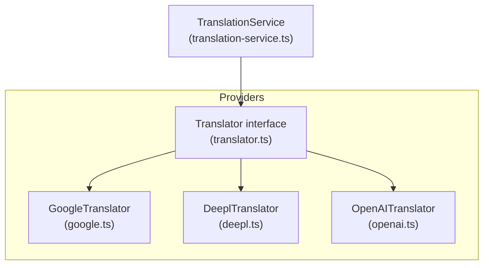
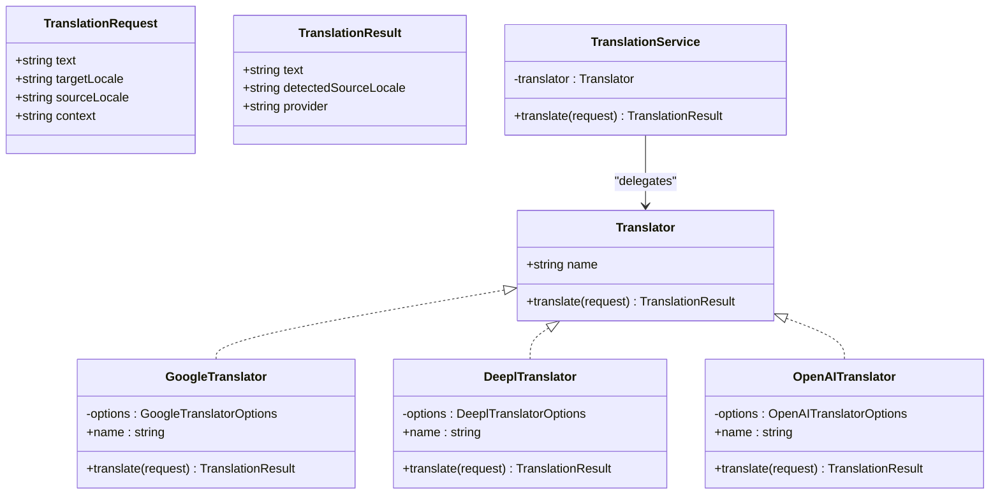
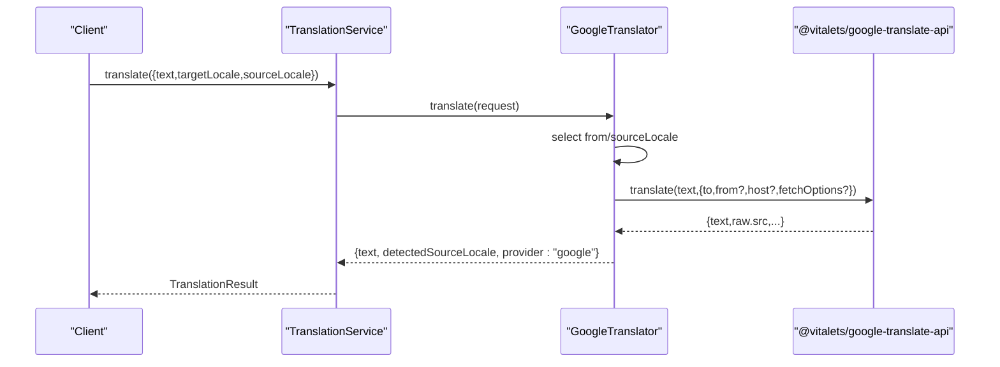
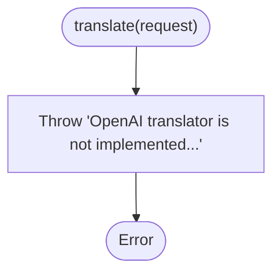
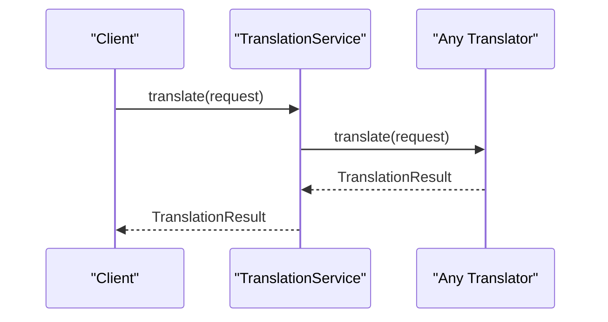
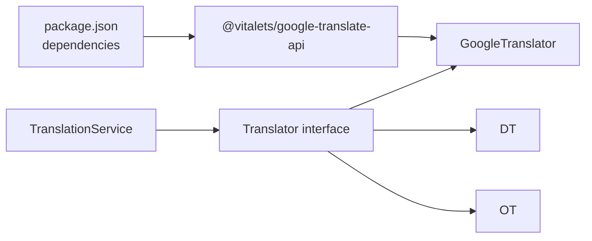

# Built-in Providers

<cite>
**Referenced Files in This Document**
- [google.ts](file://src/providers/google.ts)
- [deepl.ts](file://src/providers/deepl.ts)
- [openai.ts](file://src/providers/openai.ts)
- [translator.ts](file://src/providers/translator.ts)
- [translation-service.ts](file://src/services/translation-service.ts)
- [translator.test.ts](file://src/providers/translator.test.ts)
- [translation-service.test.ts](file://src/services/translation-service.test.ts)
- [README.md](file://README.md)
- [package.json](file://package.json)
</cite>

## Table of Contents
1. [Introduction](#introduction)
2. [Project Structure](#project-structure)
3. [Core Components](#core-components)
4. [Architecture Overview](#architecture-overview)
5. [Detailed Component Analysis](#detailed-component-analysis)
6. [Dependency Analysis](#dependency-analysis)
7. [Performance Considerations](#performance-considerations)
8. [Troubleshooting Guide](#troubleshooting-guide)
9. [Conclusion](#conclusion)

## Introduction
This document explains the built-in translation provider implementations for Google Translate, DeepL, and OpenAI. It focuses on how each provider is structured, what configuration options are available, how they integrate with the TranslationService, and how to use them programmatically. It also covers the current state of each provider (fully implemented vs. stub), error handling patterns, and guidance for choosing a provider based on use case, budget, and performance expectations.

## Project Structure
The provider system is organized around a shared interface and a small set of provider implementations. The TranslationService acts as a thin wrapper around any Translator implementation, enabling pluggable providers.

**Diagram sources**
- [translator.ts:1-18](file://src/providers/translator.ts#L1-L18)
- [google.ts:15-56](file://src/providers/google.ts#L15-L56)
- [deepl.ts:12-26](file://src/providers/deepl.ts#L12-L26)
- [openai.ts:13-27](file://src/providers/openai.ts#L13-L27)
- [translation-service.ts:7-17](file://src/services/translation-service.ts#L7-L17)

**Section sources**
- [translator.ts:1-18](file://src/providers/translator.ts#L1-L18)
- [translation-service.ts:7-17](file://src/services/translation-service.ts#L7-L17)

## Core Components
- Translator interface: Defines the contract that all providers must implement, including a name and a translate method that accepts a TranslationRequest and returns a TranslationResult.
- TranslationService: A simple façade that delegates translation requests to the configured Translator.
- Provider implementations:
  - GoogleTranslator: Fully implemented using @vitalets/google-translate-api.
  - DeeplTranslator: Stub implementation that throws when translate is called.
  - OpenAITranslator: Stub implementation that throws when translate is called.

**Section sources**
- [translator.ts:14-17](file://src/providers/translator.ts#L14-L17)
- [translation-service.ts:7-17](file://src/services/translation-service.ts#L7-L17)
- [google.ts:15-56](file://src/providers/google.ts#L15-L56)
- [deepl.ts:12-26](file://src/providers/deepl.ts#L12-L26)
- [openai.ts:13-27](file://src/providers/openai.ts#L13-L27)

## Architecture Overview
The provider architecture follows a simple, extensible pattern:
- All providers implement the Translator interface.
- TranslationService depends only on the Translator interface, enabling runtime substitution of providers.
- Providers encapsulate external API integrations and return normalized results.

**Diagram sources**
- [translator.ts:14-17](file://src/providers/translator.ts#L14-L17)
- [translator.ts:1-6](file://src/providers/translator.ts#L1-L6)
- [translator.ts:8-12](file://src/providers/translator.ts#L8-L12)
- [translation-service.ts:7-17](file://src/services/translation-service.ts#L7-L17)
- [google.ts:15-56](file://src/providers/google.ts#L15-L56)
- [deepl.ts:12-26](file://src/providers/deepl.ts#L12-L26)
- [openai.ts:13-27](file://src/providers/openai.ts#L13-L27)

## Detailed Component Analysis

### Google Translate Provider
- Implementation: Fully implemented using @vitalets/google-translate-api.
- Configuration options:
  - from: Default source language code.
  - to: Target language code (passed via request).
  - host: Custom host for the translation endpoint.
  - fetchOptions: Additional fetch options passed to the underlying client.
- Behavior:
  - Uses request.sourceLocale if present; otherwise falls back to constructor option from.
  - Returns detectedSourceLocale from the raw response when available.
  - Propagates errors from the underlying API.
- Usage pattern:
  - Construct GoogleTranslator with desired options.
  - Wrap with TranslationService and call translate with a TranslationRequest.

**Diagram sources**
- [google.ts:23-54](file://src/providers/google.ts#L23-L54)
- [translator.ts:1-6](file://src/providers/translator.ts#L1-L6)
- [translator.ts:8-12](file://src/providers/translator.ts#L8-L12)
- [translation-service.ts:14-16](file://src/services/translation-service.ts#L14-L16)

**Section sources**
- [google.ts:8-13](file://src/providers/google.ts#L8-L13)
- [google.ts:19-21](file://src/providers/google.ts#L19-L21)
- [google.ts:23-54](file://src/providers/google.ts#L23-L54)
- [translator.test.ts:20-122](file://src/providers/translator.test.ts#L20-L122)

#### Configuration and Authentication
- Authentication: The Google provider does not require explicit API keys; it relies on the underlying library’s default behavior.
- Rate limiting and quotas: Not handled by the provider itself; consult the library’s documentation for limits and usage policies.
- Practical example:
  - Initialize with default options and call translate with a TranslationRequest.
  - Override from and host for advanced scenarios.

**Section sources**
- [google.ts:19-21](file://src/providers/google.ts#L19-L21)
- [translator.test.ts:73-99](file://src/providers/translator.test.ts#L73-L99)

#### Error Handling and Fallbacks
- Errors thrown by the underlying API propagate to the caller.
- Fallback behavior is not implemented in the provider; callers should wrap translate in try/catch and implement retries or fallbacks as needed.

**Section sources**
- [google.ts:47-54](file://src/providers/google.ts#L47-L54)
- [translator.test.ts:142-152](file://src/providers/translator.test.ts#L142-L152)

### DeepL Provider
- Implementation: Stub implementation that throws an error when translate is invoked.
- Configuration options:
  - apiKey: Placeholder for future API key support.
  - apiUrl: Placeholder for custom API base URL.
- Behavior:
  - Intentionally not implemented; use as a placeholder for a future adapter.
- Usage pattern:
  - Instantiate with options and replace with a real adapter when ready.

**Diagram sources**
- [deepl.ts:20-24](file://src/providers/deepl.ts#L20-L24)

**Section sources**
- [deepl.ts:7-10](file://src/providers/deepl.ts#L7-L10)
- [deepl.ts:16-18](file://src/providers/deepl.ts#L16-L18)
- [deepl.ts:20-24](file://src/providers/deepl.ts#L20-L24)
- [translator.test.ts:172-202](file://src/providers/translator.test.ts#L172-L202)

#### Configuration and Authentication
- Authentication: Not applicable until a real adapter is implemented.
- Rate limiting and quotas: Not applicable until a real adapter is implemented.
- Practical example:
  - Initialize with apiKey and apiUrl placeholders; replace with a real adapter later.

**Section sources**
- [deepl.ts:7-10](file://src/providers/deepl.ts#L7-L10)

#### Error Handling and Fallbacks
- Throws immediately upon translate; implement a real adapter to handle errors gracefully.

**Section sources**
- [deepl.ts:20-24](file://src/providers/deepl.ts#L20-L24)

### OpenAI Provider
- Implementation: Stub implementation that throws an error when translate is invoked.
- Configuration options:
  - apiKey: Placeholder for future API key support.
  - model: Placeholder for model selection.
  - baseUrl: Placeholder for custom base URL.
- Behavior:
  - Intentionally not implemented; use as a placeholder for a future adapter.
- Usage pattern:
  - Instantiate with options and replace with a real adapter when ready.

**Diagram sources**
- [openai.ts:21-25](file://src/providers/openai.ts#L21-L25)

**Section sources**
- [openai.ts:7-11](file://src/providers/openai.ts#L7-L11)
- [openai.ts:17-19](file://src/providers/openai.ts#L17-L19)
- [openai.ts:21-25](file://src/providers/openai.ts#L21-L25)
- [translator.test.ts:204-235](file://src/providers/translator.test.ts#L204-L235)

#### Configuration and Authentication
- Authentication: Not applicable until a real adapter is implemented.
- Rate limiting and quotas: Not applicable until a real adapter is implemented.
- Practical example:
  - Initialize with apiKey, model, and baseUrl placeholders; replace with a real adapter later.

**Section sources**
- [openai.ts:7-11](file://src/providers/openai.ts#L7-L11)

#### Error Handling and Fallbacks
- Throws immediately upon translate; implement a real adapter to handle errors gracefully.

**Section sources**
- [openai.ts:21-25](file://src/providers/openai.ts#L21-L25)

### TranslationService Integration
- TranslationService wraps any Translator and forwards requests unchanged.
- It preserves all request fields (text, targetLocale, sourceLocale, context) and returns the provider’s normalized result.

**Diagram sources**
- [translation-service.ts:14-16](file://src/services/translation-service.ts#L14-L16)
- [translator.ts:1-6](file://src/providers/translator.ts#L1-L6)
- [translator.ts:8-12](file://src/providers/translator.ts#L8-L12)

**Section sources**
- [translation-service.ts:7-17](file://src/services/translation-service.ts#L7-L17)
- [translation-service.test.ts:20-96](file://src/services/translation-service.test.ts#L20-L96)

## Dependency Analysis
- External dependency for Google: @vitalets/google-translate-api is declared in package.json.
- Internal dependencies:
  - Providers depend on the Translator interface.
  - TranslationService depends on the Translator interface.
- Coupling:
  - Low coupling between TranslationService and providers due to the interface abstraction.
  - Providers are loosely coupled to each other and to TranslationService.

**Diagram sources**
- [package.json:26-36](file://package.json#L26-L36)
- [google.ts:1-6](file://src/providers/google.ts#L1-L6)
- [translation-service.ts:1-5](file://src/services/translation-service.ts#L1-L5)
- [translator.ts:1-18](file://src/providers/translator.ts#L1-L18)

**Section sources**
- [package.json:26-36](file://package.json#L26-L36)
- [google.ts:1-6](file://src/providers/google.ts#L1-L6)
- [translation-service.ts:1-5](file://src/services/translation-service.ts#L1-L5)
- [translator.ts:1-18](file://src/providers/translator.ts#L1-L18)

## Performance Considerations
- Google Translate:
  - Relies on the underlying library’s network behavior; no built-in retry or caching in the provider.
  - Consider batching or rate-limiting at the application level if translating large volumes.
- DeepL and OpenAI:
  - Both are stubs; performance characteristics are not applicable until adapters are implemented.
- General:
  - Use TranslationService to swap providers without changing application logic.
  - Implement retry/backoff and circuit breaker patterns at the application layer if needed.

[No sources needed since this section provides general guidance]

## Troubleshooting Guide
- Google Translate:
  - If translate throws, inspect the underlying error and consider wrapping with retry logic.
  - Verify that from/sourceLocale resolution behaves as expected in your scenario.
- DeepL/OpenAI:
  - Both throw “not implemented” errors; implement or replace with a real adapter.
- TranslationService:
  - Errors from providers propagate through TranslationService.translate; wrap calls in try/catch.

**Section sources**
- [translator.test.ts:142-152](file://src/providers/translator.test.ts#L142-L152)
- [translator.test.ts:178-188](file://src/providers/translator.test.ts#L178-L188)
- [translator.test.ts:210-219](file://src/providers/translator.test.ts#L210-L219)
- [translation-service.test.ts:85-96](file://src/services/translation-service.test.ts#L85-L96)

## Conclusion
- Google Translate is fully functional and integrates via @vitalets/google-translate-api. Configure via constructor options and handle errors at the application level.
- DeepL and OpenAI are currently stubs intended as placeholders for future adapters. Use them to align your application’s provider interface while you implement or adopt third-party adapters.
- TranslationService provides a clean abstraction that enables easy swapping of providers and consistent error propagation.

[No sources needed since this section summarizes without analyzing specific files]