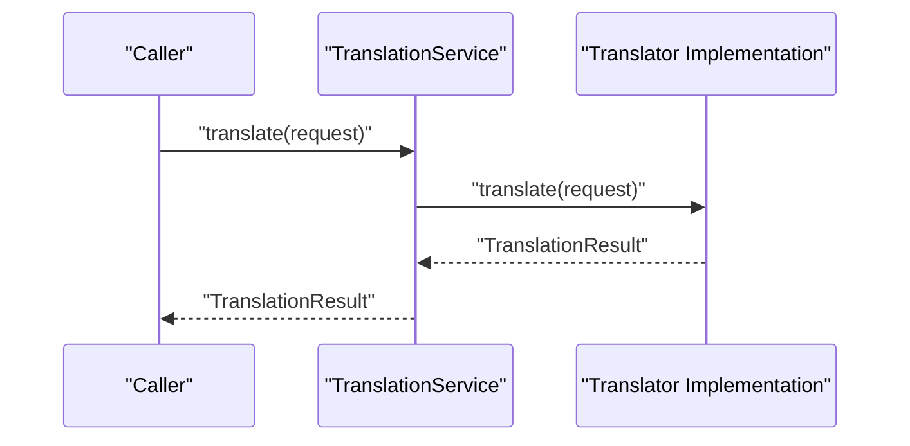
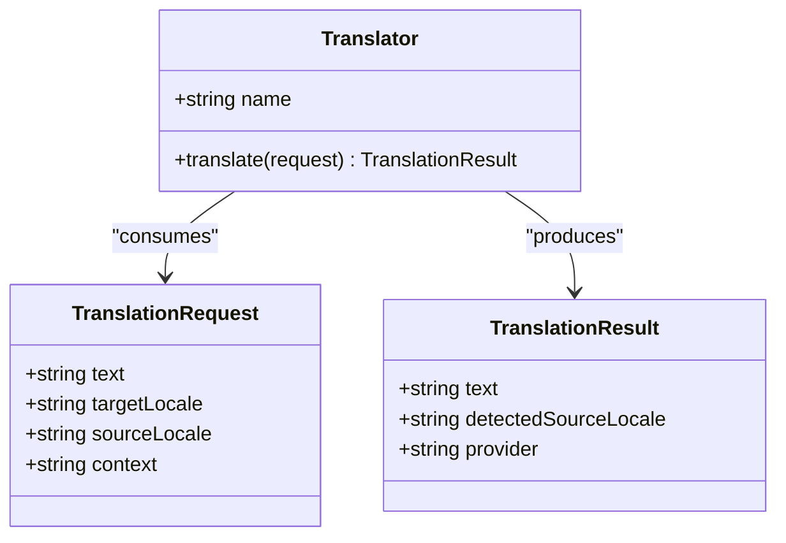
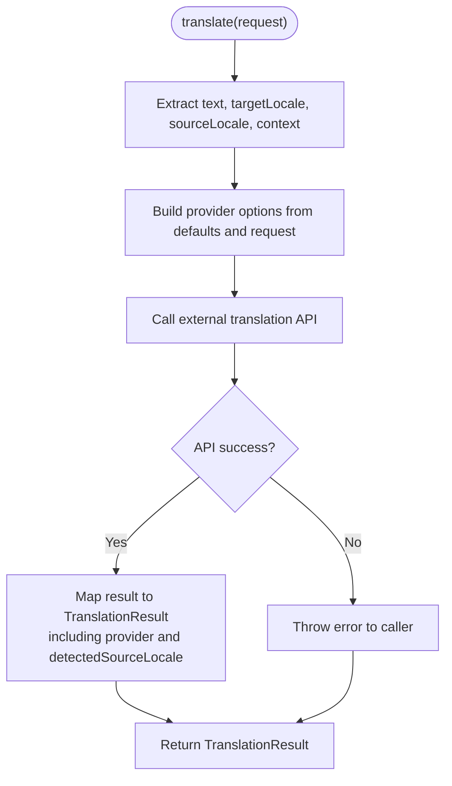
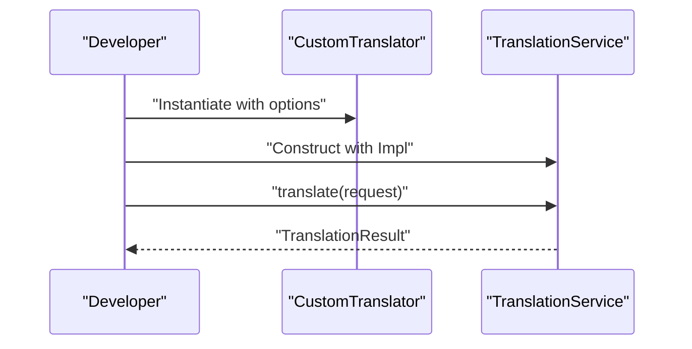
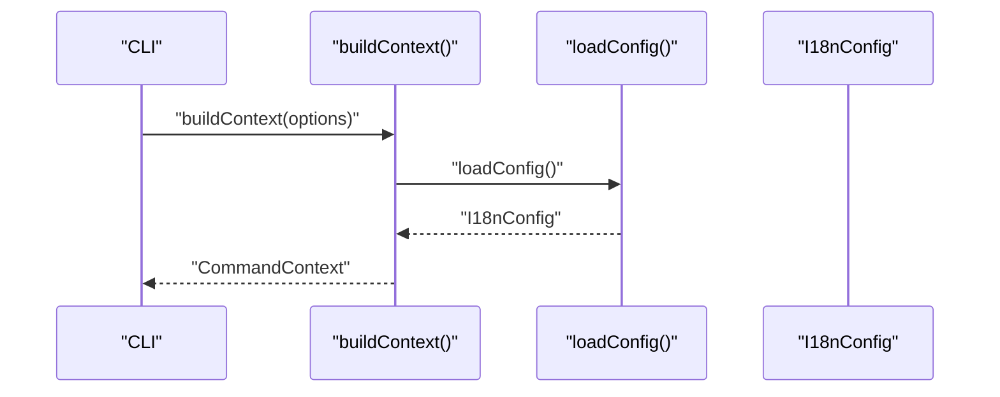
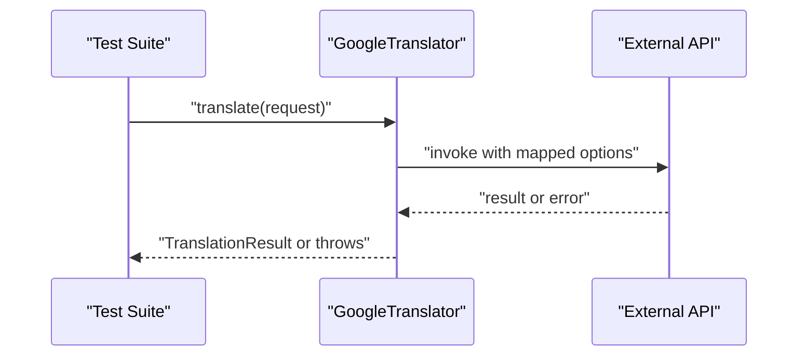
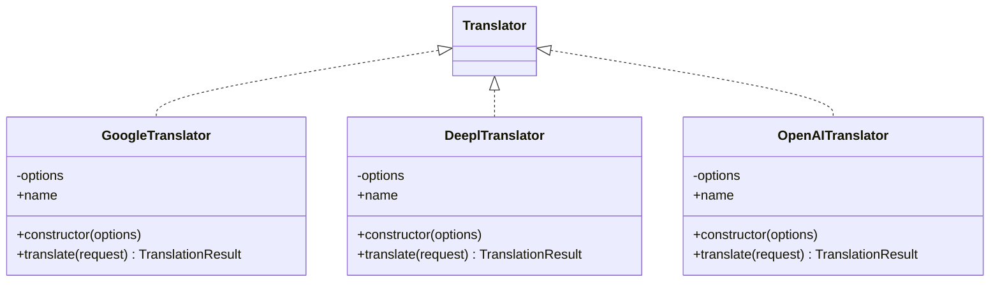
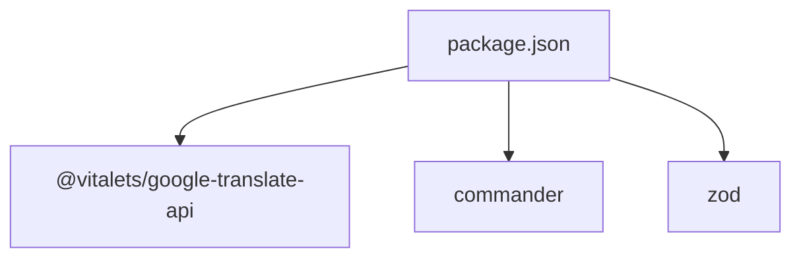

# Custom Provider Development

<cite>
**Referenced Files in This Document**
- [translator.ts](file://src/providers/translator.ts)
- [google.ts](file://src/providers/google.ts)
- [deepl.ts](file://src/providers/deepl.ts)
- [openai.ts](file://src/providers/openai.ts)
- [translation-service.ts](file://src/services/translation-service.ts)
- [config-loader.ts](file://src/config/config-loader.ts)
- [types.ts](file://src/config/types.ts)
- [build-context.ts](file://src/context/build-context.ts)
- [cli.ts](file://src/bin/cli.ts)
- [translator.test.ts](file://src/providers/translator.test.ts)
- [translation-service.test.ts](file://src/services/translation-service.test.ts)
- [package.json](file://package.json)
- [README.md](file://README.md)
</cite>

## Table of Contents
1. [Introduction](#introduction)
2. [Project Structure](#project-structure)
3. [Core Components](#core-components)
4. [Architecture Overview](#architecture-overview)
5. [Detailed Component Analysis](#detailed-component-analysis)
6. [Dependency Analysis](#dependency-analysis)
7. [Performance Considerations](#performance-considerations)
8. [Troubleshooting Guide](#troubleshooting-guide)
9. [Conclusion](#conclusion)
10. [Appendices](#appendices)

## Introduction
This document explains how to develop custom translation providers for the system by implementing the Translator interface. It covers step-by-step implementation, method requirements, error handling, return value formatting, provider registration, service discovery, configuration integration, testing strategies, and operational considerations such as rate limiting, quotas, and monitoring. It also provides guidance on performance optimization, caching, and deployment patterns.

## Project Structure
The provider system centers around a small set of interfaces and classes that define the contract for translation providers and how they are consumed by the rest of the application.

```mermaid
graph TB
subgraph "Provider Layer"
TIF["Translator Interface<br/>translator.ts"]
GT["GoogleTranslator<br/>google.ts"]
DT["DeeplTranslator<br/>deepl.ts"]
OT["OpenAITranslator<br/>openai.ts"]
end
subgraph "Service Layer"
TS["TranslationService<br/>translation-service.ts"]
end
subgraph "Configuration & Context"
CL["loadConfig()<br/>config-loader.ts"]
CT["buildContext()<br/>build-context.ts"]
TY["I18nConfig Types<br/>types.ts"]
end
subgraph "CLI"
CLI["CLI Entrypoint<br/>cli.ts"]
end
TIF --> GT
TIF --> DT
TIF --> OT
TS --> TIF
CT --> CL
CT --> TY
CLI --> CT
```

**Diagram sources**
- [translator.ts:14-17](file://src/providers/translator.ts#L14-L17)
- [google.ts:15-56](file://src/providers/google.ts#L15-L56)
- [deepl.ts:12-26](file://src/providers/deepl.ts#L12-L26)
- [openai.ts:13-27](file://src/providers/openai.ts#L13-L27)
- [translation-service.ts:7-17](file://src/services/translation-service.ts#L7-L17)
- [config-loader.ts:24-67](file://src/config/config-loader.ts#L24-L67)
- [build-context.ts:5-16](file://src/context/build-context.ts#L5-L16)
- [types.ts:3-11](file://src/config/types.ts#L3-L11)
- [cli.ts:1-122](file://src/bin/cli.ts#L1-L122)

**Section sources**
- [translator.ts:1-18](file://src/providers/translator.ts#L1-L18)
- [google.ts:1-56](file://src/providers/google.ts#L1-L56)
- [translation-service.ts:1-18](file://src/services/translation-service.ts#L1-L18)
- [config-loader.ts:1-176](file://src/config/config-loader.ts#L1-L176)
- [build-context.ts:1-16](file://src/context/build-context.ts#L1-L16)
- [cli.ts:1-122](file://src/bin/cli.ts#L1-L122)

## Core Components
- Translator interface defines the contract for all translation providers, including a name identifier and a translate method that accepts a TranslationRequest and returns a TranslationResult.
- GoogleTranslator demonstrates a complete implementation that integrates with an external translation library, honoring optional configuration and returning standardized results.
- TranslationService is a thin wrapper that delegates translation requests to the configured Translator, enabling easy substitution of providers at runtime.

Implementation highlights:
- Method signature and return shape are standardized by the Translator interface.
- Providers must honor optional fields in TranslationRequest (sourceLocale, context) and return a TranslationResult with provider metadata.
- Error propagation is straightforward: thrown exceptions from providers surface to callers.

**Section sources**
- [translator.ts:14-17](file://src/providers/translator.ts#L14-L17)
- [google.ts:23-54](file://src/providers/google.ts#L23-L54)
- [translation-service.ts:14-16](file://src/services/translation-service.ts#L14-L16)

## Architecture Overview
The provider architecture is intentionally minimal and extensible. The TranslationService depends on the Translator interface, allowing any implementation to be injected. Configuration and context are resolved at startup and passed to commands and services that need them.



**Diagram sources**
- [translation-service.ts:7-17](file://src/services/translation-service.ts#L7-L17)
- [translator.ts:14-17](file://src/providers/translator.ts#L14-L17)

## Detailed Component Analysis

### Translator Interface and Contracts
The Translator interface defines:
- name: a stable provider identifier used for result attribution.
- translate(request): a method that returns a standardized TranslationResult.

TranslationRequest and TranslationResult define the data contracts for input and output.



**Diagram sources**
- [translator.ts:14-17](file://src/providers/translator.ts#L14-L17)
- [translator.ts:1-12](file://src/providers/translator.ts#L1-L12)

**Section sources**
- [translator.ts:1-18](file://src/providers/translator.ts#L1-L18)

### GoogleTranslator Implementation Pattern
GoogleTranslator illustrates a robust provider implementation:
- Accepts optional configuration via a typed options object.
- Resolves translation options dynamically from request and defaults.
- Returns a standardized TranslationResult including detected source locale and provider identity.
- Propagates underlying API errors to callers.



**Diagram sources**
- [google.ts:23-54](file://src/providers/google.ts#L23-L54)

**Section sources**
- [google.ts:15-56](file://src/providers/google.ts#L15-L56)

### Provider Registration and Discovery
- Registration: To register a new provider, implement the Translator interface and instantiate it where needed (e.g., in a command handler or service factory).
- Discovery: There is no centralized registry. Providers are discovered by importing and instantiating the desired implementation.
- Composition: Inject the provider into TranslationService during construction to route translation calls.



**Diagram sources**
- [translation-service.ts:7-17](file://src/services/translation-service.ts#L7-L17)
- [translator.ts:14-17](file://src/providers/translator.ts#L14-L17)

**Section sources**
- [translation-service.ts:7-17](file://src/services/translation-service.ts#L7-L17)

### Configuration Integration
- Configuration loading is handled by loadConfig, which validates and compiles usage patterns. While not directly involved in provider selection, it ensures the environment is ready for commands and services.
- Context building resolves configuration and exposes it to commands and services.



**Diagram sources**
- [build-context.ts:5-16](file://src/context/build-context.ts#L5-L16)
- [config-loader.ts:24-67](file://src/config/config-loader.ts#L24-L67)
- [types.ts:3-11](file://src/config/types.ts#L3-L11)

**Section sources**
- [build-context.ts:1-16](file://src/context/build-context.ts#L1-L16)
- [config-loader.ts:1-176](file://src/config/config-loader.ts#L1-L176)
- [types.ts:1-12](file://src/config/types.ts#L1-L12)

### Testing Strategies
- Unit tests demonstrate mocking external APIs and asserting provider behavior, including error propagation and result shaping.
- TranslationService tests validate delegation and error propagation without requiring real providers.
- Recommended patterns:
  - Mock external SDKs or HTTP clients in provider tests.
  - Test error scenarios by injecting rejected promises.
  - Verify that TranslationResult includes provider and detectedSourceLocale when available.



**Diagram sources**
- [translator.test.ts:14-170](file://src/providers/translator.test.ts#L14-L170)
- [translation-service.test.ts:20-96](file://src/services/translation-service.test.ts#L20-L96)

**Section sources**
- [translator.test.ts:1-237](file://src/providers/translator.test.ts#L1-L237)
- [translation-service.test.ts:1-185](file://src/services/translation-service.test.ts#L1-L185)

### Example Provider Implementations
- GoogleTranslator: Demonstrates option merging, request mapping, and result shaping.
- DeeplTranslator and OpenAITranslator: Serve as stubs showing the expected constructor and name field, with placeholder translate methods.



**Diagram sources**
- [google.ts:15-56](file://src/providers/google.ts#L15-L56)
- [deepl.ts:12-26](file://src/providers/deepl.ts#L12-L26)
- [openai.ts:13-27](file://src/providers/openai.ts#L13-L27)
- [translator.ts:14-17](file://src/providers/translator.ts#L14-L17)

**Section sources**
- [google.ts:1-56](file://src/providers/google.ts#L1-L56)
- [deepl.ts:1-26](file://src/providers/deepl.ts#L1-L26)
- [openai.ts:1-27](file://src/providers/openai.ts#L1-L27)

## Dependency Analysis
- External dependencies include a translation library for Google and CLI-related packages. These influence provider implementation choices (e.g., whether to wrap an SDK or implement HTTP calls).
- The provider interface is decoupled from any specific external library, enabling multiple implementations.



**Diagram sources**
- [package.json:26-36](file://package.json#L26-L36)

**Section sources**
- [package.json:1-45](file://package.json#L1-L45)

## Performance Considerations
- Minimize network calls: batch translations when feasible and reuse connections.
- Implement caching: cache frequent translations keyed by text, targetLocale, and sourceLocale to reduce repeated calls.
- Concurrency control: limit concurrent requests to respect provider rate limits and avoid timeouts.
- Timeout management: enforce per-request timeouts and fail fast on slow responses.
- Retry logic: implement exponential backoff for transient failures; avoid retrying non-transient errors.
- Resource management: close idle connections, dispose of temporary buffers, and monitor memory usage.

## Troubleshooting Guide
Common issues and resolutions:
- Provider not implemented: Some stubs throw when translate is invoked. Implement the provider or replace with a working implementation.
- API errors: Ensure proper error handling in providers and propagate meaningful messages to callers.
- Configuration errors: Validate configuration before invoking translation operations; invalid locales or unsupported patterns cause early failures.
- Context resolution: Confirm that buildContext loads configuration successfully and that file paths are correct.

**Section sources**
- [deepl.ts:20-24](file://src/providers/deepl.ts#L20-L24)
- [openai.ts:21-25](file://src/providers/openai.ts#L21-L25)
- [config-loader.ts:24-67](file://src/config/config-loader.ts#L24-L67)

## Conclusion
By implementing the Translator interface and adhering to the TranslationRequest/TranslationResult contracts, you can extend the system with proprietary or specialized translation services. Keep implementations focused, testable, and resilient with proper error handling, timeouts, retries, and caching. Integrate providers through TranslationService injection and leverage configuration and context for environment readiness.

## Appendices

### Step-by-Step Provider Implementation Checklist
- Define options interface for your provider.
- Implement Translator with a stable name and translate method.
- Map TranslationRequest fields to provider-specific options.
- Return a TranslationResult with provider and detectedSourceLocale when available.
- Handle errors by throwing or returning structured errors.
- Add unit tests mocking external dependencies and verifying outcomes.

### Provider-Specific Considerations
- Rate limiting: Enforce per-second or per-minute caps; queue or backoff on throttling.
- Quota management: Track remaining credits or tokens; guard against overuse.
- Monitoring: Log request latency, success rates, and error types; expose metrics for alerting.

### Configuration Schema Guidance
- Use a configuration loader similar to loadConfig to validate and normalize settings.
- Compile usage patterns and validate regex correctness before runtime.

### Deployment Considerations
- Package your provider as part of the application or publish as a separate module.
- Document required environment variables and secrets.
- Provide examples of instantiation and integration with TranslationService.

**Section sources**
- [README.md:277-318](file://README.md#L277-L318)