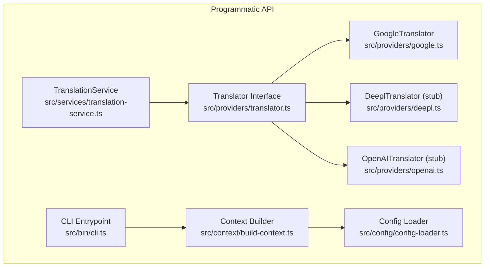
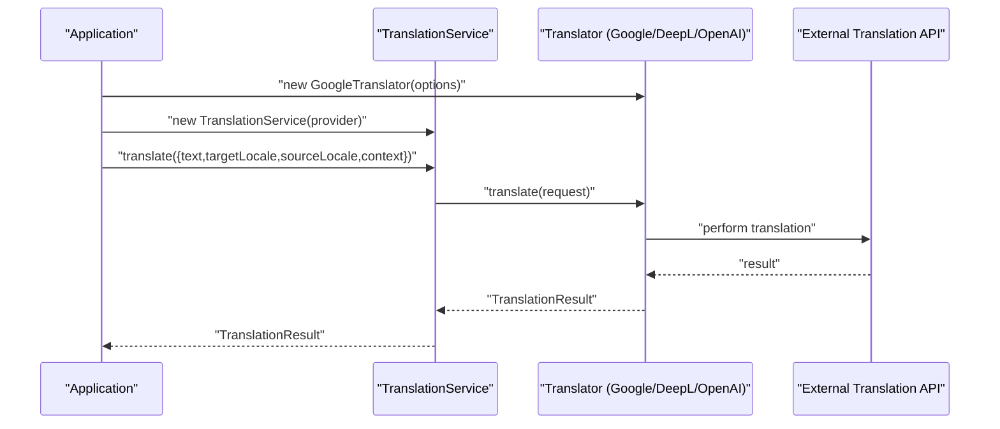
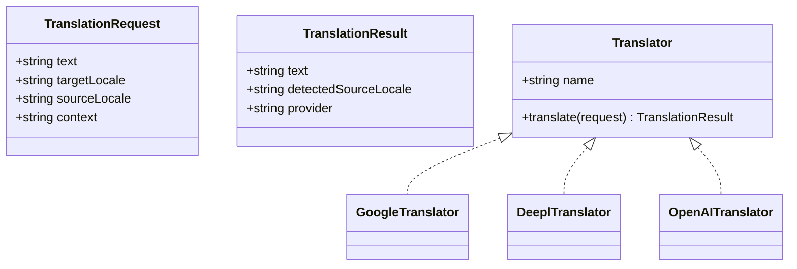
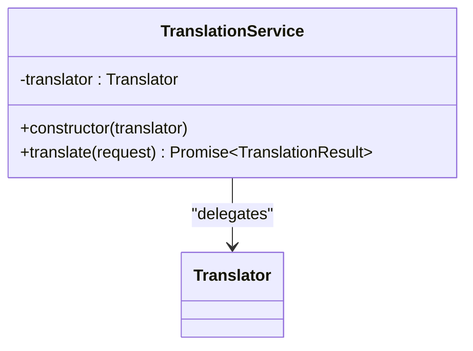
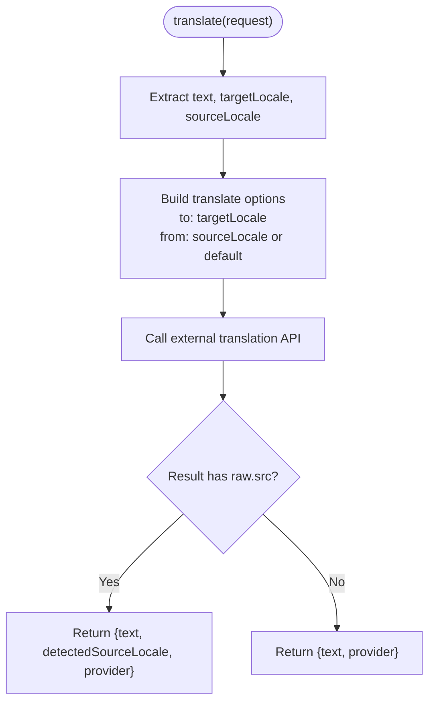
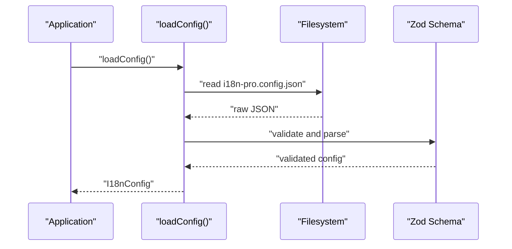
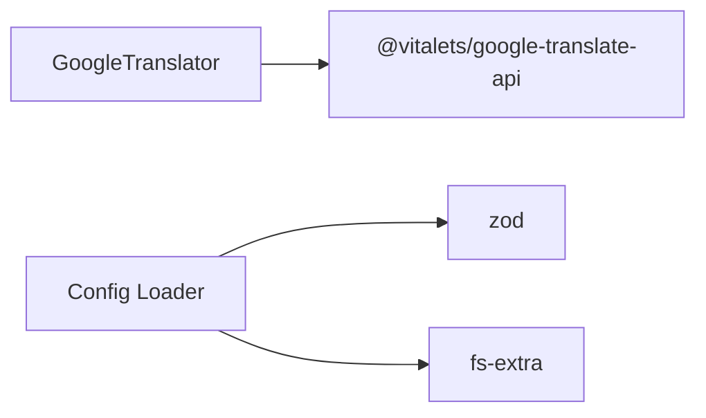

# Programmatic Usage

<cite>
**Referenced Files in This Document**
- [README.md](file://README.md)
- [package.json](file://package.json)
- [src/bin/cli.ts](file://src/bin/cli.ts)
- [src/context/build-context.ts](file://src/context/build-context.ts)
- [src/config/config-loader.ts](file://src/config/config-loader.ts)
- [src/config/types.ts](file://src/config/types.ts)
- [src/services/translation-service.ts](file://src/services/translation-service.ts)
- [src/providers/translator.ts](file://src/providers/translator.ts)
- [src/providers/google.ts](file://src/providers/google.ts)
- [src/providers/deepl.ts](file://src/providers/deepl.ts)
- [src/providers/openai.ts](file://src/providers/openai.ts)
- [src/services/translation-service.test.ts](file://src/services/translation-service.test.ts)
- [src/providers/translator.test.ts](file://src/providers/translator.test.ts)
</cite>

## Table of Contents
1. [Introduction](#introduction)
2. [Project Structure](#project-structure)
3. [Core Components](#core-components)
4. [Architecture Overview](#architecture-overview)
5. [Detailed Component Analysis](#detailed-component-analysis)
6. [Dependency Analysis](#dependency-analysis)
7. [Performance Considerations](#performance-considerations)
8. [Troubleshooting Guide](#troubleshooting-guide)
9. [Conclusion](#conclusion)
10. [Appendices](#appendices)

## Introduction
This document explains how to integrate translation services directly in applications using the programmatic API. It focuses on instantiating and configuring the TranslationService, selecting and initializing providers, and using the Translator interface for direct provider usage without the service layer abstraction. It also covers asynchronous operation patterns, error handling, batch translation scenarios, concurrency, performance optimization, dependency injection, and runtime configuration updates.

## Project Structure
The programmatic translation API centers around a small set of modules:
- A Translator interface that defines a uniform contract for translation providers.
- Provider implementations (Google, DeepL stub, OpenAI stub).
- A TranslationService wrapper that delegates translation requests to a configured Translator.
- Configuration loading utilities for application integration.
- CLI entry point and context builder for command-line usage.

**Diagram sources**
- [src/services/translation-service.ts:1-18](file://src/services/translation-service.ts#L1-L18)
- [src/providers/translator.ts:1-18](file://src/providers/translator.ts#L1-L18)
- [src/providers/google.ts:1-56](file://src/providers/google.ts#L1-L56)
- [src/providers/deepl.ts:1-26](file://src/providers/deepl.ts#L1-L26)
- [src/providers/openai.ts:1-27](file://src/providers/openai.ts#L1-L27)
- [src/bin/cli.ts:1-122](file://src/bin/cli.ts#L1-L122)
- [src/context/build-context.ts:1-16](file://src/context/build-context.ts#L1-L16)
- [src/config/config-loader.ts:1-176](file://src/config/config-loader.ts#L1-L176)

**Section sources**
- [README.md:277-318](file://README.md#L277-L318)
- [src/bin/cli.ts:1-122](file://src/bin/cli.ts#L1-L122)
- [src/context/build-context.ts:1-16](file://src/context/build-context.ts#L1-L16)
- [src/config/config-loader.ts:1-176](file://src/config/config-loader.ts#L1-L176)

## Core Components
- Translator interface: Defines the contract for translation providers, including a name and an async translate method returning a standardized result.
- TranslationService: A thin wrapper that holds a Translator and forwards translation requests.
- Provider implementations:
  - GoogleTranslator: Implements translation using an external library and returns standardized results with detected source locale.
  - DeeplTranslator and OpenAITranslator: Provided as stubs that throw when translate is invoked, indicating missing implementations.

These components enable direct provider usage and service-layer abstraction depending on your needs.

**Section sources**
- [src/providers/translator.ts:1-18](file://src/providers/translator.ts#L1-L18)
- [src/services/translation-service.ts:1-18](file://src/services/translation-service.ts#L1-L18)
- [src/providers/google.ts:1-56](file://src/providers/google.ts#L1-L56)
- [src/providers/deepl.ts:1-26](file://src/providers/deepl.ts#L1-L26)
- [src/providers/openai.ts:1-27](file://src/providers/openai.ts#L1-L27)

## Architecture Overview
The programmatic translation architecture separates concerns:
- Application code constructs a Translator (e.g., GoogleTranslator).
- Optionally wraps it in TranslationService for a unified interface.
- Executes translate requests asynchronously and handles results and errors.

**Diagram sources**
- [src/services/translation-service.ts:7-17](file://src/services/translation-service.ts#L7-L17)
- [src/providers/translator.ts:14-17](file://src/providers/translator.ts#L14-L17)
- [src/providers/google.ts:23-54](file://src/providers/google.ts#L23-L54)

## Detailed Component Analysis

### Translator Interface
The Translator interface defines:
- A readonly name identifying the provider.
- An async translate method that accepts a TranslationRequest and returns a TranslationResult.

**Diagram sources**
- [src/providers/translator.ts:1-18](file://src/providers/translator.ts#L1-L18)
- [src/providers/google.ts:15-21](file://src/providers/google.ts#L15-L21)
- [src/providers/deepl.ts:12-18](file://src/providers/deepl.ts#L12-L18)
- [src/providers/openai.ts:13-19](file://src/providers/openai.ts#L13-L19)

**Section sources**
- [src/providers/translator.ts:1-18](file://src/providers/translator.ts#L1-L18)

### TranslationService
TranslationService encapsulates a Translator and exposes a single translate method that forwards requests. It is useful when you want a uniform interface regardless of the underlying provider.

**Diagram sources**
- [src/services/translation-service.ts:7-17](file://src/services/translation-service.ts#L7-L17)

**Section sources**
- [src/services/translation-service.ts:1-18](file://src/services/translation-service.ts#L1-L18)

### GoogleTranslator
GoogleTranslator implements the Translator interface using an external translation library. It:
- Accepts options for default source locale, host, and fetch options.
- Resolves source locale precedence: request.sourceLocale overrides default options.
- Returns a standardized TranslationResult including detected source locale when available.

**Diagram sources**
- [src/providers/google.ts:23-54](file://src/providers/google.ts#L23-L54)

**Section sources**
- [src/providers/google.ts:1-56](file://src/providers/google.ts#L1-L56)

### DeeplTranslator and OpenAITranslator (Stubs)
Both providers define the Translator interface but throw when translate is invoked, indicating missing implementations. They can serve as placeholders for custom adapters or future integrations.

**Section sources**
- [src/providers/deepl.ts:1-26](file://src/providers/deepl.ts#L1-L26)
- [src/providers/openai.ts:1-27](file://src/providers/openai.ts#L1-L27)

### Configuration Loading (for application integration)
Applications can load configuration using the provided loader to integrate with i18n workflows alongside translation operations.

**Diagram sources**
- [src/config/config-loader.ts:24-67](file://src/config/config-loader.ts#L24-L67)
- [src/config/types.ts:3-11](file://src/config/types.ts#L3-L11)

**Section sources**
- [src/config/config-loader.ts:1-176](file://src/config/config-loader.ts#L1-L176)
- [src/config/types.ts:1-12](file://src/config/types.ts#L1-L12)

## Dependency Analysis
External dependencies relevant to programmatic usage:
- @vitalets/google-translate-api: Used by GoogleTranslator for translation.
- zod: Used by config loader for schema validation.
- fs-extra: Used by config loader for filesystem operations.

**Diagram sources**
- [src/providers/google.ts](file://src/providers/google.ts#L1)
- [src/config/config-loader.ts:1-3](file://src/config/config-loader.ts#L1-L3)
- [package.json:26-36](file://package.json#L26-L36)

**Section sources**
- [package.json:26-36](file://package.json#L26-L36)

## Performance Considerations
- Asynchronous operations: All translation methods are async and return promises. Use async/await or Promise chaining for readable code.
- Concurrency: For batch translation, consider parallel execution with Promise.all to maximize throughput while respecting provider rate limits.
- Request shaping: Minimize payload sizes by sending only required fields (text, targetLocale) and avoid unnecessary context unless supported by the provider.
- Caching: Cache frequent translations keyed by text and target locale to reduce repeated calls.
- Backpressure: Implement retry with exponential backoff and circuit breaker patterns for external APIs.
- Memory management: Avoid retaining large intermediate objects; release references promptly after use.
- Graceful degradation: Fall back to cached results or a simpler provider when external services are unavailable.

[No sources needed since this section provides general guidance]

## Troubleshooting Guide
Common issues and resolutions:
- Provider not implemented: DeeplTranslator and OpenAITranslator throw when translate is called. Implement or replace with a working provider.
- API errors: External translation APIs may fail. Wrap translate calls in try/catch and handle errors gracefully.
- Missing configuration: Ensure the configuration file exists and is valid when loading config programmatically.
- Locale mismatches: Verify supported locales and default locale settings to prevent runtime errors.

**Section sources**
- [src/providers/deepl.ts:20-24](file://src/providers/deepl.ts#L20-L24)
- [src/providers/openai.ts:21-25](file://src/providers/openai.ts#L21-L25)
- [src/providers/translator.test.ts:178-188](file://src/providers/translator.test.ts#L178-L188)
- [src/config/config-loader.ts:27-54](file://src/config/config-loader.ts#L27-L54)

## Conclusion
The programmatic translation API offers a clean separation between providers and consumers. Use the Translator interface for direct provider usage or wrap providers in TranslationService for a uniform interface. Integrate configuration loading to align translation workflows with your application’s i18n setup. Apply asynchronous patterns, concurrency controls, caching, and graceful degradation to achieve robust, scalable translation capabilities.

[No sources needed since this section summarizes without analyzing specific files]

## Appendices

### How to Instantiate and Configure a Translator
- Choose a provider: GoogleTranslator is implemented; DeeplTranslator and OpenAITranslator are stubs.
- Construct the provider with options (e.g., default source locale, host, fetch options).
- Optionally wrap it in TranslationService for a uniform translate method.

**Section sources**
- [README.md:285-299](file://README.md#L285-L299)
- [src/providers/google.ts:19-21](file://src/providers/google.ts#L19-L21)

### Using the Translator Interface Directly
- Implement the Translator interface to integrate a custom provider.
- Ensure translate returns a standardized TranslationResult with provider metadata.

**Section sources**
- [src/providers/translator.ts:14-17](file://src/providers/translator.ts#L14-L17)

### Asynchronous Operations and Error Handling
- Use async/await or Promise chaining for translation requests.
- Propagate or transform errors from providers into application-specific exceptions.
- Validate inputs before invoking translate to avoid runtime failures.

**Section sources**
- [src/services/translation-service.test.ts:85-96](file://src/services/translation-service.test.ts#L85-L96)
- [src/providers/translator.test.ts:142-152](file://src/providers/translator.test.ts#L142-L152)

### Batch Translation and Concurrency
- For multiple texts, use Promise.all to execute translations concurrently.
- Respect provider rate limits and implement backpressure controls.
- Aggregate results and handle partial failures.

[No sources needed since this section provides general guidance]

### Dependency Injection and Service Container Integration
- Inject a Translator instance into your application components.
- Register providers with DI containers using factory functions or tokens.
- Swap providers at runtime by replacing the injected Translator.

[No sources needed since this section provides general guidance]

### Custom Provider Registration and Dynamic Switching
- Implement a custom class that satisfies the Translator interface.
- Register it in your DI container and switch providers based on configuration or environment.
- Update runtime configuration to change provider behavior without redeploying.

[No sources needed since this section provides general guidance]

### Runtime Configuration Updates
- Load configuration at startup and periodically refresh as needed.
- Rebind translators or recreate TranslationService instances when configuration changes.

**Section sources**
- [src/config/config-loader.ts:24-67](file://src/config/config-loader.ts#L24-L67)

### Memory Management and Resource Cleanup
- Avoid retaining large translation payloads unnecessarily.
- Dispose of any external resources associated with providers during shutdown.
- Use weak references or periodic cleanup for caches.

[No sources needed since this section provides general guidance]