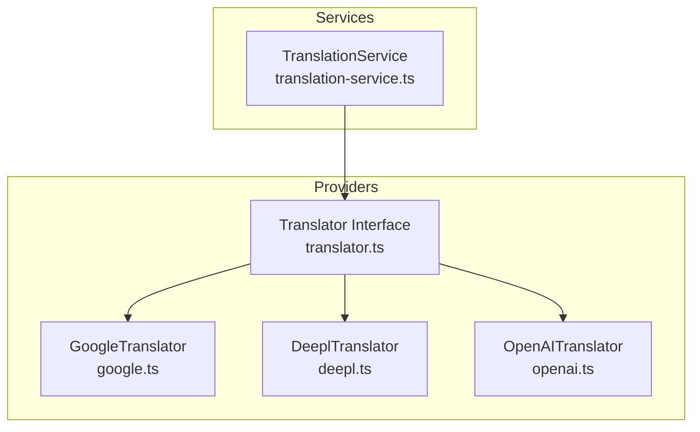
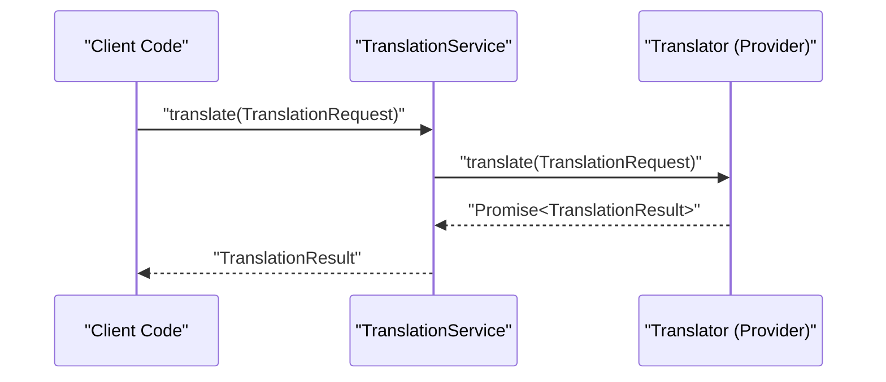
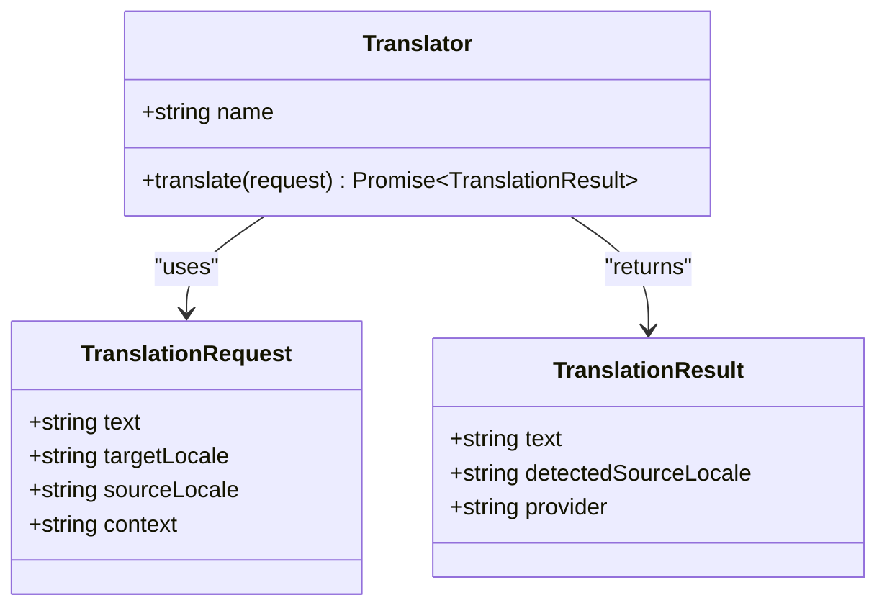
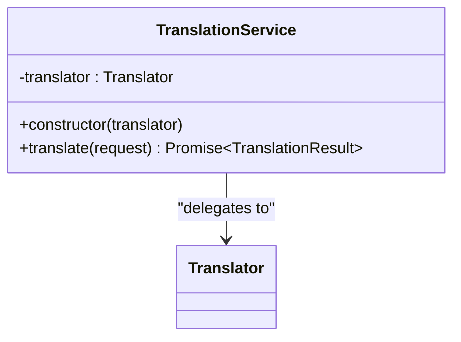
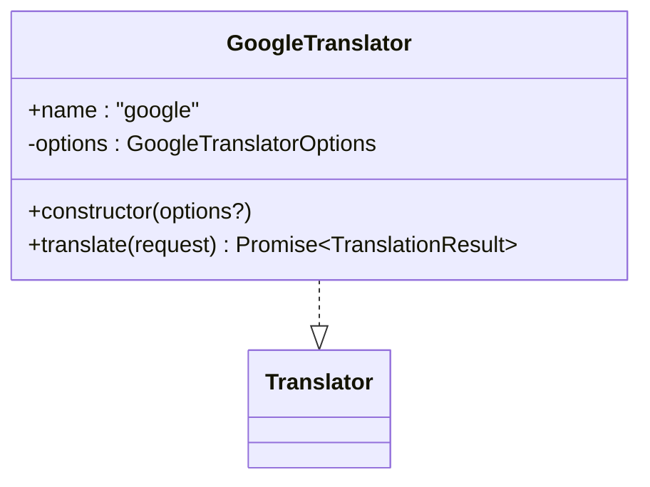
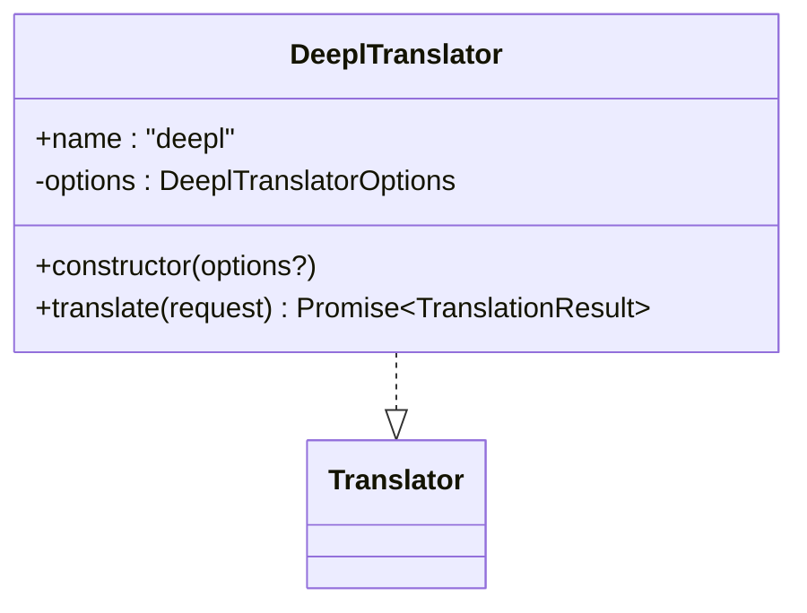
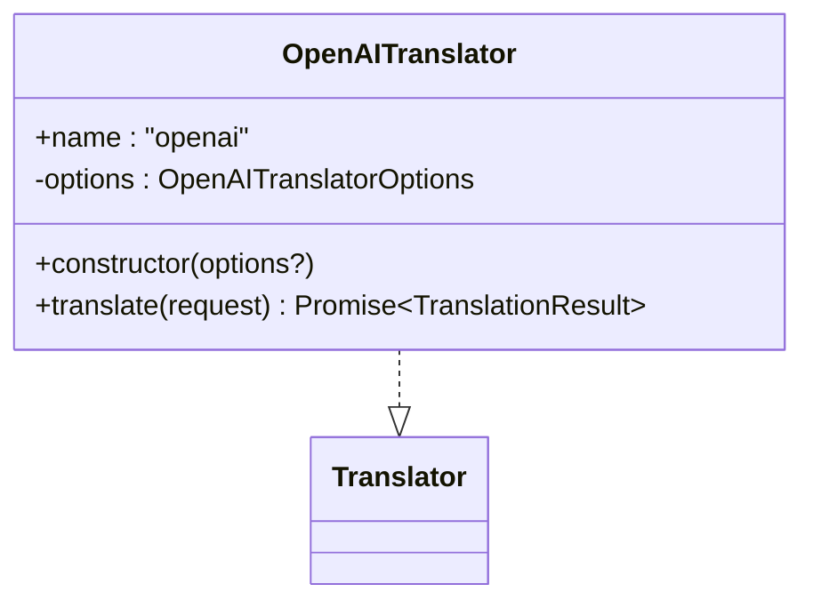
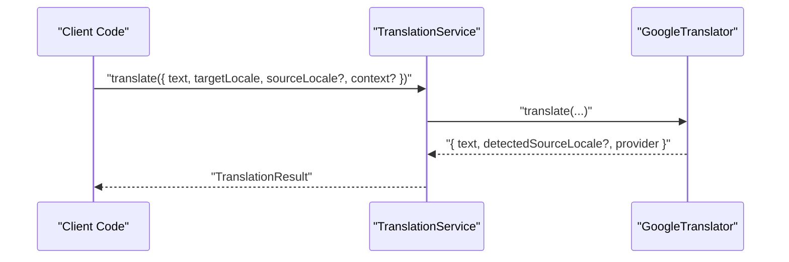
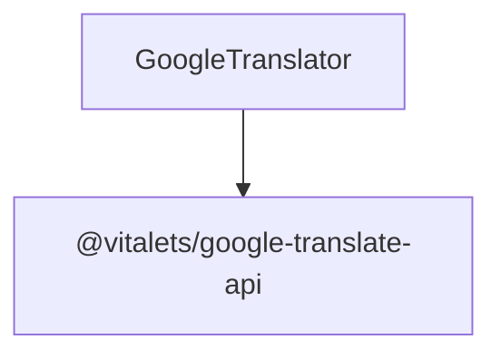

# Provider Interface & Architecture

<cite>
**Referenced Files in This Document**
- [translator.ts](file://src/providers/translator.ts)
- [translation-service.ts](file://src/services/translation-service.ts)
- [google.ts](file://src/providers/google.ts)
- [deepl.ts](file://src/providers/deepl.ts)
- [openai.ts](file://src/providers/openai.ts)
- [translator.test.ts](file://src/providers/translator.test.ts)
- [translation-service.test.ts](file://src/services/translation-service.test.ts)
- [README.md](file://README.md)
- [package.json](file://package.json)
- [cli.ts](file://src/bin/cli.ts)
- [build-context.ts](file://src/context/build-context.ts)
</cite>

## Table of Contents
1. [Introduction](#introduction)
2. [Project Structure](#project-structure)
3. [Core Components](#core-components)
4. [Architecture Overview](#architecture-overview)
5. [Detailed Component Analysis](#detailed-component-analysis)
6. [Dependency Analysis](#dependency-analysis)
7. [Performance Considerations](#performance-considerations)
8. [Troubleshooting Guide](#troubleshooting-guide)
9. [Conclusion](#conclusion)
10. [Appendices](#appendices)

## Introduction
This document explains the translation provider interface architecture that enables pluggable translation services. It focuses on the core abstraction layer defined by the Translator interface and the TranslationService class that coordinates provider operations. The document details the standardized method signatures and data structures, provider lifecycle management, error handling patterns, and extensibility principles for adding new translation providers.

## Project Structure
The translation provider system resides under the providers and services directories. The core abstractions live in the providers module, while the TranslationService acts as a thin coordinator that delegates translation requests to the configured provider.

**Diagram sources**
- [translator.ts:1-18](file://src/providers/translator.ts#L1-L18)
- [google.ts:1-56](file://src/providers/google.ts#L1-L56)
- [deepl.ts:1-26](file://src/providers/deepl.ts#L1-L26)
- [openai.ts:1-27](file://src/providers/openai.ts#L1-L27)
- [translation-service.ts:1-18](file://src/services/translation-service.ts#L1-L18)

**Section sources**
- [translator.ts:1-18](file://src/providers/translator.ts#L1-L18)
- [translation-service.ts:1-18](file://src/services/translation-service.ts#L1-L18)
- [google.ts:1-56](file://src/providers/google.ts#L1-L56)
- [deepl.ts:1-26](file://src/providers/deepl.ts#L1-L26)
- [openai.ts:1-27](file://src/providers/openai.ts#L1-L27)

## Core Components
This section documents the core abstraction layer and the central coordinator.

- Translator interface contract
  - TranslationRequest: defines the input shape for translation requests.
  - TranslationResult: defines the output shape returned by providers.
  - Translator: the provider contract with a name and translate method.

- TranslationService class
  - Holds a single provider instance.
  - Exposes a translate method that forwards requests to the provider.
  - Passes through errors from the provider unchanged.

Implementation references:
- Translator interface and types: [translator.ts:1-18](file://src/providers/translator.ts#L1-L18)
- TranslationService class: [translation-service.ts:7-17](file://src/services/translation-service.ts#L7-L17)

**Section sources**
- [translator.ts:1-18](file://src/providers/translator.ts#L1-L18)
- [translation-service.ts:1-18](file://src/services/translation-service.ts#L1-L18)

## Architecture Overview
The architecture follows a simple, extensible pattern:
- Clients construct a provider that implements the Translator interface.
- They wrap it with TranslationService.
- TranslationService forwards requests to the provider and returns results unchanged.

**Diagram sources**
- [translation-service.ts:14-16](file://src/services/translation-service.ts#L14-L16)
- [translator.ts:14-17](file://src/providers/translator.ts#L14-L17)

## Detailed Component Analysis

### Translator Interface Contract
The Translator interface defines the provider contract:
- name: a human-readable identifier for the provider.
- translate(request): a method that takes a TranslationRequest and returns a Promise resolving to a TranslationResult.

Data structures:
- TranslationRequest: includes text, targetLocale, optional sourceLocale, and optional context.
- TranslationResult: includes text, optional detectedSourceLocale, and provider name.

**Diagram sources**
- [translator.ts:1-18](file://src/providers/translator.ts#L1-L18)

**Section sources**
- [translator.ts:1-18](file://src/providers/translator.ts#L1-L18)

### TranslationService Coordinator
TranslationService encapsulates a single provider and exposes a translate method that delegates to the provider’s translate method. It does not modify the request or result; it simply forwards them.

**Diagram sources**
- [translation-service.ts:7-17](file://src/services/translation-service.ts#L7-L17)

**Section sources**
- [translation-service.ts:1-18](file://src/services/translation-service.ts#L1-L18)

### Provider Implementations

#### GoogleTranslator
- Implements Translator using @vitalets/google-translate-api.
- Supports optional configuration via GoogleTranslatorOptions.
- Respects request.sourceLocale over default options when present.
- Returns detectedSourceLocale from the underlying API response when available.

Key behaviors verified by tests:
- Correct provider name.
- Uses request.sourceLocale when provided.
- Falls back to default from option when no request sourceLocale is given.
- Honors host and fetchOptions when provided.
- Propagates API errors.
- Handles missing raw metadata gracefully.

**Diagram sources**
- [google.ts:15-55](file://src/providers/google.ts#L15-L55)
- [translator.ts:14-17](file://src/providers/translator.ts#L14-L17)

**Section sources**
- [google.ts:1-56](file://src/providers/google.ts#L1-L56)
- [translator.test.ts:15-170](file://src/providers/translator.test.ts#L15-L170)

#### DeeplTranslator
- Implements Translator with a placeholder implementation that throws when translate is called.
- Accepts optional DeeplTranslatorOptions in the constructor.
- Intended as a stub for future DeepL integration.

**Diagram sources**
- [deepl.ts:12-25](file://src/providers/deepl.ts#L12-L25)
- [translator.ts:14-17](file://src/providers/translator.ts#L14-L17)

**Section sources**
- [deepl.ts:1-26](file://src/providers/deepl.ts#L1-L26)
- [translator.test.ts:172-202](file://src/providers/translator.test.ts#L172-L202)

#### OpenAITranslator
- Implements Translator with a placeholder implementation that throws when translate is called.
- Accepts optional OpenAITranslatorOptions in the constructor.
- Intended as a stub for future OpenAI integration.

**Diagram sources**
- [openai.ts:13-26](file://src/providers/openai.ts#L13-L26)
- [translator.ts:14-17](file://src/providers/translator.ts#L14-L17)

**Section sources**
- [openai.ts:1-27](file://src/providers/openai.ts#L1-L27)
- [translator.test.ts:204-235](file://src/providers/translator.test.ts#L204-L235)

### Service Coordination Patterns
TranslationService translates by delegating to the provider’s translate method. Tests demonstrate:
- Passing through all request fields (text, targetLocale, sourceLocale, context).
- Returning provider name and detectedSourceLocale when provided.
- Propagating errors thrown by the provider.

**Diagram sources**
- [translation-service.ts:14-16](file://src/services/translation-service.ts#L14-L16)
- [google.ts:23-54](file://src/providers/google.ts#L23-L54)

**Section sources**
- [translation-service.test.ts:20-184](file://src/services/translation-service.test.ts#L20-L184)

### Provider Lifecycle Management
- Initialization: Providers are instantiated with optional configuration objects.
- Selection: The TranslationService holds a single provider instance; selection occurs at construction time.
- Resource cleanup: No explicit cleanup is implemented in the current codebase; providers rely on the underlying library’s lifecycle.

References:
- Provider constructors accept options: [google.ts:19-21](file://src/providers/google.ts#L19-L21), [deepl.ts:16-18](file://src/providers/deepl.ts#L16-L18), [openai.ts:17-19](file://src/providers/openai.ts#L17-L19)
- TranslationService stores provider instance: [translation-service.ts:8-12](file://src/services/translation-service.ts#L8-L12)

**Section sources**
- [google.ts:15-21](file://src/providers/google.ts#L15-L21)
- [deepl.ts:12-18](file://src/providers/deepl.ts#L12-L18)
- [openai.ts:13-19](file://src/providers/openai.ts#L13-L19)
- [translation-service.ts:7-12](file://src/services/translation-service.ts#L7-L12)

### Extensibility Principles
Adding a new provider requires:
- Implementing the Translator interface with a name and translate method.
- Optionally defining an options interface for configuration.
- Returning a TranslationResult with text, optional detectedSourceLocale, and provider set to the provider’s name.

References:
- Interface contract: [translator.ts:14-17](file://src/providers/translator.ts#L14-L17)
- Example implementations: [google.ts:15-55](file://src/providers/google.ts#L15-L55), [deepl.ts:12-25](file://src/providers/deepl.ts#L12-L25), [openai.ts:13-26](file://src/providers/openai.ts#L13-L26)

**Section sources**
- [translator.ts:14-17](file://src/providers/translator.ts#L14-L17)
- [google.ts:15-55](file://src/providers/google.ts#L15-L55)
- [deepl.ts:12-25](file://src/providers/deepl.ts#L12-L25)
- [openai.ts:13-26](file://src/providers/openai.ts#L13-L26)

### Error Handling Patterns
- Providers throw errors when translation fails (e.g., network issues).
- TranslationService propagates errors from the provider unchanged.
- Tests verify error propagation and handling of missing metadata.

References:
- Google API error propagation: [translator.test.ts:142-152](file://src/providers/translator.test.ts#L142-L152)
- Service error propagation: [translation-service.test.ts:85-96](file://src/services/translation-service.test.ts#L85-L96)
- Placeholder provider errors: [translator.test.ts:178-188](file://src/providers/translator.test.ts#L178-L188), [translator.test.ts:210-220](file://src/providers/translator.test.ts#L210-L220)

**Section sources**
- [translator.test.ts:142-152](file://src/providers/translator.test.ts#L142-L152)
- [translation-service.test.ts:85-96](file://src/services/translation-service.test.ts#L85-L96)
- [translator.test.ts:178-188](file://src/providers/translator.test.ts#L178-L188)
- [translator.test.ts:210-220](file://src/providers/translator.test.ts#L210-L220)

### Timeout Management and Retry Mechanisms
- The current implementation does not define built-in timeouts or retries.
- GoogleTranslator relies on the underlying library’s behavior for timeouts and retries.
- If needed, implement timeouts and retries at the provider level or by wrapping the provider in a higher-order component.

References:
- Google API usage: [google.ts:47](file://src/providers/google.ts#L47)
- Dependencies: [package.json:26-36](file://package.json#L26-L36)

**Section sources**
- [google.ts:23-54](file://src/providers/google.ts#L23-L54)
- [package.json:26-36](file://package.json#L26-L36)

### Practical Examples of Interface Compliance
- Constructing a provider and service:
  - See programmatic usage in the README: [README.md:287-299](file://README.md#L287-L299)
- Using GoogleTranslator:
  - Constructor options and translate behavior: [google.ts:19-54](file://src/providers/google.ts#L19-L54)
  - Tests covering various scenarios: [translator.test.ts:25-170](file://src/providers/translator.test.ts#L25-L170)
- Using TranslationService:
  - Delegation and result passthrough: [translation-service.ts:14-16](file://src/services/translation-service.ts#L14-L16)
  - Tests covering request forwarding and error propagation: [translation-service.test.ts:21-184](file://src/services/translation-service.test.ts#L21-L184)

**Section sources**
- [README.md:287-299](file://README.md#L287-L299)
- [google.ts:19-54](file://src/providers/google.ts#L19-L54)
- [translator.test.ts:25-170](file://src/providers/translator.test.ts#L25-L170)
- [translation-service.ts:14-16](file://src/services/translation-service.ts#L14-L16)
- [translation-service.test.ts:21-184](file://src/services/translation-service.test.ts#L21-L184)

## Dependency Analysis
External dependencies used by providers:
- @vitalets/google-translate-api: Used by GoogleTranslator for translation.
- Other dependencies (chalk, commander, fs-extra, etc.) are used by the CLI and core modules but not directly by providers.

**Diagram sources**
- [google.ts:1](file://src/providers/google.ts#L1)
- [package.json:27](file://package.json#L27)

**Section sources**
- [google.ts:1](file://src/providers/google.ts#L1)
- [package.json:26-36](file://package.json#L26-L36)

## Performance Considerations
- Provider selection is O(1); TranslationService delegates without overhead.
- GoogleTranslator’s performance depends on the underlying API latency and rate limits.
- Consider batching or caching strategies at the application layer if translating large volumes of text.

[No sources needed since this section provides general guidance]

## Troubleshooting Guide
Common issues and resolutions:
- Provider not implemented: DeeplTranslator and OpenAITranslator throw when translate is called. Replace with a real provider or implement the interface.
- API errors: GoogleTranslator may throw errors from the underlying API; catch and handle appropriately in client code.
- Missing detectedSourceLocale: When the underlying API does not provide raw metadata, detectedSourceLocale will be undefined.

References:
- Not implemented errors: [translator.test.ts:178-188](file://src/providers/translator.test.ts#L178-L188), [translator.test.ts:210-220](file://src/providers/translator.test.ts#L210-L220)
- API error handling: [translator.test.ts:142-152](file://src/providers/translator.test.ts#L142-L152)
- Missing metadata handling: [translator.test.ts:154-169](file://src/providers/translator.test.ts#L154-L169)

**Section sources**
- [translator.test.ts:178-188](file://src/providers/translator.test.ts#L178-L188)
- [translator.test.ts:210-220](file://src/providers/translator.test.ts#L210-L220)
- [translator.test.ts:142-152](file://src/providers/translator.test.ts#L142-L152)
- [translator.test.ts:154-169](file://src/providers/translator.test.ts#L154-L169)

## Conclusion
The translation provider interface architecture provides a clean, extensible foundation for pluggable translation services. The Translator interface and TranslationService coordinate provider operations with minimal overhead, enabling straightforward integration of new providers. Current implementations demonstrate robust request/result handling, error propagation, and extensibility for future providers.

[No sources needed since this section summarizes without analyzing specific files]

## Appendices

### Provider Registration and Selection
- Registration: Instantiate a provider with desired options.
- Selection: Pass the provider to TranslationService during construction.
- Usage: Call service.translate with a TranslationRequest.

References:
- Provider construction: [google.ts:19-21](file://src/providers/google.ts#L19-L21), [deepl.ts:16-18](file://src/providers/deepl.ts#L16-L18), [openai.ts:17-19](file://src/providers/openai.ts#L17-L19)
- Service construction and usage: [translation-service.ts:10-16](file://src/services/translation-service.ts#L10-L16)

**Section sources**
- [google.ts:19-21](file://src/providers/google.ts#L19-L21)
- [deepl.ts:16-18](file://src/providers/deepl.ts#L16-L18)
- [openai.ts:17-19](file://src/providers/openai.ts#L17-L19)
- [translation-service.ts:10-16](file://src/services/translation-service.ts#L10-L16)

### Integration with CLI and Context
- The CLI builds a CommandContext that includes configuration and file manager; translation providers are not directly integrated into the CLI commands in this codebase.
- Providers can be used programmatically via TranslationService as shown in the README.

References:
- CLI entry point: [cli.ts:1-122](file://src/bin/cli.ts#L1-L122)
- Context building: [build-context.ts:5-16](file://src/context/build-context.ts#L5-L16)
- Programmatic usage example: [README.md:287-299](file://README.md#L287-L299)

**Section sources**
- [cli.ts:1-122](file://src/bin/cli.ts#L1-L122)
- [build-context.ts:5-16](file://src/context/build-context.ts#L5-L16)
- [README.md:287-299](file://README.md#L287-L299)