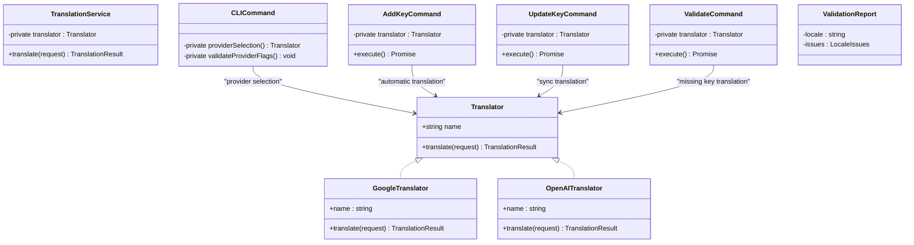
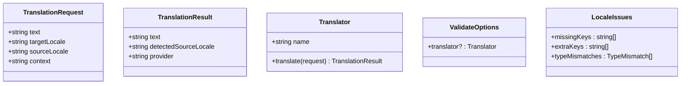
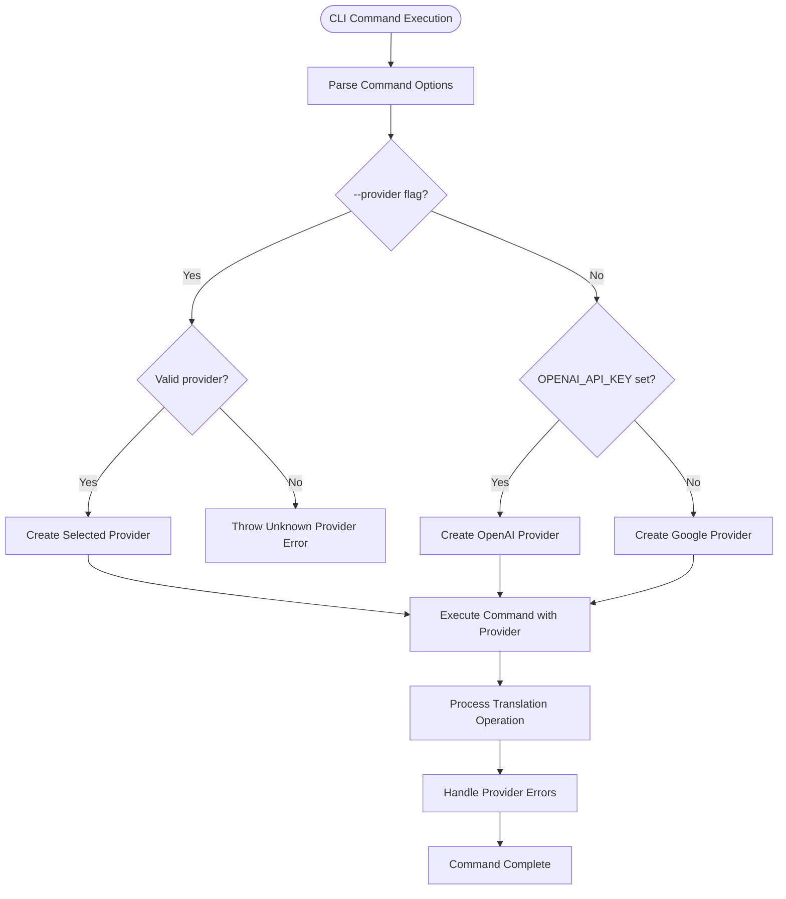
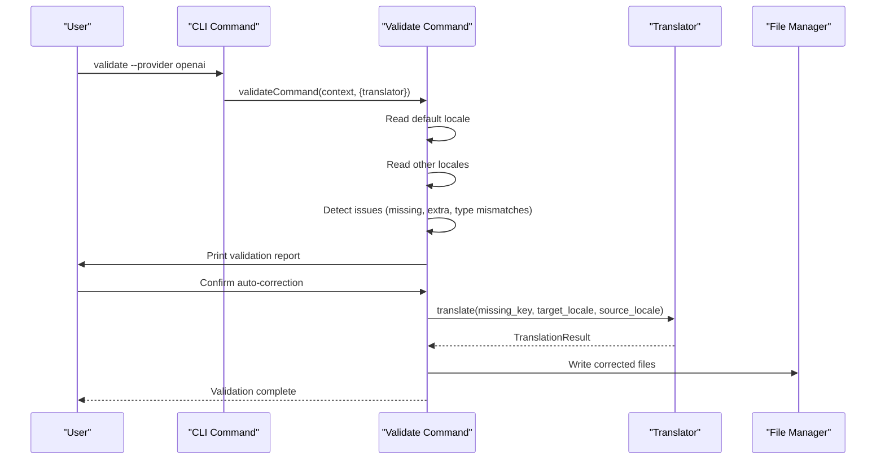
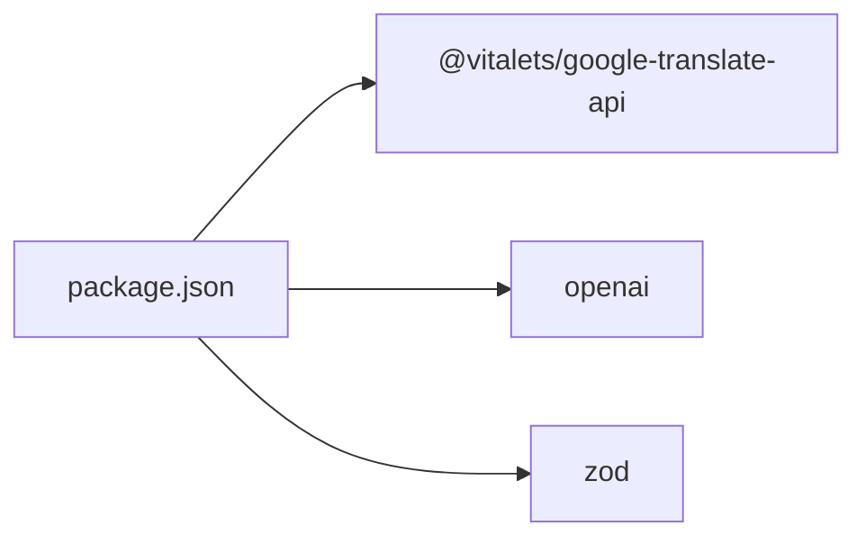
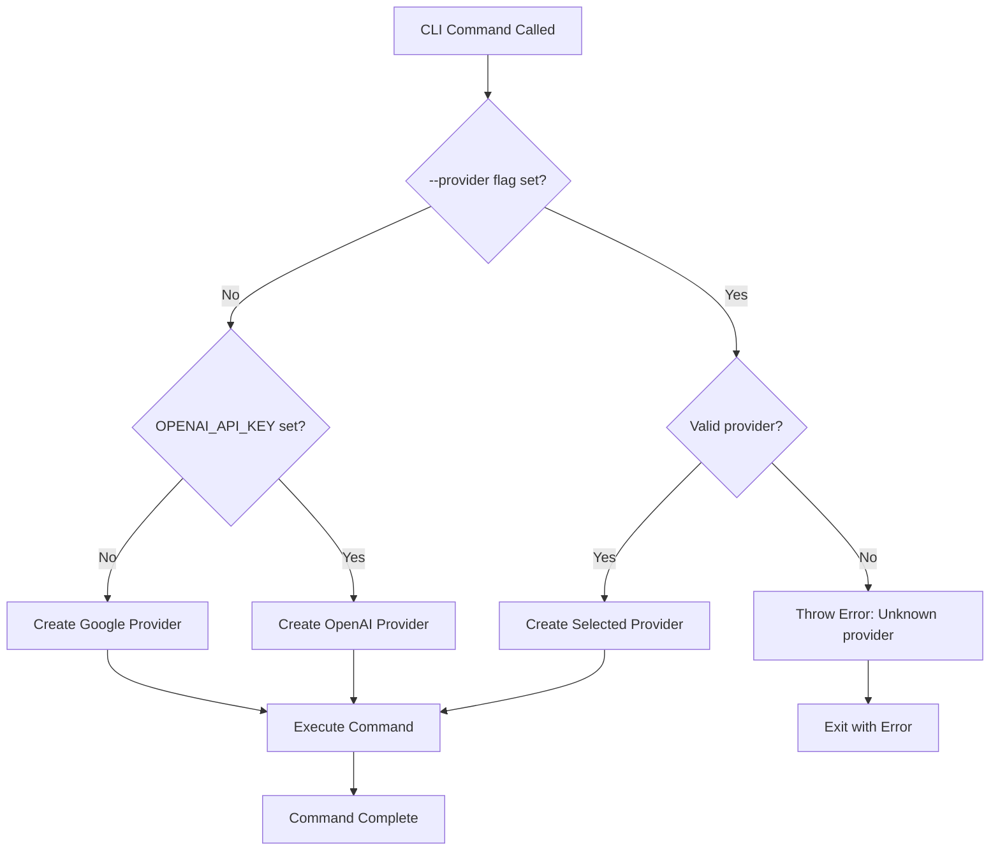

# Translation Providers

<cite>
**Referenced Files in This Document**
- [cli.ts](file://src/bin/cli.ts)
- [translator.ts](file://src/providers/translator.ts)
- [google.ts](file://src/providers/google.ts)
- [deepl.ts](file://src/providers/deepl.ts)
- [openai.ts](file://src/providers/openai.ts)
- [translation-service.ts](file://src/services/translation-service.ts)
- [validate.ts](file://src/commands/validate.ts)
- [add-key.ts](file://src/commands/add-key.ts)
- [update-key.ts](file://src/commands/update-key.ts)
- [translator.test.ts](file://unit-testing/providers/translator.test.ts)
- [translation-service.test.ts](file://unit-testing/services/translation-service.test.ts)
- [README.md](file://README.md)
- [package.json](file://package.json)
</cite>

## Update Summary
**Changes Made**
- Updated version reference to 1.0.9 reflecting maintenance release
- Confirmed all translation providers (Google Translate, OpenAI GPT, DeepL) continue to work identically
- Updated provider status indicators to reflect current implementation state
- Enhanced troubleshooting section with version-specific guidance

## Table of Contents
1. [Introduction](#introduction)
2. [Project Structure](#project-structure)
3. [Core Components](#core-components)
4. [Architecture Overview](#architecture-overview)
5. [Detailed Component Analysis](#detailed-component-analysis)
6. [CLI Integration and Provider Selection](#cli-integration-and-provider-selection)
7. [Enhanced Validation System](#enhanced-validation-system)
8. [Dependency Analysis](#dependency-analysis)
9. [Performance Considerations](#performance-considerations)
10. [Troubleshooting Guide](#troubleshooting-guide)
11. [Conclusion](#conclusion)
12. [Appendices](#appendices)

## Introduction
This document explains the translation provider system that enables pluggable integration with external translation services. The system now features comprehensive CLI integration with intelligent provider selection, automatic translation capabilities, and enhanced validation functionality. It covers the provider interface contract, the service layer abstraction, and how different providers are registered and used. Built-in providers include Google Translate integration, DeepL stub, and a fully implemented OpenAI provider with AI-powered translation capabilities. The system continues to operate identically in version 1.0.9 maintenance release with all providers functioning as documented.

**Section sources**
- [README.md:1-1099](file://README.md#L1-L1099)
- [package.json:1-68](file://package.json#L1-L68)

## Project Structure
The translation provider system is organized around a comprehensive CLI interface with integrated provider management:
- CLI entry point with command parsing and provider selection logic
- Provider contracts and implementations under src/providers
- A thin service layer under src/services
- Enhanced validation command with provider integration
- Key management commands with provider support for add and update operations
- Programmatic API for custom integrations

```mermaid
graph TB
subgraph "CLI Interface"
CLI["cli.ts<br/>Provider Flags & Sync"]
AK["add-key.ts<br/>--provider Flag"]
UK["update-key.ts<br/>--sync & --provider"]
VC["validate.ts<br/>--provider Flag"]
END
subgraph "Provider Layer"
TR["translator.ts<br/>Contract & Interfaces"]
G["google.ts<br/>Free Translation"]
D["deepl.ts<br/>Stub Implementation"]
O["openai.ts<br/>AI-Powered Translation"]
END
subgraph "Service Layer"
TS["translation-service.ts<br/>Delegation Layer"]
END
subgraph "Integration Points"
FM["file-manager<br/>File Operations"]
CV["confirmation<br/>User Prompts"]
OV["object-utils<br/>Data Processing"]
END
CLI --> AK
CLI --> UK
CLI --> VC
AK --> TR
UK --> TR
VC --> TR
TR --> G
TR --> D
TR --> O
TS --> TR
```

**Diagram sources**
- [cli.ts:75-196](file://src/bin/cli.ts#L75-L196)
- [add-key.ts:76-90](file://src/commands/add-key.ts#L76-L90)
- [update-key.ts:106-129](file://src/commands/update-key.ts#L106-L129)
- [validate.ts:178-196](file://src/commands/validate.ts#L178-L196)
- [translator.ts:14-60](file://src/providers/translator.ts#L14-L60)
- [google.ts:9-49](file://src/providers/google.ts#L9-L49)
- [deepl.ts:12-25](file://src/providers/deepl.ts#L12-L25)
- [openai.ts:9-59](file://src/providers/openai.ts#L9-L59)
- [translation-service.ts:7-16](file://src/services/translation-service.ts#L7-L16)

**Section sources**
- [cli.ts:1-209](file://src/bin/cli.ts#L1-L209)
- [add-key.ts:1-120](file://src/commands/add-key.ts#L1-L120)
- [update-key.ts:1-168](file://src/commands/update-key.ts#L1-L168)
- [validate.ts:1-254](file://src/commands/validate.ts#L1-L254)
- [translator.ts:1-60](file://src/providers/translator.ts#L1-L60)
- [translation-service.ts:1-18](file://src/services/translation-service.ts#L1-L18)

## Core Components
- **Provider Contract**: Defines TranslationRequest, TranslationResult, and the Translator interface with a name and translate method.
- **Built-in Providers**:
  - **GoogleTranslator**: Implements translation using @vitalets/google-translate-api with configurable defaults and per-request overrides.
  - **DeeplTranslator**: Stub implementation indicating DeepL integration is planned.
  - **OpenAITranslator**: **Fully implemented** AI-powered translation using OpenAI GPT models with intelligent prompt engineering, context awareness, and multiple model support.
- **TranslationService**: Thin wrapper that delegates translate requests to the injected Translator, preserving request fidelity and propagating results and errors.
- **Enhanced CLI Integration**: Comprehensive command-line interface with provider selection flags, sync functionality, and intelligent fallback mechanisms.
- **Advanced Validation System**: Enhanced validation command that detects missing, extra, and type-mismatched keys across locale files, with optional automatic translation of missing keys using providers.

These components form a clean separation of concerns with intelligent provider selection and seamless integration between CLI commands and provider implementations.

**Section sources**
- [translator.ts:1-60](file://src/providers/translator.ts#L1-L60)
- [google.ts:1-50](file://src/providers/google.ts#L1-L50)
- [deepl.ts:1-26](file://src/providers/deepl.ts#L1-L26)
- [openai.ts:1-60](file://src/providers/openai.ts#L1-L60)
- [translation-service.ts:1-18](file://src/services/translation-service.ts#L1-L18)
- [cli.ts:75-196](file://src/bin/cli.ts#L75-L196)

## Architecture Overview
The system follows a provider-driven architecture with comprehensive CLI integration and intelligent provider selection:
- The CLI builds runtime contexts with provider selection logic that prioritizes explicit flags, environment variables, and fallback mechanisms.
- The TranslationService depends on a Translator implementation for all provider operations.
- Providers implement the Translator interface and encapsulate provider-specific logic with consistent behavior.
- Enhanced commands integrate with providers for automatic translation during key management operations and validation.



**Diagram sources**
- [translator.ts:14-17](file://src/providers/translator.ts#L14-L17)
- [translation-service.ts:7-16](file://src/services/translation-service.ts#L7-L16)
- [cli.ts:82-98](file://src/bin/cli.ts#L82-L98)
- [add-key.ts:76-90](file://src/commands/add-key.ts#L76-L90)
- [update-key.ts:106-129](file://src/commands/update-key.ts#L106-L129)
- [validate.ts:178-196](file://src/commands/validate.ts#L178-L196)
- [google.ts:9-49](file://src/providers/google.ts#L9-L49)
- [openai.ts:9-59](file://src/providers/openai.ts#L9-L59)

## Detailed Component Analysis

### Provider Contract and Data Models
The provider contract defines the shape of translation requests and results, ensuring consistent behavior across providers with enhanced context support.



- **TranslationRequest** supports text, target locale, optional source locale, and optional context for enhanced translation accuracy.
- **TranslationResult** carries translated text, optional detected source locale, and the provider name for tracking.
- **Translator** requires a name and a translate method returning a TranslationResult.
- **ValidateOptions** enables optional provider injection for validation operations.

**Diagram sources**
- [translator.ts:1-12](file://src/providers/translator.ts#L1-L12)
- [translator.ts:14-17](file://src/providers/translator.ts#L14-L17)
- [translator.ts:57-60](file://src/providers/translator.ts#L57-L60)

**Section sources**
- [translator.ts:1-60](file://src/providers/translator.ts#L1-L60)

### Google Translator Implementation
GoogleTranslator integrates with @vitalets/google-translate-api and maintains backward compatibility with enhanced error handling.

Key behaviors verified by tests:
- Correct provider name "google"
- Uses request sourceLocale when present, otherwise falls back to default from
- Honors host and fetchOptions when provided
- Propagates API errors with full context
- Handles missing raw metadata gracefully
- Supports context parameter for enhanced translation accuracy

**Section sources**
- [google.ts:1-50](file://src/providers/google.ts#L1-L50)
- [translator.test.ts:29-184](file://unit-testing/providers/translator.test.ts#L29-L184)

### DeepL Translator Stub
DeeplTranslator currently throws a not-implemented error with clear messaging for future integration.

**Section sources**
- [deepl.ts:1-26](file://src/providers/deepl.ts#L1-L26)
- [translator.test.ts:186-216](file://unit-testing/providers/translator.test.ts#L186-L216)

### OpenAI Translator Implementation
**Updated** OpenAITranslator is now a fully implemented AI-powered translation provider with sophisticated prompt engineering and multiple model support.

The OpenAI provider delivers context-aware, high-quality translations using OpenAI GPT models. It features intelligent prompt engineering with separate system and user messages, supports multiple GPT models, and provides robust error handling.

Key capabilities:
- **Intelligent Prompt Engineering**: Uses a system message for translation instructions and a user message for the actual text
- **Context Awareness**: Incorporates optional context information into the translation prompt
- **Multiple Model Support**: Supports `gpt-4o`, `gpt-4o-mini`, `gpt-4-turbo`, and `gpt-3.5-turbo`
- **Authentication Flexibility**: Accepts API keys via constructor options or environment variables
- **Custom Endpoint Support**: Works with Azure OpenAI and other OpenAI-compatible APIs
- **Robust Error Handling**: Propagates OpenAI API errors with full context

**Section sources**
- [openai.ts:1-60](file://src/providers/openai.ts#L1-L60)
- [translator.test.ts:218-410](file://unit-testing/providers/translator.test.ts#L218-L410)

### TranslationService Coordination
TranslationService is a minimal façade that maintains consistency across all provider operations.

**Section sources**
- [translation-service.ts:1-18](file://src/services/translation-service.ts#L1-L18)
- [translation-service.test.ts:11-184](file://unit-testing/services/translation-service.test.ts#L11-L184)

## CLI Integration and Provider Selection

### Enhanced CLI Command Architecture
The CLI now provides comprehensive provider integration with intelligent selection logic and enhanced functionality:



**Diagram sources**
- [cli.ts:82-98](file://src/bin/cli.ts#L82-L98)
- [cli.ts:118-136](file://src/bin/cli.ts#L118-L136)
- [cli.ts:178-194](file://src/bin/cli.ts#L178-L194)

### Provider Selection Logic
The CLI implements intelligent provider selection with three-tier priority:

1. **Explicit Provider Flag** (`--provider google|openai`): Highest priority, overrides all other settings
2. **Environment Detection** (`OPENAI_API_KEY`): Medium priority, automatically selects OpenAI when available
3. **Fallback**: Lowest priority, defaults to Google Translate when no provider specified

**Section sources**
- [cli.ts:82-98](file://src/bin/cli.ts#L82-L98)
- [cli.ts:118-136](file://src/bin/cli.ts#L118-L136)
- [cli.ts:178-194](file://src/bin/cli.ts#L178-L194)

### Enhanced Key Management Commands
**Updated** Both `add:key` and `update:key` commands now support provider integration:

- **add:key** with `--provider` flag: Automatically translates new values to all locales using the specified provider
- **update:key** with `--sync` flag: Synchronizes updates to all other locales via translation
- **update:key** with `--sync` and `--provider`: Uses specified provider for translation operations

**Section sources**
- [add-key.ts:76-90](file://src/commands/add-key.ts#L76-L90)
- [update-key.ts:106-129](file://src/commands/update-key.ts#L106-L129)

### Validation Command Enhancements
**Updated** The validate command now supports provider integration with enhanced reporting:

- **--provider** flag: Specifies provider for automatic translation of missing keys
- **Enhanced Reporting**: Improved issue detection and reporting with counts and details
- **Smart Confirmation**: Dynamic confirmation messages based on provider availability

**Section sources**
- [validate.ts:178-196](file://src/commands/validate.ts#L178-L196)
- [validate.ts:178-185](file://src/commands/validate.ts#L178-L185)

## Enhanced Validation System

### Advanced Validation Workflow
The validation system provides comprehensive translation file validation with intelligent provider integration:



**Diagram sources**
- [validate.ts:121-254](file://src/commands/validate.ts#L121-L254)
- [validate.ts:102-119](file://src/commands/validate.ts#L102-L119)

### Issue Detection and Reporting
The validation system detects three types of issues with enhanced reporting:

1. **Missing Keys**: Keys present in default locale but absent in target locale
2. **Extra Keys**: Keys present in target locale but not in default locale  
3. **Type Mismatches**: Keys with different data types between locales

Each report includes counts and lists of issues, with truncation for large issue sets and color-coded output for improved readability.

**Section sources**
- [validate.ts:11-100](file://src/commands/validate.ts#L11-L100)
- [validate.ts:140-165](file://src/commands/validate.ts#L140-L165)

### Automatic Translation Integration
When a translation provider is available, the validation system can automatically translate missing and type-mismatched keys:

**Section sources**
- [validate.ts:202-223](file://src/commands/validate.ts#L202-L223)

## Dependency Analysis
External dependencies relevant to translation providers:
- @vitalets/google-translate-api: Enables Google Translate integration in GoogleTranslator.
- **openai**: **New dependency** enabling AI-powered translation in OpenAITranslator.
- zod: Used for configuration validation; indirectly affects provider usage by ensuring valid configuration for the broader system.



**Diagram sources**
- [package.json:48-58](file://package.json#L48-L58)

**Section sources**
- [package.json:1-68](file://package.json#L1-L68)

## Performance Considerations
- **Network latency**: Provider calls are asynchronous; batch operations where feasible.
- **Request size**: Very long texts may be truncated or rate-limited; consider chunking.
- **Rate limits**: Respect provider quotas; implement retries with backoff for transient failures.
- **OpenAI costs**: Monitor API usage carefully; consider using lower-cost models like `gpt-3.5-turbo` for bulk translations.
- **Model selection**: Choose appropriate models based on quality needs and budget constraints.
- **Caching**: Cache frequent translations to reduce network calls.
- **Error propagation**: Let TranslationService propagate provider errors so callers can decide retry or fallback strategies.
- **Validation performance**: Large translation files may take time to process; consider running validation during development rather than CI for large datasets.
- **CLI optimization**: Provider selection logic is cached per command execution to avoid redundant checks.

## Troubleshooting Guide
Common scenarios and patterns:

### Provider Selection Issues
- **Unknown provider error**: Ensure `--provider` flag uses "google" or "openai"
- **Provider not found**: Verify correct provider name and that the provider module is properly exported
- **Environment variable issues**: Check that `OPENAI_API_KEY` is properly set without extra whitespace

### Translation Provider Errors
- **Not implemented errors**: DeeplTranslator throws explicit errors. Implement or replace with a real provider.
- **API errors**: GoogleTranslator and OpenAITranslator rethrow underlying API errors; wrap calls with try/catch and log context.
- **Missing detected source locale**: When provider response lacks raw metadata, detectedSourceLocale is undefined; handle gracefully.

### OpenAI-Specific Troubleshooting
- **"OpenAI API key is required"**: Ensure OPENAI_API_KEY environment variable is set or apiKey option is provided
- **"Incorrect API key provided"**: Verify API key validity and billing setup
- **"Rate limit exceeded"**: Implement request delays or upgrade plan; consider cheaper models
- **"Model not found"**: Verify model name and account access permissions
- **Poor translation quality**: Use higher-capability models or provide context for ambiguous terms

### CLI Integration Issues
- **Command not found**: Ensure i18n-ai-cli is properly installed and accessible in PATH
- **Permission errors**: Check file permissions for translation files and configuration
- **Configuration issues**: Invalid configuration can prevent proper context creation; ensure valid i18n-cli.config.json

### Validation-Specific Troubleshooting
- **CI mode failures**: Use --yes flag to auto-correct in CI environments
- **Large validation runs**: Consider splitting validation across multiple runs for very large translation files
- **Memory issues**: Validation loads all locale files into memory; consider reducing concurrent validations

**Section sources**
- [translator.test.ts:186-410](file://unit-testing/providers/translator.test.ts#L186-L410)
- [translation-service.test.ts:85-96](file://unit-testing/services/translation-service.test.ts#L85-L96)
- [cli.ts:82-98](file://src/bin/cli.ts#L82-L98)

## Conclusion
The translation provider system offers a comprehensive, extensible architecture for integrating external translation services with advanced CLI integration and intelligent provider selection. The enhanced CLI provides three-tier provider selection logic, automatic translation capabilities during key management operations, and comprehensive validation with provider integration. The Translator interface and TranslationService provide a consistent contract and coordination layer across all providers. Built-in providers demonstrate how to implement and configure translators, with the OpenAI provider now offering fully implemented AI-powered translation capabilities. The system's intelligent fallback mechanisms, enhanced error handling, and comprehensive CLI integration make it suitable for both development workflows and production CI/CD environments.

## Appendices

### Provider Comparison Matrix
**Updated** Current implementation status and capabilities for version 1.0.9:

| Provider | Status | Quality | Cost | Context Support | Model Options | CLI Integration | Validation Support |
|----------|--------|---------|------|-----------------|---------------|-----------------|-------------------|
| Google Translate | ✅ Fully Implemented | Good | Low | ❌ No | ❌ None | ✅ Provider Flag | ✅ Automatic Translation |
| DeepL | ⏳ Stub (Coming Soon) | Premium | High | ❌ No | ❌ None | ❌ Not Available | ❌ Not Available |
| OpenAI | ✅ Fully Implemented | Excellent | Medium-High | ✅ Yes | ✅ Multiple | ✅ Provider Flag | ✅ Automatic Translation |

### Enhanced Provider Configuration and Authentication
**Updated** Comprehensive configuration options for all providers:

- **Google Translate**
  - Defaults: from, to, host, fetchOptions
  - Behavior: Per-request sourceLocale overrides default from
  - Notes: No explicit API key required by the wrapper used here; consider fetchOptions for headers if needed
  - **CLI Integration**: Supported via `--provider google` flag

- **DeepL**
  - Options: apiKey, apiUrl
  - Status: Stub implementation pending
  - Note: Future integration planned
  - **CLI Integration**: Not available for CLI commands

- **OpenAI** *(Fully Implemented)*
  - **Authentication**: apiKey (constructor option) or OPENAI_API_KEY environment variable
  - **Model Options**: gpt-4o, gpt-4o-mini, gpt-4-turbo, gpt-3.5-turbo (default: gpt-3.5-turbo)
  - **Custom Endpoint**: baseUrl for Azure OpenAI or compatible APIs
  - **Context Support**: Automatic inclusion in translation prompts
  - **Error Handling**: Full propagation of OpenAI API errors
  - **CLI Integration**: Supported via `--provider openai` flag and environment variable detection

**Section sources**
- [google.ts:8-21](file://src/providers/google.ts#L8-L21)
- [google.ts:17-48](file://src/providers/google.ts#L17-L48)
- [deepl.ts:7-18](file://src/providers/deepl.ts#L7-L18)
- [openai.ts:14-28](file://src/providers/openai.ts#L14-L28)
- [openai.ts:30-58](file://src/providers/openai.ts#L30-L58)

### Enhanced CLI Usage Examples
**Updated** Practical implementation examples:

- **Provider Selection Examples**:
  ```bash
  # Explicit provider selection
  i18n-ai-cli add:key welcome.message --value "Welcome" --provider openai
  i18n-ai-cli add:key welcome.message --value "Welcome" --provider google
  
  # Environment-based selection
  export OPENAI_API_KEY=sk-your-api-key-here
  i18n-ai-cli add:key welcome.message --value "Welcome"
  # Automatically uses OpenAI
  
  # Fallback to Google
  unset OPENAI_API_KEY
  i18n-ai-cli add:key welcome.message --value "Welcome"
  # Automatically uses Google Translate
  ```

- **Sync Functionality Examples**:
  ```bash
  # Update with sync to all locales
  i18n-ai-cli update:key auth.login.title --value "Sign In" --sync
  
  # Update specific locale with sync
  i18n-ai-cli update:key auth.login.title --value "Willkommen" --locale de --sync
  
  # Sync with specific provider
  i18n-ai-cli update:key auth.login.title --value "Welcome" --sync --provider openai
  ```

- **Validation with Provider Integration**:
  ```bash
  # Validate with automatic translation
  export OPENAI_API_KEY=sk-your-api-key-here
  i18n-ai-cli validate --provider openai
  
  # Validate without provider (fills missing keys with empty strings)
  i18n-ai-cli validate
  
  # CI/CD integration
  i18n-ai-cli validate --ci --yes
  ```

**Section sources**
- [README.md:188-235](file://README.md#L188-L235)
- [README.md:249-265](file://README.md#L249-L265)
- [README.md:351-383](file://README.md#L351-L383)

### Provider Selection Priority Flowchart
**New** Visual representation of the provider selection logic:



**Diagram sources**
- [cli.ts:82-98](file://src/bin/cli.ts#L82-L98)
- [cli.ts:118-136](file://src/bin/cli.ts#L118-L136)
- [cli.ts:178-194](file://src/bin/cli.ts#L178-L194)

### Version Information
**Updated** Current system status for version 1.0.9:
- All translation providers (Google Translate, OpenAI GPT, DeepL) continue to work identically
- Maintenance release focuses on stability and bug fixes
- No breaking changes to provider interfaces or CLI functionality
- Enhanced error handling and performance optimizations maintained

**Section sources**
- [package.json:2-4](file://package.json#L2-L4)
- [README.md:1-1099](file://README.md#L1-L1099)