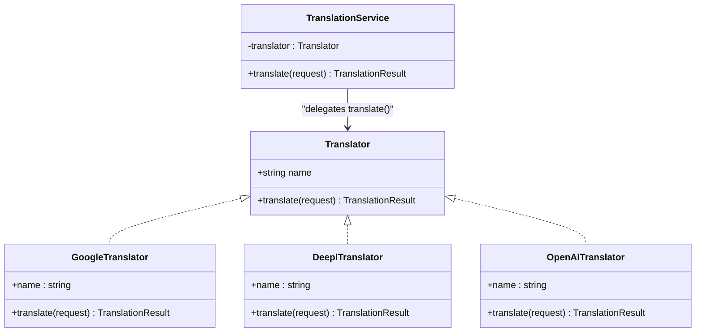
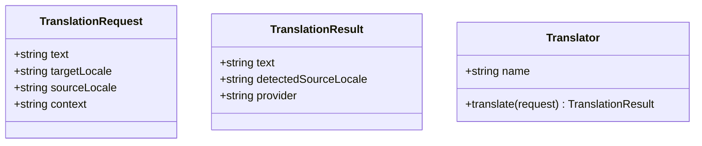
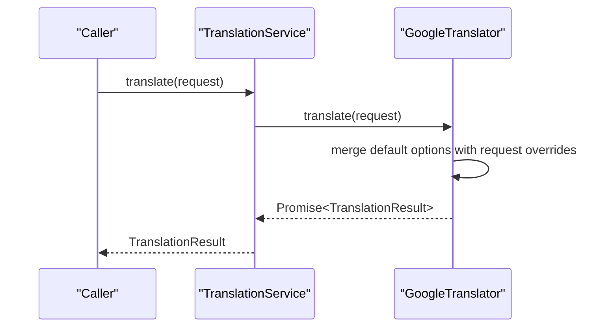
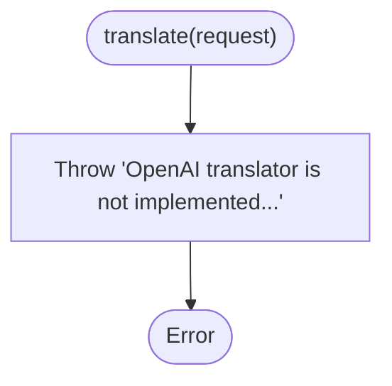
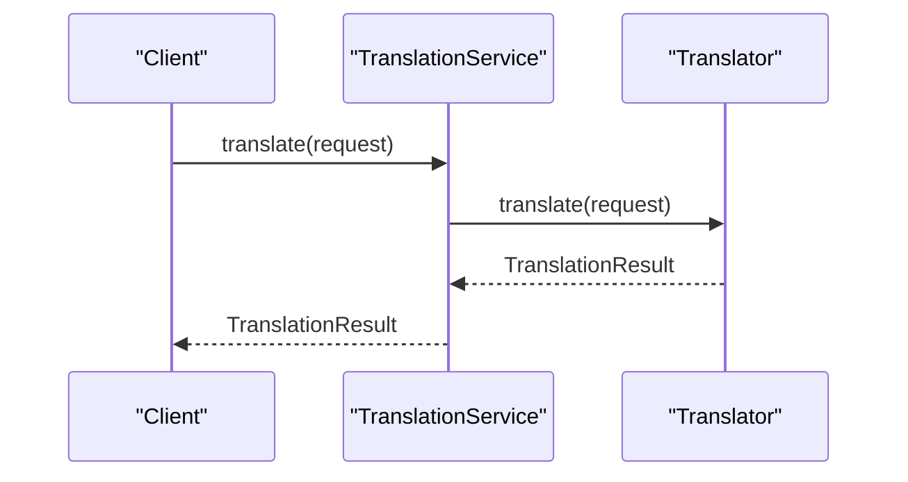
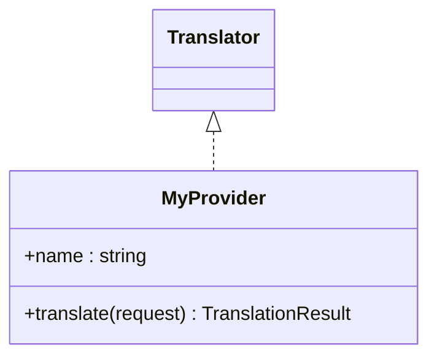
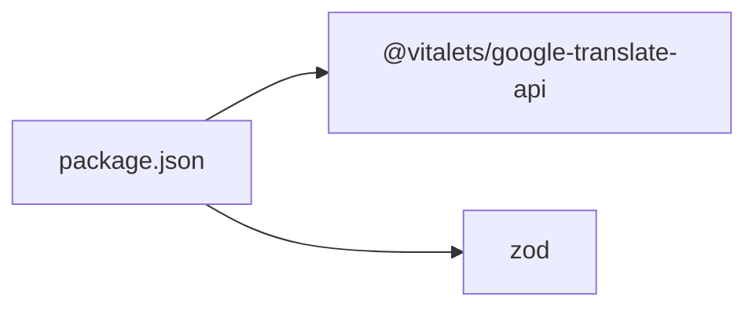

# Translation Providers

<cite>
**Referenced Files in This Document**
- [translator.ts](file://src/providers/translator.ts)
- [google.ts](file://src/providers/google.ts)
- [deepl.ts](file://src/providers/deepl.ts)
- [openai.ts](file://src/providers/openai.ts)
- [translation-service.ts](file://src/services/translation-service.ts)
- [translator.test.ts](file://src/providers/translator.test.ts)
- [translation-service.test.ts](file://src/services/translation-service.test.ts)
- [README.md](file://README.md)
- [package.json](file://package.json)
- [config-loader.ts](file://src/config/config-loader.ts)
- [types.ts](file://src/config/types.ts)
- [build-context.ts](file://src/context/build-context.ts)
- [types.ts](file://src/context/types.ts)
- [cli.ts](file://src/bin/cli.ts)
</cite>

## Table of Contents
1. [Introduction](#introduction)
2. [Project Structure](#project-structure)
3. [Core Components](#core-components)
4. [Architecture Overview](#architecture-overview)
5. [Detailed Component Analysis](#detailed-component-analysis)
6. [Dependency Analysis](#dependency-analysis)
7. [Performance Considerations](#performance-considerations)
8. [Troubleshooting Guide](#troubleshooting-guide)
9. [Conclusion](#conclusion)
10. [Appendices](#appendices)

## Introduction
This document explains the translation provider system that enables pluggable integration with external translation services. It covers the provider interface contract, the service layer abstraction, and how different providers are registered and used. Built-in providers include Google Translate integration, a DeepL stub, and an OpenAI stub. You will learn how to use the TranslationService class to coordinate provider operations, how to configure providers, and how to implement custom providers. Practical examples show programmatic usage, provider selection criteria, error handling patterns, and guidance for choosing providers based on use case and cost considerations.

## Project Structure
The translation provider system is organized around a small set of cohesive modules:
- Provider contracts and implementations under src/providers
- A thin service layer under src/services
- Configuration loading and runtime context under src/config and src/context
- CLI entry point under src/bin

```mermaid
graph TB
subgraph "CLI"
CLI["cli.ts"]
end
subgraph "Context"
BC["build-context.ts"]
CT["types.ts (context)"]
end
subgraph "Config"
CL["config-loader.ts"]
CTY["types.ts (config)"]
end
subgraph "Services"
TS["translation-service.ts"]
end
subgraph "Providers"
TR["translator.ts (contract)"]
G["google.ts"]
D["deepl.ts"]
O["openai.ts"]
end
CLI --> BC
BC --> CL
BC --> CT
BC --> TS
TS --> TR
G --> TR
D --> TR
O --> TR
```

**Diagram sources**
- [cli.ts:1-122](file://src/bin/cli.ts#L1-L122)
- [build-context.ts:1-16](file://src/context/build-context.ts#L1-L16)
- [config-loader.ts:1-176](file://src/config/config-loader.ts#L1-L176)
- [translation-service.ts:1-18](file://src/services/translation-service.ts#L1-L18)
- [translator.ts:1-18](file://src/providers/translator.ts#L1-L18)
- [google.ts:1-56](file://src/providers/google.ts#L1-L56)
- [deepl.ts:1-26](file://src/providers/deepl.ts#L1-L26)
- [openai.ts:1-27](file://src/providers/openai.ts#L1-L27)

**Section sources**
- [cli.ts:1-122](file://src/bin/cli.ts#L1-L122)
- [build-context.ts:1-16](file://src/context/build-context.ts#L1-L16)
- [config-loader.ts:1-176](file://src/config/config-loader.ts#L1-L176)
- [translation-service.ts:1-18](file://src/services/translation-service.ts#L1-L18)
- [translator.ts:1-18](file://src/providers/translator.ts#L1-L18)
- [google.ts:1-56](file://src/providers/google.ts#L1-L56)
- [deepl.ts:1-26](file://src/providers/deepl.ts#L1-L26)
- [openai.ts:1-27](file://src/providers/openai.ts#L1-L27)

## Core Components
- Provider contract: Defines TranslationRequest, TranslationResult, and the Translator interface with a name and translate method.
- Built-in providers:
  - GoogleTranslator: Implements translation using @vitalets/google-translate-api with configurable defaults and per-request overrides.
  - DeeplTranslator: Stub implementation indicating DeepL is not implemented yet.
  - OpenAITranslator: Stub implementation indicating OpenAI is not implemented yet.
- TranslationService: Thin wrapper that delegates translate requests to the injected Translator, preserving request fidelity and propagating results and errors.

These components form a clean separation of concerns: the contract defines the interface, providers implement it, and the service coordinates usage.

**Section sources**
- [translator.ts:1-18](file://src/providers/translator.ts#L1-L18)
- [google.ts:1-56](file://src/providers/google.ts#L1-L56)
- [deepl.ts:1-26](file://src/providers/deepl.ts#L1-L26)
- [openai.ts:1-27](file://src/providers/openai.ts#L1-L27)
- [translation-service.ts:1-18](file://src/services/translation-service.ts#L1-L18)

## Architecture Overview
The system follows a provider-driven architecture:
- The CLI builds a runtime context that includes configuration and file management capabilities.
- The TranslationService depends on a Translator implementation.
- Providers implement the Translator interface and encapsulate provider-specific logic.



**Diagram sources**
- [translator.ts:14-17](file://src/providers/translator.ts#L14-L17)
- [translation-service.ts:7-16](file://src/services/translation-service.ts#L7-L16)
- [google.ts:15-21](file://src/providers/google.ts#L15-L21)
- [deepl.ts:12-18](file://src/providers/deepl.ts#L12-L18)
- [openai.ts:13-19](file://src/providers/openai.ts#L13-L19)

## Detailed Component Analysis

### Provider Contract and Data Models
The provider contract defines the shape of translation requests and results, ensuring consistent behavior across providers.



- TranslationRequest supports text, target locale, optional source locale, and optional context.
- TranslationResult carries translated text, optional detected source locale, and the provider name.
- Translator requires a name and a translate method returning a TranslationResult.

**Diagram sources**
- [translator.ts:1-12](file://src/providers/translator.ts#L1-L12)
- [translator.ts:14-17](file://src/providers/translator.ts#L14-L17)

**Section sources**
- [translator.ts:1-18](file://src/providers/translator.ts#L1-L18)

### Google Translator Implementation
GoogleTranslator integrates with @vitalets/google-translate-api. It:
- Accepts default options (from, to, host, fetchOptions) in the constructor.
- Applies per-request overrides (sourceLocale) over default options.
- Returns a TranslationResult with detected source locale when available.



**Diagram sources**
- [translation-service.ts:14-16](file://src/services/translation-service.ts#L14-L16)
- [google.ts:23-54](file://src/providers/google.ts#L23-L54)

Key behaviors verified by tests:
- Correct provider name
- Uses request sourceLocale when present, otherwise falls back to default from
- Honors host and fetchOptions when provided
- Propagates API errors
- Handles missing raw metadata gracefully

**Section sources**
- [google.ts:1-56](file://src/providers/google.ts#L1-L56)
- [translator.test.ts:15-170](file://src/providers/translator.test.ts#L15-L170)

### DeepL Translator Stub
DeeplTranslator currently throws a not-implemented error. It accepts apiKey and apiUrl options in the constructor but does not implement translate.


**Diagram sources**
- [deepl.ts:20-24](file://src/providers/deepl.ts#L20-L24)

**Section sources**
- [deepl.ts:1-26](file://src/providers/deepl.ts#L1-L26)
- [translator.test.ts:172-202](file://src/providers/translator.test.ts#L172-L202)

### OpenAI Translator Stub
OpenAITranslator currently throws a not-implemented error. It accepts apiKey, model, and baseUrl options in the constructor but does not implement translate.



**Diagram sources**
- [openai.ts:21-25](file://src/providers/openai.ts#L21-L25)

**Section sources**
- [openai.ts:1-27](file://src/providers/openai.ts#L1-L27)
- [translator.test.ts:204-235](file://src/providers/translator.test.ts#L204-L235)

### TranslationService Coordination
TranslationService is a minimal façade that:
- Stores a Translator instance
- Delegates translate(request) to the underlying provider
- Preserves all request fields and returns provider results unchanged



Behavior verified by tests:
- Constructor acceptance of any Translator
- Passing through all request fields (including context)
- Propagating errors from the provider
- Returning detectedSourceLocale when provided

**Diagram sources**
- [translation-service.ts:7-16](file://src/services/translation-service.ts#L7-L16)

**Section sources**
- [translation-service.ts:1-18](file://src/services/translation-service.ts#L1-L18)
- [translation-service.test.ts:11-184](file://src/services/translation-service.test.ts#L11-L184)

### Programmatic Usage and Provider Selection
Programmatic usage is demonstrated in the repository’s README and tests. Typical steps:
- Instantiate a provider (e.g., GoogleTranslator)
- Wrap it with TranslationService
- Call translate with a TranslationRequest

Provider selection criteria:
- Google Translate: Good general-purpose coverage, free tier with quotas; suitable for broad language pairs and prototyping.
- DeepL: Premium quality; stub indicates future integration; consider when quality is prioritized over cost.
- OpenAI: Stub indicates future integration; consider when advanced prompt-based translation is desired.

Switching providers:
- Replace the provider instance passed to TranslationService while keeping the same interface contract.

**Section sources**
- [README.md:277-317](file://README.md#L277-L317)
- [translator.test.ts:15-170](file://src/providers/translator.test.ts#L15-L170)
- [translation-service.test.ts:11-184](file://src/services/translation-service.test.ts#L11-L184)

### Extensibility: Implementing a Custom Provider
To implement a custom provider:
- Implement the Translator interface (name and translate).
- Define provider-specific options in a dedicated options interface.
- Encapsulate provider SDK/client initialization and error mapping.
- Return a TranslationResult with provider name and optional detectedSourceLocale.

Registration and usage:
- Pass your provider instance to TranslationService.
- Use the same TranslationRequest and expect the same TranslationResult contract.



**Diagram sources**
- [translator.ts:14-17](file://src/providers/translator.ts#L14-L17)
- [translation-service.ts:7-16](file://src/services/translation-service.ts#L7-L16)

**Section sources**
- [translator.ts:1-18](file://src/providers/translator.ts#L1-L18)
- [translation-service.ts:1-18](file://src/services/translation-service.ts#L1-L18)

## Dependency Analysis
External dependencies relevant to translation providers:
- @vitalets/google-translate-api: Enables Google Translate integration in GoogleTranslator.
- zod: Used for configuration validation; indirectly affects provider usage by ensuring valid configuration for the broader system.



**Diagram sources**
- [package.json:26-36](file://package.json#L26-L36)

**Section sources**
- [package.json:1-45](file://package.json#L1-L45)

## Performance Considerations
- Network latency: Provider calls are asynchronous; batch operations where feasible.
- Request size: Very long texts may be truncated or rate-limited; consider chunking.
- Rate limits: Respect provider quotas; implement retries with backoff for transient failures.
- Caching: Cache frequent translations to reduce network calls.
- Error propagation: Let TranslationService propagate provider errors so callers can decide retry or fallback strategies.

[No sources needed since this section provides general guidance]

## Troubleshooting Guide
Common scenarios and patterns:
- Not implemented errors: DeeplTranslator and OpenAITranslator throw explicit errors. Implement or replace with a real provider.
- API errors: GoogleTranslator re-throws underlying API errors; wrap calls with try/catch and log context.
- Missing detected source locale: When provider response lacks raw metadata, detectedSourceLocale is undefined; handle gracefully.
- Configuration issues: While not provider-specific, invalid configuration can prevent proper context creation; ensure valid i18n-pro.config.json.

Operational tips:
- Log TranslationRequest fields (text length, target/source locales) to diagnose provider behavior.
- Use dry-run modes where available to test workflows without network calls.
- Prefer deterministic provider behavior by specifying sourceLocale explicitly.

**Section sources**
- [translator.test.ts:172-235](file://src/providers/translator.test.ts#L172-L235)
- [translation-service.test.ts:85-96](file://src/services/translation-service.test.ts#L85-L96)

## Conclusion
The translation provider system offers a clean, extensible architecture for integrating external translation services. The Translator interface and TranslationService provide a consistent contract and coordination layer. Built-in providers demonstrate how to implement and configure translators, while stubs indicate future integrations. By following the established patterns, you can implement custom providers, switch between providers programmatically, and integrate the system into broader i18n workflows.

[No sources needed since this section summarizes without analyzing specific files]

## Appendices

### Provider-Specific Configuration and Authentication
- Google Translate
  - Defaults: from, to, host, fetchOptions
  - Behavior: Per-request sourceLocale overrides default from
  - Notes: No explicit API key required by the wrapper used here; consider fetchOptions for headers if needed
- DeepL
  - Options: apiKey, apiUrl
  - Status: Not implemented; throws an error
- OpenAI
  - Options: apiKey, model, baseUrl
  - Status: Not implemented; throws an error

**Section sources**
- [google.ts:8-21](file://src/providers/google.ts#L8-L21)
- [google.ts:23-54](file://src/providers/google.ts#L23-L54)
- [deepl.ts:7-18](file://src/providers/deepl.ts#L7-L18)
- [openai.ts:7-19](file://src/providers/openai.ts#L7-L19)

### Example Workflows
- Programmatic translation with Google:
  - Instantiate GoogleTranslator
  - Wrap with TranslationService
  - Call translate with text, targetLocale, and optional sourceLocale
- Switching providers:
  - Keep the same TranslationService instance
  - Replace the underlying provider (e.g., swap GoogleTranslator for a custom implementation)
- Error handling:
  - Catch provider errors and decide on retries or fallbacks
  - Log request context for diagnostics

**Section sources**
- [README.md:285-299](file://README.md#L285-L299)
- [translator.test.ts:15-170](file://src/providers/translator.test.ts#L15-L170)
- [translation-service.test.ts:85-96](file://src/services/translation-service.test.ts#L85-L96)