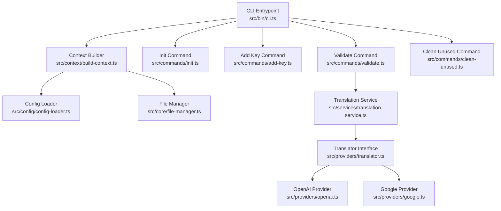
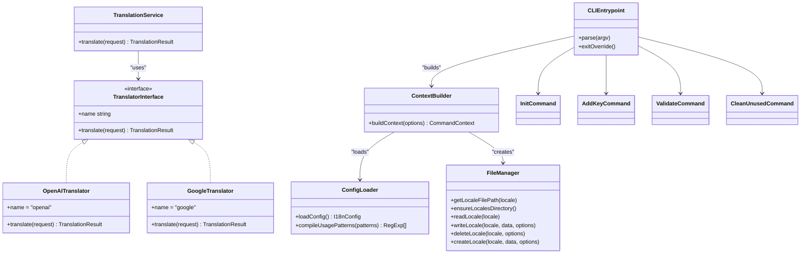
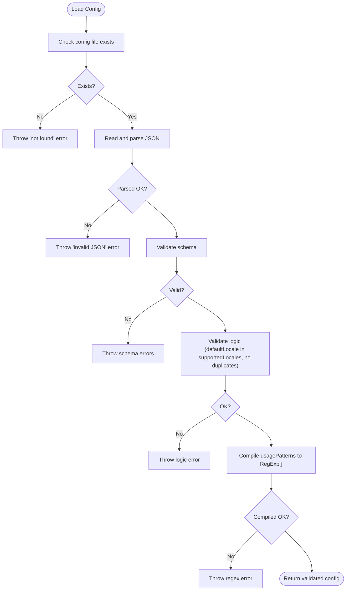
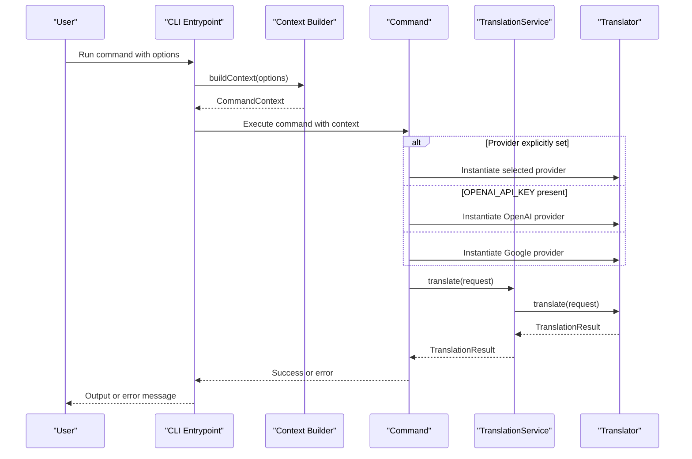
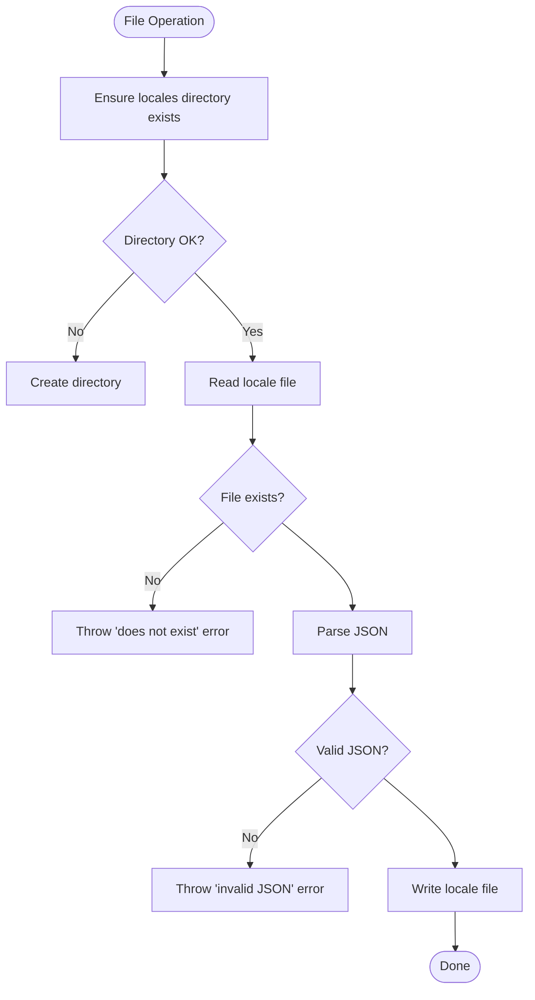
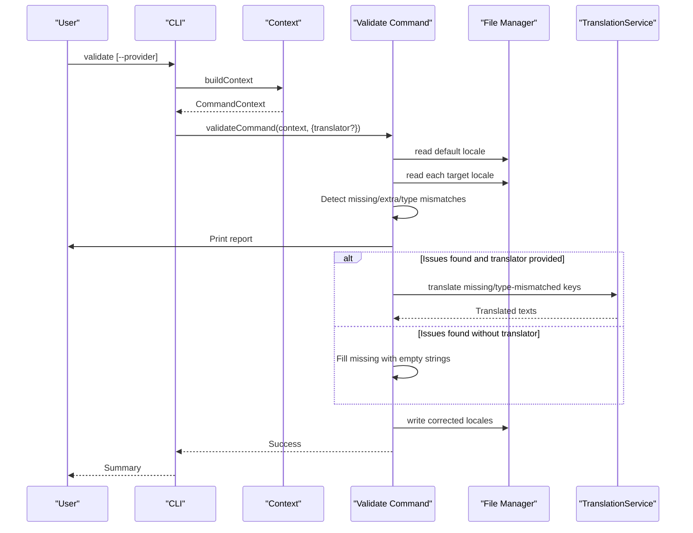
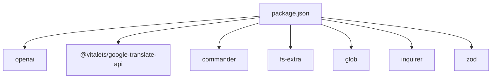

# Troubleshooting and FAQ

<cite>
**Referenced Files in This Document**
- [README.md](file://README.md)
- [package.json](file://package.json)
- [src/bin/cli.ts](file://src/bin/cli.ts)
- [src/context/build-context.ts](file://src/context/build-context.ts)
- [src/config/config-loader.ts](file://src/config/config-loader.ts)
- [src/core/file-manager.ts](file://src/core/file-manager.ts)
- [src/core/confirmation.ts](file://src/core/confirmation.ts)
- [src/core/key-validator.ts](file://src/core/key-validator.ts)
- [src/providers/translator.ts](file://src/providers/translator.ts)
- [src/providers/openai.ts](file://src/providers/openai.ts)
- [src/providers/google.ts](file://src/providers/google.ts)
- [src/services/translation-service.ts](file://src/services/translation-service.ts)
- [src/commands/init.ts](file://src/commands/init.ts)
- [src/commands/validate.ts](file://src/commands/validate.ts)
- [src/commands/add-key.ts](file://src/commands/add-key.ts)
- [src/commands/clean-unused.ts](file://src/commands/clean-unused.ts)
</cite>

## Table of Contents
1. [Introduction](#introduction)
2. [Project Structure](#project-structure)
3. [Core Components](#core-components)
4. [Architecture Overview](#architecture-overview)
5. [Detailed Component Analysis](#detailed-component-analysis)
6. [Dependency Analysis](#dependency-analysis)
7. [Performance Considerations](#performance-considerations)
8. [Troubleshooting Guide](#troubleshooting-guide)
9. [Migration and Breaking Changes](#migration-and-breaking-changes)
10. [Platform and Environment Notes](#platform-and-environment-notes)
11. [Escalation and Community Support](#escalation-and-community-support)
12. [Conclusion](#conclusion)

## Introduction
This document provides a comprehensive troubleshooting and FAQ guide for i18n-ai-cli. It focuses on diagnosing and resolving common issues such as configuration problems, translation provider errors, file permission issues, and validation failures. It also covers systematic debugging approaches, error message explanations, resolution steps, performance optimization techniques, large project handling strategies, migration guidance, platform-specific concerns, and escalation paths.

## Project Structure
The CLI is organized around a clear separation of concerns:
- CLI entrypoint defines commands and global options, orchestrating context building and command execution.
- Context builder loads configuration and initializes the file manager.
- Configuration loader validates and compiles usage patterns.
- File manager handles locale file reads/writes, ensuring directories and sorting.
- Providers implement translation interfaces for OpenAI and Google Translate.
- Services wrap provider usage for higher-level operations.
- Commands implement domain logic for initialization, key management, validation, and cleanup.

**Diagram sources**
- [src/bin/cli.ts:1-209](file://src/bin/cli.ts#L1-L209)
- [src/context/build-context.ts:1-16](file://src/context/build-context.ts#L1-L16)
- [src/config/config-loader.ts:1-176](file://src/config/config-loader.ts#L1-L176)
- [src/core/file-manager.ts:1-118](file://src/core/file-manager.ts#L1-L118)
- [src/providers/translator.ts:1-60](file://src/providers/translator.ts#L1-L60)
- [src/providers/openai.ts:1-60](file://src/providers/openai.ts#L1-L60)
- [src/providers/google.ts:1-50](file://src/providers/google.ts#L1-L50)
- [src/services/translation-service.ts:1-18](file://src/services/translation-service.ts#L1-L18)
- [src/commands/init.ts:1-239](file://src/commands/init.ts#L1-L239)
- [src/commands/add-key.ts:1-120](file://src/commands/add-key.ts#L1-L120)
- [src/commands/validate.ts:1-254](file://src/commands/validate.ts#L1-L254)
- [src/commands/clean-unused.ts:1-138](file://src/commands/clean-unused.ts#L1-L138)

**Section sources**
- [src/bin/cli.ts:1-209](file://src/bin/cli.ts#L1-L209)
- [src/context/build-context.ts:1-16](file://src/context/build-context.ts#L1-L16)
- [src/config/config-loader.ts:1-176](file://src/config/config-loader.ts#L1-L176)
- [src/core/file-manager.ts:1-118](file://src/core/file-manager.ts#L1-L118)
- [src/providers/translator.ts:1-60](file://src/providers/translator.ts#L1-L60)
- [src/providers/openai.ts:1-60](file://src/providers/openai.ts#L1-L60)
- [src/providers/google.ts:1-50](file://src/providers/google.ts#L1-L50)
- [src/services/translation-service.ts:1-18](file://src/services/translation-service.ts#L1-L18)
- [src/commands/init.ts:1-239](file://src/commands/init.ts#L1-L239)
- [src/commands/add-key.ts:1-120](file://src/commands/add-key.ts#L1-L120)
- [src/commands/validate.ts:1-254](file://src/commands/validate.ts#L1-L254)
- [src/commands/clean-unused.ts:1-138](file://src/commands/clean-unused.ts#L1-L138)

## Core Components
- CLI Entrypoint: Defines commands, global options, and provider selection logic. It also centralizes error handling and prints user-friendly messages.
- Context Builder: Loads configuration and constructs the file manager for subsequent commands.
- Config Loader: Validates configuration shape and logic, compiles usage patterns, and throws descriptive errors for invalid inputs.
- File Manager: Handles locale file IO, directory creation, sorting, and dry-run behavior.
- Translator Interface and Providers: Define a unified translation contract and implement OpenAI and Google Translate integrations.
- Commands: Implement domain-specific workflows with confirmation, CI mode, and dry-run support.

**Section sources**
- [src/bin/cli.ts:1-209](file://src/bin/cli.ts#L1-L209)
- [src/context/build-context.ts:1-16](file://src/context/build-context.ts#L1-L16)
- [src/config/config-loader.ts:1-176](file://src/config/config-loader.ts#L1-L176)
- [src/core/file-manager.ts:1-118](file://src/core/file-manager.ts#L1-L118)
- [src/providers/translator.ts:1-60](file://src/providers/translator.ts#L1-L60)
- [src/providers/openai.ts:1-60](file://src/providers/openai.ts#L1-L60)
- [src/providers/google.ts:1-50](file://src/providers/google.ts#L1-L50)
- [src/services/translation-service.ts:1-18](file://src/services/translation-service.ts#L1-L18)
- [src/commands/init.ts:1-239](file://src/commands/init.ts#L1-L239)
- [src/commands/add-key.ts:1-120](file://src/commands/add-key.ts#L1-L120)
- [src/commands/validate.ts:1-254](file://src/commands/validate.ts#L1-L254)
- [src/commands/clean-unused.ts:1-138](file://src/commands/clean-unused.ts#L1-L138)

## Architecture Overview
The CLI follows a layered architecture:
- Presentation: CLI commands and options.
- Orchestration: Context builder and command handlers.
- Domain Services: Translation service and file manager.
- Infrastructure: Provider implementations and filesystem operations.

**Diagram sources**
- [src/bin/cli.ts:1-209](file://src/bin/cli.ts#L1-L209)
- [src/context/build-context.ts:1-16](file://src/context/build-context.ts#L1-L16)
- [src/config/config-loader.ts:1-176](file://src/config/config-loader.ts#L1-L176)
- [src/core/file-manager.ts:1-118](file://src/core/file-manager.ts#L1-L118)
- [src/providers/translator.ts:1-60](file://src/providers/translator.ts#L1-L60)
- [src/providers/openai.ts:1-60](file://src/providers/openai.ts#L1-L60)
- [src/providers/google.ts:1-50](file://src/providers/google.ts#L1-L50)
- [src/services/translation-service.ts:1-18](file://src/services/translation-service.ts#L1-L18)
- [src/commands/init.ts:1-239](file://src/commands/init.ts#L1-L239)
- [src/commands/add-key.ts:1-120](file://src/commands/add-key.ts#L1-L120)
- [src/commands/validate.ts:1-254](file://src/commands/validate.ts#L1-L254)
- [src/commands/clean-unused.ts:1-138](file://src/commands/clean-unused.ts#L1-L138)

## Detailed Component Analysis

### Configuration Loading and Validation
Common issues:
- Missing configuration file.
- Invalid JSON or schema violations.
- Unsupported or duplicate locales.
- Invalid usage patterns (regex compilation or capturing groups).

Resolution steps:
- Ensure the configuration file exists at the project root and contains valid JSON.
- Verify required fields and types match the schema.
- Confirm defaultLocale is included in supportedLocales and there are no duplicates.
- Validate usagePatterns regex syntax and presence of capturing groups.

**Diagram sources**
- [src/config/config-loader.ts:24-67](file://src/config/config-loader.ts#L24-L67)
- [src/config/config-loader.ts:69-82](file://src/config/config-loader.ts#L69-L82)
- [src/config/config-loader.ts:84-109](file://src/config/config-loader.ts#L84-L109)
- [src/config/config-loader.ts:111-161](file://src/config/config-loader.ts#L111-L161)
- [src/config/config-loader.ts:163-175](file://src/config/config-loader.ts#L163-L175)

**Section sources**
- [src/config/config-loader.ts:1-176](file://src/config/config-loader.ts#L1-L176)

### Translation Provider Selection and Errors
Common issues:
- Missing API key for OpenAI.
- Unknown provider argument.
- Network or quota limits with providers.
- Unexpected provider behavior.

Resolution steps:
- Set OPENAI_API_KEY or explicitly specify provider.
- Use supported provider names.
- Retry with smaller batches or adjust model.
- Fall back to Google Translate when appropriate.

**Diagram sources**
- [src/bin/cli.ts:80-101](file://src/bin/cli.ts#L80-L101)
- [src/bin/cli.ts:116-139](file://src/bin/cli.ts#L116-L139)
- [src/bin/cli.ts:176-196](file://src/bin/cli.ts#L176-L196)
- [src/context/build-context.ts:5-16](file://src/context/build-context.ts#L5-L16)
- [src/services/translation-service.ts:7-17](file://src/services/translation-service.ts#L7-L17)
- [src/providers/openai.ts:9-28](file://src/providers/openai.ts#L9-L28)
- [src/providers/google.ts:9-15](file://src/providers/google.ts#L9-L15)

**Section sources**
- [src/bin/cli.ts:1-209](file://src/bin/cli.ts#L1-L209)
- [src/providers/openai.ts:1-60](file://src/providers/openai.ts#L1-L60)
- [src/providers/google.ts:1-50](file://src/providers/google.ts#L1-L50)
- [src/services/translation-service.ts:1-18](file://src/services/translation-service.ts#L1-L18)

### File Operations and Permission Issues
Common issues:
- Locale file does not exist.
- Invalid JSON in locale files.
- Directory creation or write failures.
- Conflicting keys during key addition.

Resolution steps:
- Ensure locales directory exists and is writable.
- Fix malformed JSON in locale files.
- Check filesystem permissions and disk space.
- Resolve structural conflicts before adding keys.

**Diagram sources**
- [src/core/file-manager.ts:18-20](file://src/core/file-manager.ts#L18-L20)
- [src/core/file-manager.ts:31-43](file://src/core/file-manager.ts#L31-L43)
- [src/core/file-manager.ts:45-61](file://src/core/file-manager.ts#L45-L61)
- [src/core/file-manager.ts:63-78](file://src/core/file-manager.ts#L63-L78)
- [src/core/file-manager.ts:80-98](file://src/core/file-manager.ts#L80-L98)

**Section sources**
- [src/core/file-manager.ts:1-118](file://src/core/file-manager.ts#L1-L118)
- [src/core/key-validator.ts:1-33](file://src/core/key-validator.ts#L1-L33)

### Validation and Auto-Correction
Common issues:
- Missing or extra keys across locales.
- Type mismatches between default and target locales.
- CI mode requiring explicit confirmation.

Resolution steps:
- Review validation report and decide whether to auto-correct.
- Provide a translator to fill missing keys intelligently.
- Use --yes in CI mode to bypass interactive prompts.

**Diagram sources**
- [src/commands/validate.ts:121-253](file://src/commands/validate.ts#L121-L253)
- [src/core/file-manager.ts:31-43](file://src/core/file-manager.ts#L31-L43)
- [src/core/file-manager.ts:45-61](file://src/core/file-manager.ts#L45-L61)
- [src/services/translation-service.ts:14-16](file://src/services/translation-service.ts#L14-L16)

**Section sources**
- [src/commands/validate.ts:1-254](file://src/commands/validate.ts#L1-L254)

### Key Addition and Sync
Common issues:
- Key already exists in a locale.
- Structural conflicts when adding keys.
- Provider translation failures.

Resolution steps:
- Use update:key for existing keys.
- Resolve structural conflicts before adding.
- Handle provider failures gracefully by falling back to empty strings.

**Section sources**
- [src/commands/add-key.ts:1-120](file://src/commands/add-key.ts#L1-L120)
- [src/core/key-validator.ts:1-33](file://src/core/key-validator.ts#L1-L33)

### Unused Key Cleanup
Common issues:
- No usage patterns configured.
- Large projects taking long to scan.
- CI mode requiring explicit confirmation.

Resolution steps:
- Configure usagePatterns to match your key extraction needs.
- Limit scanned directories or adjust patterns for performance.
- Use --yes in CI mode.

**Section sources**
- [src/commands/clean-unused.ts:1-138](file://src/commands/clean-unused.ts#L1-L138)

## Dependency Analysis
External dependencies and their roles:
- openai: OpenAI integration for chat completions.
- @vitalets/google-translate-api: Free translation via Google Translate.
- commander: CLI argument parsing and help generation.
- fs-extra: Robust filesystem operations.
- glob: Globbing for scanning source files.
- inquirer: Interactive prompts for init and confirmations.
- zod: Configuration schema validation.

**Diagram sources**
- [package.json:48-58](file://package.json#L48-L58)

**Section sources**
- [package.json:1-68](file://package.json#L1-L68)

## Performance Considerations
- Large projects: The unused key scanner globs and reads many files. Narrow usagePatterns or limit scanned directories to improve speed.
- Translation costs: OpenAI can be expensive; prefer batch operations and appropriate models. Google Translate is free but may be rate-limited.
- Sorting: Enabling autoSort increases write time for large files; disable if unnecessary.
- Dry runs: Use --dry-run to preview changes and avoid unnecessary writes.
- CI mode: Use --ci with --yes to automate without prompts.

[No sources needed since this section provides general guidance]

## Troubleshooting Guide

### Configuration Problems
Symptoms:
- Error indicating configuration file not found.
- Schema validation errors listing field issues.
- Logic errors about defaultLocale or duplicates.
- Regex errors in usagePatterns.

Resolutions:
- Run initialization to create a valid configuration file.
- Fix JSON syntax and schema fields.
- Ensure defaultLocale is included in supportedLocales and remove duplicates.
- Correct regex syntax and ensure capturing groups.

**Section sources**
- [src/config/config-loader.ts:24-67](file://src/config/config-loader.ts#L24-L67)
- [src/config/config-loader.ts:69-82](file://src/config/config-loader.ts#L69-L82)
- [src/config/config-loader.ts:84-109](file://src/config/config-loader.ts#L84-L109)
- [src/commands/init.ts:25-182](file://src/commands/init.ts#L25-L182)

### Translation Provider Errors
Symptoms:
- OpenAI API key required error.
- Unknown provider argument error.
- Provider translation failures.

Resolutions:
- Set OPENAI_API_KEY or explicitly select a provider.
- Use supported provider names.
- Handle failures gracefully; missing translations become empty strings.

**Section sources**
- [src/providers/openai.ts:14-21](file://src/providers/openai.ts#L14-L21)
- [src/bin/cli.ts:89-93](file://src/bin/cli.ts#L89-L93)
- [src/bin/cli.ts:126-130](file://src/bin/cli.ts#L126-L130)
- [src/bin/cli.ts:185-189](file://src/bin/cli.ts#L185-L189)
- [src/commands/add-key.ts:75-90](file://src/commands/add-key.ts#L75-L90)

### File Permission and IO Issues
Symptoms:
- Locale file does not exist.
- Invalid JSON in locale files.
- Directory creation or write failures.

Resolutions:
- Ensure locales directory exists and is writable.
- Fix malformed JSON.
- Check filesystem permissions and available disk space.

**Section sources**
- [src/core/file-manager.ts:31-43](file://src/core/file-manager.ts#L31-L43)
- [src/core/file-manager.ts:45-61](file://src/core/file-manager.ts#L45-L61)
- [src/core/file-manager.ts:63-78](file://src/core/file-manager.ts#L63-L78)
- [src/core/file-manager.ts:80-98](file://src/core/file-manager.ts#L80-L98)

### Validation Failures
Symptoms:
- Missing/extra/type mismatched keys reported.
- CI mode requires --yes to auto-correct.

Resolutions:
- Review the validation report and decide whether to auto-correct.
- Provide a translator to fill missing keys.
- Use --yes in CI mode to apply corrections.

**Section sources**
- [src/commands/validate.ts:121-253](file://src/commands/validate.ts#L121-L253)
- [src/core/confirmation.ts:9-42](file://src/core/confirmation.ts#L9-L42)

### Key Management Conflicts
Symptoms:
- Structural conflict errors when adding keys.
- Key already exists in a locale.

Resolutions:
- Resolve parent/child conflicts before adding.
- Use update:key for existing keys.

**Section sources**
- [src/core/key-validator.ts:1-33](file://src/core/key-validator.ts#L1-L33)
- [src/commands/add-key.ts:34-44](file://src/commands/add-key.ts#L34-L44)

### Unused Key Cleanup Issues
Symptoms:
- No usage patterns configured.
- Long scan times on large projects.

Resolutions:
- Configure usagePatterns to match your key extraction.
- Narrow the scan scope or optimize patterns.

**Section sources**
- [src/commands/clean-unused.ts:8-23](file://src/commands/clean-unused.ts#L8-L23)
- [src/commands/clean-unused.ts:25-46](file://src/commands/clean-unused.ts#L25-L46)

### Global Options and CI Behavior
Symptoms:
- CI mode requiring --yes for operations.
- Dry runs not applying changes.

Resolutions:
- Use --yes in CI mode to bypass prompts.
- Use --dry-run to preview changes without writing.

**Section sources**
- [src/bin/cli.ts:25-32](file://src/bin/cli.ts#L25-L32)
- [src/commands/validate.ts:172-176](file://src/commands/validate.ts#L172-L176)
- [src/commands/clean-unused.ts:88-92](file://src/commands/clean-unused.ts#L88-L92)
- [src/commands/add-key.ts:51-55](file://src/commands/add-key.ts#L51-L55)

## Migration and Breaking Changes
- Configuration schema: Ensure localesPath, defaultLocale, supportedLocales, keyStyle, usagePatterns, and autoSort are properly defined.
- Provider selection: Explicit provider flag overrides environment variables; ensure environment variables align with intended behavior.
- CI mode: Non-interactive environments require --yes for operations that would otherwise prompt.

[No sources needed since this section provides general guidance]

## Platform and Environment Notes
- Node.js version: Requires Node.js 18+.
- TTY and interactivity: Some commands rely on interactive prompts; CI environments should use --yes and --ci.
- Network connectivity: OpenAI requires network access; Google Translate may be rate-limited.

**Section sources**
- [package.json:42-44](file://package.json#L42-L44)
- [src/core/confirmation.ts:27-30](file://src/core/confirmation.ts#L27-L30)

## Escalation and Community Support
- Report bugs and request features via GitHub Issues.
- Participate in discussions on GitHub Discussions.
- Contact maintainers through the provided email.

**Section sources**
- [README.md:362-369](file://README.md#L362-L369)

## Conclusion
By understanding the CLI’s architecture, validating configuration rigorously, selecting appropriate translation providers, and leveraging dry runs and CI-friendly flags, most issues can be diagnosed and resolved efficiently. For persistent problems, consult the community channels and review logs for precise error messages.